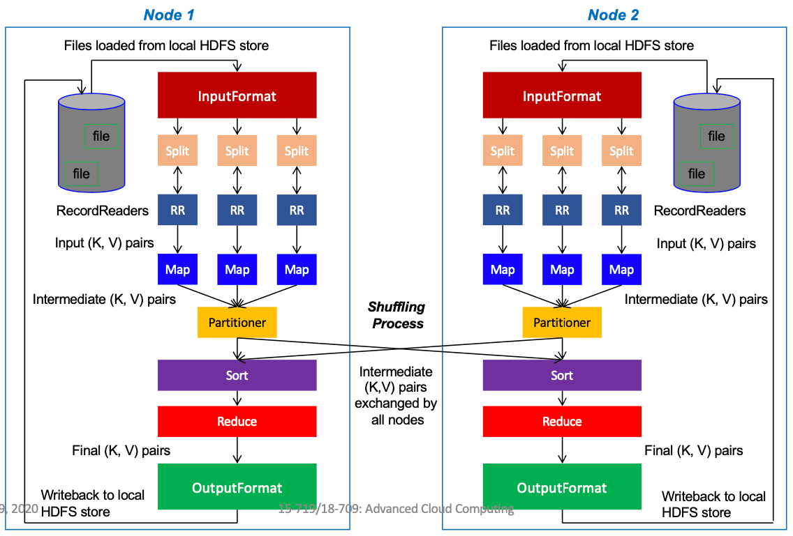
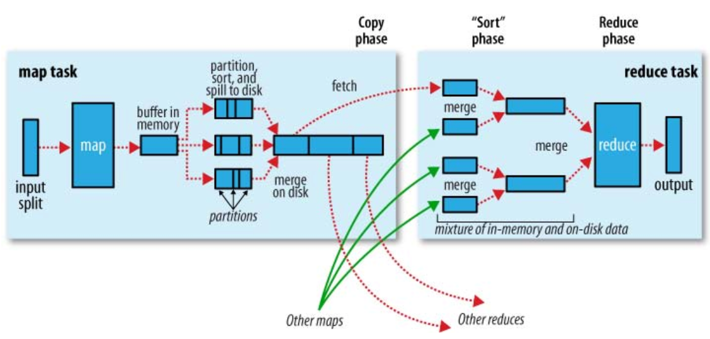
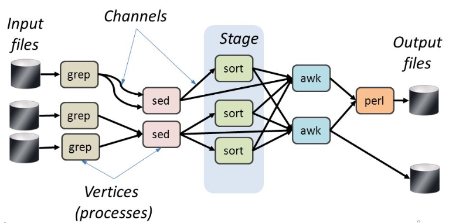

# Lecture 5 Programming Models and Frameworks

## Example: Killer Cloud App

* Online retail stores
  * Problem: one client -> fraction of one server
    * Computationally demanding: browsing products, forming/rendering web pages, managing client state
  * But: no interaction between clients (unless inventory is low)
  * Solution: parallelism - using more cores to run web server copies
* Downside: need to deal with parallel programming
  * Elasticity requires parallel programs: name services, load monitoring, cluster allocation
  * Goal: replace user programming with service configuration
* What about larger apps?
  * Data Parallel
    * Specify op on element; apply to each in collection
    * Analogy to SIMD operation: single instruction on multiple data

## High Performance Computing

* HPC: home for most parallel computing in 90s
* Strong Scaling: same problem finishes N times faster
* Weak Scaling: N times bigger problem finish at same time
* Important Scaling Factor: set problem size to match total available memory

### High Performance Computing Frameworks

* Machine cost O(10M-100M) -> emphasis on maximizing utilization
  * Low-level speed and hardware-specific optimizations
* Developed MPI (Message Passing Interface) framework
  * Launch N threads with library routines for everything you need: naming, addressing, membership, messaging, synchronization (barriers), transforms, physic modules, math libraries
* Very manual, deep learning curve, few commercial runaway success

### Broadening HPC: Grid Computing

* Grid Computing: with commodity servers and emphasizes geographical sharing
  * Jobs selected from batch queue, take over cluster

### Cloud Programming

|                      | HPC/Cluster                 | Grid                | Cloud              |
| -------------------- | --------------------------- | ------------------- | ------------------ |
| Size                 | Small to medium             | Large               | Small to large     |
| Resources            | Homogeneous                 | Heterogeneous       | Heterogeneous      |
| Initial Capital Cost | Very high                   | High                | Very low           |
| Network type         | Private (IB or proprietary) | Private (Ethernet)  | Private (Ethernet) |
| Hardware type        | Top-of-the-line             | Commodity or better | Commodity          |
| Typical ROI          | Very high                   | Medium              | High               |
| Workload diversity   | Low                         | Medium              | High               |

## Programming Models: MapReduce

* Batch processing of large datasets on a cluster
* Applications in MapReduce are represented as jobs
  * Each job encompasses several map and reduce tasks
  * Map and reduce tasks operate on data **independently** and in **parallel**
* Map Phase + Reduce Phase
  * User writes `map()` and `reduce()` functions
  * Read a large input data set as `(key, value)` pairs
  * **Map**: Run `map()` function in parallel on all input `(key, value)` pairs and produce `(key', value')` partitioned as intermediate data by `key'`
  * **Shuffle**: hash intermediate key to a reducer, sort and merge
  * **Reduce**: Run `reduce()` function on intermediate data `(key', value')`
  * Write results as `(key'', value'')` pairs
* Individual Map and Reduce tasks in a MapReduce job are idempotent and have no side effects
* Data is distributed to all the nodes of the cluster as it is being loaded
  * An underlying distributed file system splits large data files into chunks across several machines, which form a single namespace
* MapReduce assumes a tree style network topology and the bandwidth between two nodes is dependent on their relative locations in the network topology

### Input Format

| InputFormat             | Description                                      | Key                                      | Value                     |
| ----------------------- | ------------------------------------------------ | ---------------------------------------- | ------------------------- |
| TextInputFormat         | Default format; reads lines of text files        | The byte offset of the line              | The line contents         |
| KeyValueInputFormat     | Parses lines into (K,V) pairs                    | Everything up to the first tab character | The remainder of the line |
| SequenceFileInputFormat | A Hadoop-specific high-performance binary format | user-defined                             | user-defined              |
| MyInputFormat           | A user-specified input format                    | user-defined                             | user-defined              |

### Record Reader

* The input split defines a slice of data but does not describe how to access it
* The RecordReader class actually loads data from its source and converts it into (K, V) pairs suitable for reading by Mappers
* The RecordReader is invoked repeatedly on the input until the entire split is consumed
* Each invocation of the RecordReader leads to another call of the map function defined by the programmer

### Mapper and Reducer

* The Mapper performs the user-defined work of the first phase of the MapReduce program
* A new instance of Mapper is created for each split
* The Reducer performs the user-defined work of the second phase of the MapReduce program
* A new instance of Reducer is created for each partition

### Partitioner

* The partitioner class determines which partition a given (K,V) pair will go to
* The default partitioner computes a hash value for a given key and assigns it to a partition based on this result

### Sort (Merge)

* Each Reducer is responsible for reducing the values associated with (several) intermediate keys
* The set of intermediate keys on a single node is automatically sorted (merged) by MapReduce before they are presented to the Reducer

### Output Format

| OutputFormat             | Description                                                  |
| ------------------------ | ------------------------------------------------------------ |
| TextOutputFormat         | Default; writes lines in "key \t value" format               |
| SequenceFileOutputFormat | Writes binary files suitable for reading into subsequent MapReduce jobs |
| NullOutputFormat         | Generates no output files                                    |

### Combiner Functions

* It pays to minimize the data shuffled between map and reduce tasks
* Hadoop allows users to specify a combiner function (just like the reduce function) to be run on a map output only if the Reduce function is commutative and associative

### Job Scheduling in MapReduce

* A job encompasses multiple map and reduce tasks
* Job schedulers in MapReduce are pluggable
* Hadoop MapReduce by default FIFO scheduler for jobs
  * Schedules jobs in order of submission
  * Starvation with long-running jobs
  * No job preemption
  * No evaluation of job priority or size

### Fault Tolerance in Hadoop

* Data redundancy
  * Achived at the storage layer through replicas (default is 3)
  * Stored at physically separate machines
  * Can tolerate corrupted files and faulty nodes
* Task Resiliency (task slowdown or failure)
  * Monitors to detect faulty or slow tasks
  * Replicates tasks

## DryadLINQ

* Goal: Simplify writing data-parallel code
  * Added compiler support for imperative and declarative ops on data
  * Extends the MapReduce model by collectively optimizing workflows
* Data flows between processes: expressions on data represent workflow between processes
* Compiler operates on expressions, rewriting execution sequences
  * Can auto-pipeline, remove redundant partitions, reorder partitions

## Spark: Optimize MapReduce for Iterative Apps

* Spark programs are functional, deterministic -> same input = same result
* RDDs (Resilient Distributed Dataset): abstraction for parallel, fault-tolerant computation
  * Splits a set into partitions for workers to parallelize operation
  * Fault-tolerance through lineage graphs showing how to recompute data
* Store invocation (code or args) with inputs as a closure
  * Treated as future contract (lazy)
* Many operators are built-ins
* Spark is lazy – only specific operators force computations
  * Build programs interactively, computing only when and what user needs
  * Lineage is chain of invocations: future on future -> delayed compute
* Replication/Fault Tolerance: ship and cache RDDs on other nodes