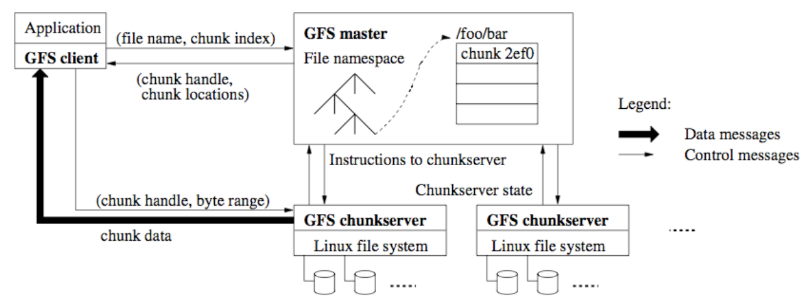
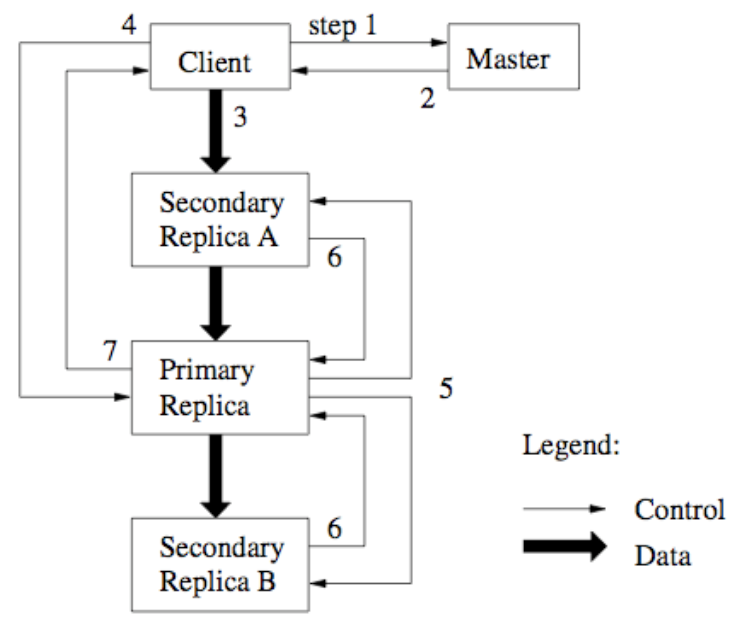

# Lecture 7 Cloud Storage I

## File System

### Approach #1: Server Does Everything

* Pros: Simplicity
  * Server just looks same as kernel-based FS
  * FS functionality, security, etc equivalent to standard case
* Cons: Performance
  * Performance of a server can bottle clients
  * Performance of network can bottleneck clients
  * Memory state must be maintained for each client app session

### Client-side Caching

* Big new problem: cache coherence
* Unix (Sprite): all reads see most recent write
* NFS: other clients' writes visible in 30 seconds (open/close)
* AFSv2: file session semantics -> reads see version closed most recently before calling open
* Original HTTP: all reads see a recent read

### Approach #2: Sprite (Caching + Server Control)

* All reads see most recent write
* How?
  * Clients tell server when they open a file for read or write
    * also asks for lastest timestamp if previously cached
  * Server tells client whether caching of the file is allowed
    * single write or multiple reader
  * Server also calls back to clients to disable caching as needed
  * Client tells server whenever file is closed
* Who does what?
  * Client maintains most session info, like current offset
  * Client has cache, but so does server

### Approach #3: NFSv3 (Stateless Caching)

* Other clients' writes visible within 30 seconds
  * Or the local open() after the other client's close()
* How?
  * Clients cache blocks and remember when last verified
  * Server promises nothing and remembers nothing
  * Clients check block freshness whenever older than 30 secs
  * No write-back caching is allowed on client or server
  * Most implementations assume no concurrent write sharing
* Who does what?
  * Client provides session and caching
  * Server does everything an FS would do on a local system
    * note that it replicates everything, including caching & access control

### Approach #4: AFSv2 (Caching + Callbacks)

* All reads see opened version, which is most recent close
* How?
  * Clients obtain full copy of file and callback from server
    * only when opening a file that is not currently cached with callback
    * AFSv3: no whole file semantics; use 64KB chunks
  * Server promises to callback if the file changes
  * Client writes back entire file (if changed) upon close
  * Server revokes callbacks for the file from other clients
    * Simple race on close for concurrent access semantics
* Who does what?
  * Client provides session and complete caching
  * Server does callbacks, directory management, and additional caching

### Stateful vs. Stateless Servers

* Stateless servers
  * simple
  * may be faster (because of simplicity)
    * though usually not
  * quick/easy to recover from crashes
  * no problem with running out of state-tracking resources
* Stateful servers
  * may be faster (because of long-lived connections)
  * can provide better semantics for users/programmers

### Network Attached Secure Disk (NASD)

* File/object storage management in storage device (inode-like)
* But, changes in storage device standards blocked in the disk solutions

## Scaling Distributed Storage

### NFS-based Design

* Metadata bottleneck
  * One image per file
  * Lots of metadata, reduced cache hit ratio
* At least 3 I/O ops per access
  * #1 - read directory metadata into memory
  * #2 - load file inode into memory
  * #3 - read file contents

### Facebook's Haystack Design

* Physical volumes
  * Large files storing multiple photos
  * Replicated for fault tolerance
* Haystack Store
  * Manage volume metadata
  * Maintain metadata in memory -> at most one I/O per access
* Haystack Directory
  * DB with photo-to-volume mappings, volume stats
* Haystack Cache
  * Recently-created photos tend to be popular

### Google File System (GFS)

* Single master with all metadata in memory
  * all files must be large; one block size (64MB)
  * rebuild state often, to allow non-durable state
    * locations of chunks not durable; poll on boot
* Concentrate all synchronization in new op
  * Don't hide inconsistency from application
* User-level library (no legacy support)
  * UNIX-like API (but no links, special fast copy)
* Repair/recovery is async, so over-replicate
* No data caching anywhere but object server (in ext3)

#### Dual Ordering

* Chunk transfers, post-transfer ordering
  * one copy of data elected as leader (output ordering)
  * orders write AFTER data has arrived at all

#### Concurrent Sharing

* Concurrent updates can be undefined
  * Large transfer split into separate races (like NFS)
* Append as special "thin" synchronizing solution
  * GFS picks and returns append offset
  * record appended atomically AT LEAST ONCE
    * Racing failures can leave differences in copies
    * GFS may pad or duplicate records
* Apps SHOULD validate (don't trust GFS)
  * Formating, checkpointing, checksums, sequence numbers

#### Recovery

* Background visit to each chunk
  * If parts are missing, re-replicate
  * gradual slow rebalancing
  * remove stale chunks with old version numbers
* Delete is just unlink
  * chunk is garbage collected
  * until collected, it is still available (time travel)

#### Single Metadata Server

* 1:1,000,000 metadata to data size ratio
  * force all large files (highly restrictive as FS)
* prefix table of pathnames, not directory tree
  * faster, but data management tools all break
* not single threaded
* replicate log & checkpoints
  * shadows can support read-only access

### Colossus and D

* GFS was limited to 50M files, 10PB
  * Users generate too many small files
  * Low latency apps poorly supported
* No longer a single metadata server
  * shards metadata over many servers
  * uses BigTable to store this metadata
* No longer simply replication
  * Uses Reed-Solomon (RAID-6 like) encoding
  * Computes encoding at client

### Log Structured Merge (LSM) Trees

* Insert/Update
  * Buffer and sort recent inserts/updates in memory
  * Write-out sorted buffers into local file system sequentially
  * Less random disk writes than traditional B-Tree
* Lookup/Scan
  * Search sorted tables one by one from the disk
    * Compaction is merge sort into new files, deleting old (cleaning)
  * Bloom-filter and in-memory index to reduce lookups
* Write optimized like LFS
  * Cacheable index per SSTable
  * List first & last key per SSTable
  * Cacheable Bloom filter per SSTable
  * Skip ~99% unneeded lookups

### TableFS: Metadata in LSM Trees

* Small objects embedded in LSM tree (tabular structure)
  * e.g., directory entries, inodes, small files
  * Turn many small files into one large object
* Larger files stored in object store indexed by TableFS-assigned IDs
* Key: <parent inode number, hash(filename)>
* Value: filename, inode attrs, inlined file data (or symlink to large object)
* Advantages
  * Fewer random lookups by co-locating dir entires with inode attrs, small files
  * `readdir` performs sequential scan on the table