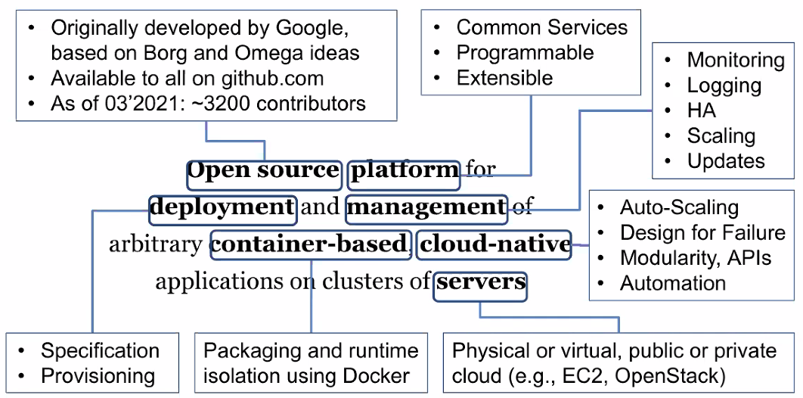
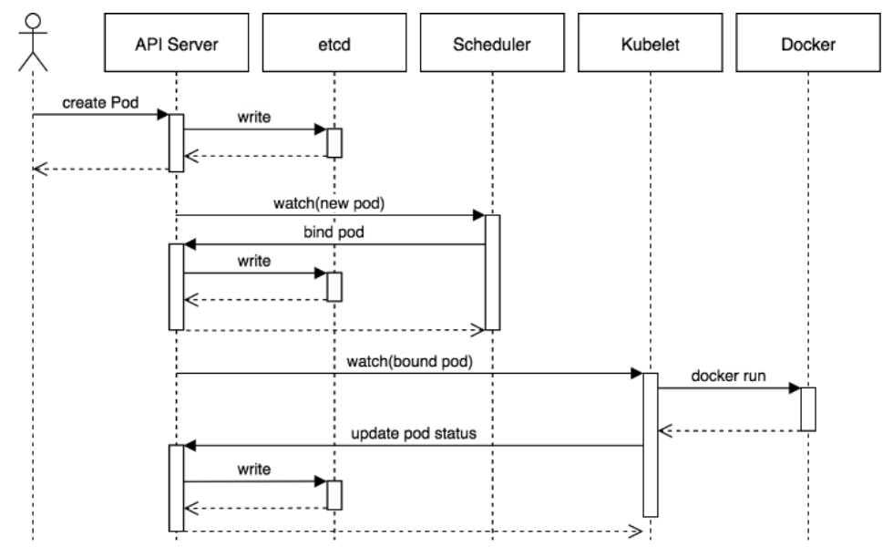

# Lecture 15 Cloud-Native Applications and Kubernetes

## Cloud-Native Applications

* Motivation: elasticity and ubiquity
* Example: Netflix
  * Value proposition -> **Low cost** video streaming with superb user experience, at **scale**
  * Application properties and unique requirements:
    * Vast **variance in load**, within minutes
    * 10s of thousands of servers at lease one server will **fail** every day
    * 1000s of daily application changes, across 100s of functions
      * ~ 1 **update** per minute
* **Design Principles**
  * Low Cost + Variance in Load (+ User Experience)
    * Can't afford over- and under-provisioning -> **Auto-scaling**
  * Hardware Failures + High Scale (+ User Experience)
    * Accommodate hardware failures without downtime -> **Design for Failure**
  * Frequent Application Updates + High Scale (+ User Experience)
    * Can't afford redeploying everything every time -> **Modularity**
    * Can't afford testing everything every time -> **Stable Internal APIs**
  * Frequent Application Updates + Low Cost (+ User Experience)
    * Can't afford manual QA/admin effort for each update -> **Automation**
* Common Services
  * Auto-Scaling: Horizontal Auto-Scaling, Elastic Load Balancing
  * Design for Failure: Elastic Load Balancing, Replication, Health Monitoring
  * Modularity: Decoupling into homogeneous (micro)services, Unified packaging (across dev/test/prod) with Docker
  * API-driven Composition: Discovery, Routing
  * Automation: Fully programmable life cycle of components, Observability (monitoring, tracing, etc)
* Platforms (Commonly referred as PaaS)

## Kubernetes

* Kubernetes (k8s): Open-Source, Cloud-Native & Container-Based Platform

### Architecture

### Unit of Deployment: Pod

* Pod: One or more containers + Resources + Labels
* Scaling/replication unit: runtime components that must run together
* Sidercar pattern: "secondary" functions deployed in separate containers
* Ambassador/Proxy pattern: simplify access to an external system (e.g., key-value store)
* Adapter pattern: simplify access from an external system (e.g., monitoring)
* From Pods to Applications: Deployment, Replica Set
  * Goal: Maintain a given number of replicas of a given Pod

### Composite Applications

* Deployment (Replica Set)
  * Maintains a given number of replica's of a given Pod
  * -> High availability, load balancing
* Daemon Set
  * Runs exactly one instance of a given Pod on every node
  * -> Access to unique host resources, load balancing
* Stateful Set
  * Maintains a scalable collection of Pods with unique roles
  * -> Persistent resource and identities
* Job
  * Enforces policies for execution and completion of groups of tasks
  * -> Controlled parallelism, work queus, schedule-based execution
* Custom
  * Your own

## Control Plane

### Default Scheduler

* Main goal: placement of Pods on Nodes
  * Triggered primarily by watching for new Pods in pending state
* FIFO scheduling
  * Supports priority-based arbitration and eviction
* Emphasis on scale and speed

### Placement Policies

* **Filtering**: filter out all nodes which can't run the pod
  * Configurable set of node **predicates**
    * `PodFitsResources`: CPU/Memory allocation
    * `PodMatchNodeSelector`: Labels match
    * `MatchInterPodAffinity`: Same/Different node as given Pods
* **Prioritization**: prioritize between the remaining nodes
  * Optimization goals expressed as **utility functions**
    * `InterPodAffinity`: Maximal affinity with given Pods
    * `LeastResourceAllocation`: Maximal spreading
    * `MostResourceAllocation`: Maximal packing
    * `BalancedResourceAllocation`: Minimal resource fragmentation
    * `ImageLocality`: Minimal startup time
  * Prefer nodes with maximal utility
* Affinity/Anti-Affinity
  * Affinity: same host/rack/zone/etc, Anti-affinity: different

### Custom Resources and Controllers

* Extend Kubernetes with Custom Resources
  * Cluster initialization, Function deployment, Function invocation

