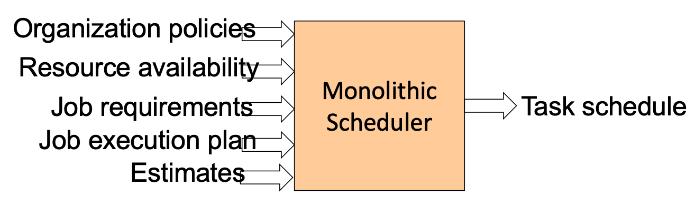
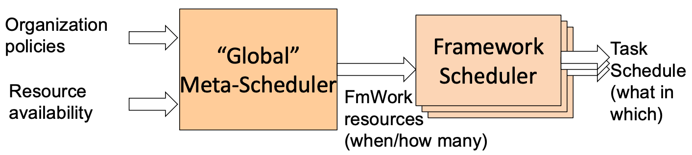
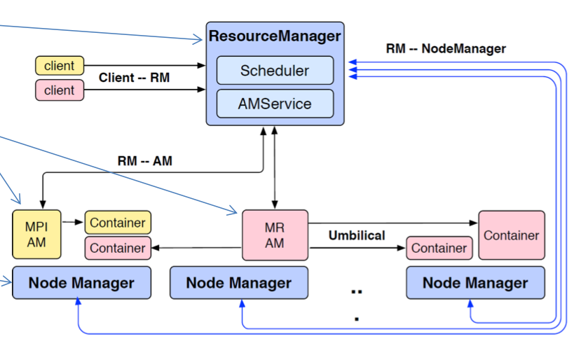

# Lecture 16 Multi-level Scheduling

## Cluster Resource Scheduling

* Traditional: separate clusters
  * There are many cluster resource consumers
    * Big data frameworks, elastic services, VMs
  * Historically, each would run its own cluster
* Preferred: dynamic sharing of cluster
  * Heterogeneous mix of activity types
  * Each grabbing/releasing resources dynamically
* Preferred: intra-cluster heterogeneity
  * Have a mix of platform types, purposefully

* Could try to do with a monolithic scheduler
  * Organization policies
  * Resource availability
  * Job requirements (Response time, Throughput, Availability)
  * Job execution plan (Task DAG, Inputs/outputs)
  * Estimates (Task durations, Input sizes, Transfer sizes)
  * Advantages: can (theoretically) achieve optimal schedule

## Two-Level Scheduler

* Advantages:
  * Simple -> easier to scale and make resilient
  * Easier to port existing frameworks, support new ones
* Disadvantages:
  * Distributed scheduling decision -> may be suboptimal
  * Need to balance awareness with coordination overhead
* One mechanism: resource offers (e.g., Mesos)
  * Unit of allocation: resource offer
    * Vector of available resources on a node (e.g., node1: <1CPU, 1GB>)
  * Meta-scheduler sends resource offers to frameworks
  * Frameworks select which (if any) offers to accept and which tasks to run
* Challenges
  * Allocation changes
    * when circumstances change, the right decisions might too
  * Planning ahead
    * lack of central planning of schedule can lead to distribuetd hoarding
  * Limited visibility for frameworks into overall cluster state
* Alternate distributed scheduler: shared state
  * Expose cluster state and schedule to all framework schedulers
  * Let each framework make decisions independently
  * Allow scheduling into future
  * -> Performance overheads in maintaining shared state & Can repeat work

## Apache Hadoop YARN

### Apache Hadoop MapReduce

* Single master for all jobs, JobTracker (Resource allocator and job scheduler)
* One or many slaves, TaskTrackers (Configurable number of Map and Reduce task slots)

* Hadoop Limitations
  * Single programming model (MapReduce only)
  * Centralized handling of jobs
    * Single point of failure (JobTracker failure kills all running and pending jobs)
    * Scalability concerns (Bottleneck for ~10K jobs)
  * Resources (task slots) were specific to either (Map or Reduce tasks)

### Apache Hadoop YARN

* Support multiple programming models
* Two-level scheduler
  * Cluster resource management detached from job management (meta-scheduler)
  * One master per job (framework-scheduler for application lifecycle management)
* Dynamic allocation of resources to run any tasks

### YARN Architecture

* Resource Manager (RM)
  * Cluster resource scheduler
* Application Master (AM)
  * One per job
  * Job life-cycle management
* Node Manager (NM)
  * One per node
  * Contaienr life-cycle management
  * Container resource monitoring

#### Resource Manager

* One per cluster
* Request-based scheduler
* Tracks resource usage and node liveness
* Enforces allocation and arbitrates contention among competing jobs
  * Fair, Capacity, Locality
* Dynamically allocates leases to applications
* Interacts with NodeManagers to assemble a global view
* Can reclaim allocated resource by
  * Collaborating with AMs
  * Killing containers directly throught the NM

#### Application Master

* One per job
* Manages life-cycle of a job
* Creates a logical plan of the job
* Requests resource through a heartbeat to the RM
* Receives a resource lease from the RM
* Creates a physical plan
* Coordinates execution
* Plans around faults
* Each AM manages the job's individual tasks
  * Start, monitor, and restart tasks
  * Each task runs within a container on each NM
* The AM acquires resources dynamically in the form of containers from the RM's scheduler before contacting corresponding NMs to start a job's tasks

#### Node Manager

* Manages container lifecycle and monitor containers
* One per node
* Authenticates container leases
* Monitors container execution
* Reports usage through heartbeat to RM
* Kills containers as directed by RM or AM

#### Container

* Container represents a lease for an allocated resource in the cluster
* The RM is the sole authority to allocate any container to applications
* The allocated container is always on a single NM and has a unique container id

## Protocols

* YARN interfaces:
  * Client-RM Protocol
  * AM-RM Protocol
  * AM-NM Protocol
  * NM-RM Protocol
* All client-facing MapReduce interfaces are unchanged, which means that there is no need to make any source code changes to run on top of YARN

### YARN Schedulers

* FIFO Scheduler
  * Has a single FIFO queue used to schedule container requests
* Fair Scheduler
  * Has multiple queues and tries to fairly allocate resources to the queues
  * Uses the Dominant Resource Fairness Algorithm which ensures that the queue with the lowest share of a particular resource gets the resource
  * Queues are configurable by the cluster administrator
* Capacity Scheduler
  * Has multiple queues and tries to allocate resources to the queues such that each queue's capacity constraint is not violated
  * During initial configuration, the administrator can split the capacity of the cluster's resources among these queues
* Late binding

### YARN Fault Tolerance

* RM Failure
  * Single point of failure
  * Can recover from persistent storage
    * Kills all contaienrs including AMs
    * Launches instance for each AM
* NM Failure
  * RM detects through heartbeat timeout
  * Marks all container on NM killed
  * Reports failure to all running AMs
  * AMs are responsible for node failures
* AM Failure
  * RM restarts AM
  * AM has to resync with all running tasks or all running tasks are killed
* Task Failure
  * Framework (AM) responsibility

