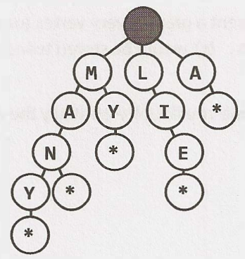
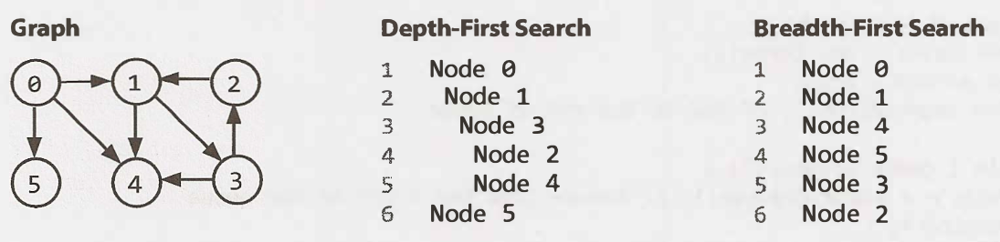

# Trees and Graphs

## Types of Trees

* A tree is a data structure composed of nodes
  * Each tree has a root node
  * The root node has zero or more child nodes
  * Each child node has zero or more child nodes, and so on

```java
class Node {
  public String name;
  public Node[] children;
}

class Tree {
  public Node root;
}
```

### Trees vs. Binary Trees

* A binary tree is a tree in which each node has **up to two children**
* A node is called a "leaf" node if it has no children

### Binary Tree vs. Binary Search Tree

* A binary search tree is a binary tree in which every node fits a specific ordering property: all left descendents <= n < all right descendents

### Balanced vs. Unbalanced

* A balanced tree is a binary tree in which the left and right subtrees of every node differ in height by no more than 1
* Two common types of balanced trees are red-black trees and AVL trees

### Complete Binary Trees

* A complete binary tree is a binary tree in which every level of the tree is **fully filled**, **except** for perhaps the last level
* To the extent that the last level is filled, it is filled left to right

### Full Binary Trees

* A full binary tree is a binary tree in which every node has either **zero** or **two** children
  * That is, no nodes have only one child

### Perfect Binary Trees

* A perfect binary tree is one that is both **full** and **complete**
  * All leaf nodes will be at the same level, and this level has the maximum number of nodes

## Binary Tree Traversal

### In-Order Traversal

* In-order traversal means to visit the left branch, then the current node, and finally, the right branch
* **When performed on a binary search tree, it visits the nodes in ascending order**

```java
void inOrderTraversal(TreeNode node) {
  if (node != null) {
    inOrderTraversal(node.left)
      visit(node)
    inOrderTraversal(node.right)
  }
}
```

### Pre-Order Traversal

* Pre-order traversal visits the current node before its child nodes
* In a pre-order traversal, the root is always the **first** node visited

```java
void preOrderTraversal(TreeNode node) {
  if (node != null) {
    visit(node)
    preOrderTraversal(node.left)
    preOrderTraversal(node.right)
  }
}
```

### Post-Order Traversal

* Post-order traversal visits the current node after its child nodes
* In a post-order traversal, the root is always the **last** node visited

```java
void postOrderTraversal(TreeNode node) {
  if (node != null) {
    postOrderTraversal(node.left)
    postOrderTraversal(node.right)
      visit(node)
  }
}
```

## Binary Heaps (Min-Heaps and Max-Heaps)

* A min-heap is a complete binary tree
  * where each node is smaller than its children
  * the root, therefore, is the minimum element in the tree
* Insert
  * When we insert into a min-heap, we always start by inserting the element at the bottom
  * We insert at the rightmost spot so as to maintain the complete tree property
  * Then, we "fix" the tree by swapping the new element with its parent, until we find an appropriate spot for the element
  * We essentially **bubble up the minimum element**
  * This takes $O(log n)$ time, where n is the number of nodes in the heap
* Extract Minimum Element
  * First, we remove the minimum element and **swap** it with the last element in the heap (the bottommost, rightmost element)
  * Then, we **bubble down** this element, swapping it with one of its children until the min­ heap property is restored
    * Take the smaller child to swap with in order to maintain the min-heap ordering
  * This algorithm will take $O(log n)$ time

## Tries (Prefix Trees)

* A trie a variant of an n-ary tree in which characters are stored at each node
  * Each path down the tree may represent a word
  * The * nodes are often used to indicate complete words
  * A node in a trie could have anywhere from 1 through ALPHABET_SIZE + 1
* **While a hash table can quickly look up whether a string is a valid word, it cannot tell us if a string is a prefix of any valid words**
* A trie can check if a string is a valid prefix in $O(K)$ time, where K is the length of the string
  * A hash table must read through all the characters in the input, which takes $O(K)$ time in the case of a word lookup
* Many problems involving lists of valid words leverage a trie as an optimization



## Graphs

* A graph is simply a collection of nodes with edges between (some of) them
* Graphs can be either directed (like the following graph) or undirected
* The graph might consist of multiple isolated subgraphs
* If there is a path between every pair of vertices, it is called a **"connected graph"**
* The graph can also have cycles (or not)
  * An **"acyclic graph"** is one without cycles

### Adjacency List

* Every vertex (or node) stores a list of adjacent vertices
* In an undirected graph, an edge like (a, b) would be stored twice: once in a's adjacent vertices and once in b's adjacent vertices
* An array (or a hash table) of lists (arrays, arraylists, linked lists, etc.) can store the adjacency list

### Adjacency Matrices

* An adjacency matrix is an NxN boolean matrix (where N is the number of nodes), where a true value at matrix[i] [j] indicates an edge from node i to node j
* In an undirected graph, an adjacency matrix will be symmetric
* The same graph algorithms that are used on adjacency lists (breadth-first search, etc.) can be performed with adjacency matrices, but they may be somewhat **less efficient**

## Graph Search



### Depth-First Search (DFS)

* In **depth-first search (DFS)**, we start at the root (or another arbitrarily selected node) and explore each branch completely before moving on to the next branch
  * That is, we go deep first (hence the name depth­ first search) before we go wide
  * Note that **pre-order** and other forms of tree traversal are a form of **DFS**
  * The key difference is that when implementing this algorithm for a graph, we must check if the node has been visited

### Breadth-First Search (BFS)

* In **breadth-first search (BFS)**, we start at the root (or another arbitrarily selected node) and explore each neighbor before going on to any of their children
  * That is, we go wide (hence breadth-first search) before we go deep
  * You can think of this as searching level by level
  * An iterative solution involving a queue usually works best

### Bidirectional Search

* **Bidirectional search** is used to find the shortest path between a source and destination node
  * It operates by essentially running two simultaneous breadth-first searches, one from each node
  * When their searches collide, we have found a path
  * This algorithm takes $O(k^{d/2})$ nodes total approximately

## Interview Questions

* **4.1 Route Between Nodes:**
  * Given a directed graph, design an algorithm to find out whether there is a route between two nodes.
* **4.2 Minimal Tree**
  * Given a sorted (increasing order) array with unique integer elements, write an algo­rithm to create a binary search tree with minimal height.
* **4.3 List of Depths:**
  * Given a binary tree, design an algorithm which creates a linked list of all the nodes at each depth (e.g., if you have a tree with depth D, you'll have D linked lists).
* **4.4 Check Balanced:**
  * Implement a function to check if a binary tree is balanced. For the purposes of this question, a balanced tree is defined to be a tree such that the heights of the two subtrees of any node never differ by more than one.
* **4.5 Validate BST:**
  * Implement a function to check if a binary tree is a binary search tree.
* **4.6 Successor:**
  * Write an algorithm to find the "next" node (i.e., in-order successor) of a given node in a binary search tree. You may assume that each node has a link to its parent.
* **4.7 Build Order:**
  * You are given a list of projects and a list of dependencies (which is a list of pairs of projects, where the second project is dependent on the first project). All of a project's dependencies must be built before the project is. Find a build order that will allow the projects to be built. If there is no valid build order, return an error.
  * EXAMPLE
    * Input:
      * projects: a, b, c, d, e, f
      * dependencies: (a, d), (f, b), (b, d), (f, a), (d, c)
    * Output: f, e, a, b, d, c
* **4.8 First Common Ancestor:**
  * Design an algorithm and write code to find the first common ancestor of two nodes in a binary tree. Avoid storing additional nodes in a data structure. NOTE: This is not necessarily a binary search tree.
* **4.9 BST Sequences:**
  * A binary search tree was created by traversing through an array from left to right and inserting each element. Given a binary search tree with distinct elements, print all possible arrays that could have led to this tree.
  * EXAMPLE
    * Input: {2, 1, 3}
    * Output: {2, 1, 3}, {2, 3, 1}
* **4.10 Check Subtree:**
  * T1 and T2 are two very large binary trees, with T1 much bigger than T2. Create an algorithm to determine if T2 is a subtree of T1.
  * A tree T2 is a subtree of T1 if there exists a node n in T1 such that the subtree of n is identical to T2. That is, if you cut off the tree at node n, the two trees would be identical.
* **4.11 Random Node:**
  * You are implementing a binary tree class from scratch which, in addition to insert, find, and delete, has a method getRandomNode() which returns a random node from the tree. All nodes should be equally likely to be chosen. Design and implement an algorithm for getRandomNode, and explain how you would implement the rest of the methods.
* **4.12 Paths with Sum:**
  * You are given a binary tree in which each node contains an integer value (which might be positive or negative). Design an algorithm to count the number of paths that sum to a given value. The path does not need to start or end at the root or a leaf, but it must go downwards (traveling only from parent nodes to child nodes).
