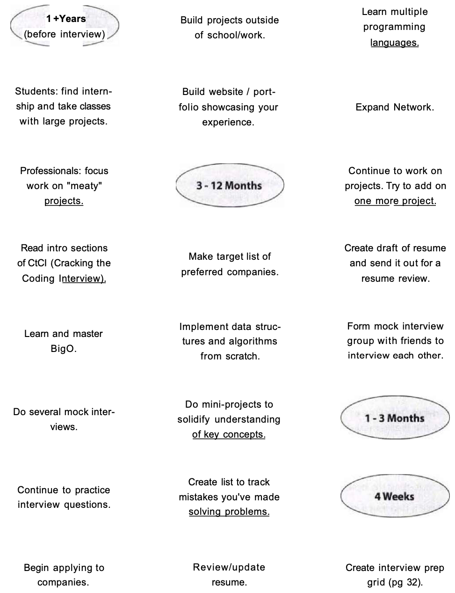
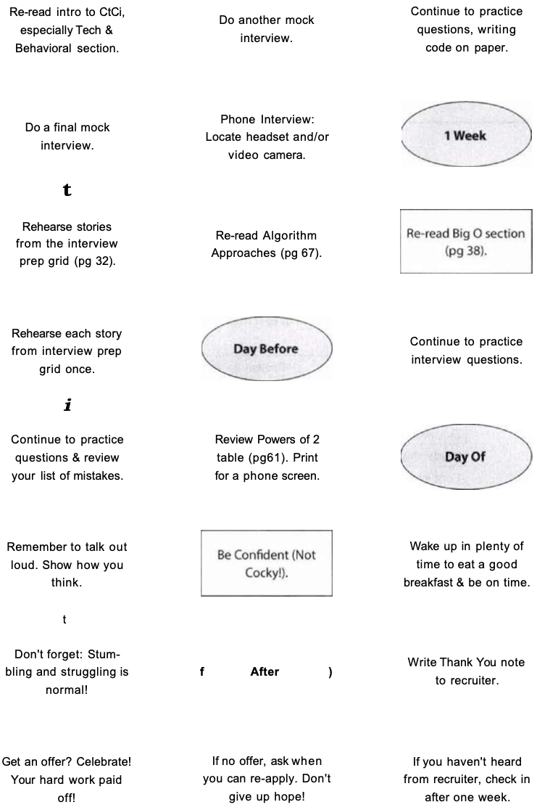

# Before The Interview

## Getting the Right Experience

* For current students, this may mean the following:
  * *Take the Big Project Classes:* Seek out the classes with big coding projects
  * *Get an Internship:* Do everything you can to land an internship early in school
  * Start *Something:* Build a project on your own time, participate in hackathons, or contribute to an open source project

## Writing a Great Resume

* In the US, it is **strongly advised** to keep a resume to **one page** if you have less than ten years of experience
  * Recruiters only spend a fixed amount of time (about 10 seconds) looking at your resume
* Your resume does not - and should not - include a full history of every role you've ever had
  * Include only the relevant positions - the ones that make you a more impressive candidate
  * *Writing Strong Bullets*
    * For each role, try to discuss your accomplishments with the following approach: "Accomplished X by implementing Y which led to Z."
    * "Reduced object rendering time by 75% by implementing distributed caching, leading to a 10% reduc- tion in log-in time."
  * Show what you did, how you did it, and what the results were
  * Ideally, you should try to make the results "measurable" somehow
* Developing the projects section on your resume is often the best way to present yourself as more experienced
  * The projects should include your *2* - 4 most significant projects
  * State what the project was and which languages or technologies it employed
  * You may also want to consider including details such as whether the project was an individual or a team project, and whether it was completed for a course or independently
  * Independent projects are generally preferred over course projects, as it shows initiative
  * Do not add too many projects
  * Some employers really like open source projects (it offers experience contributing to a large code base), while others prefer independent projects (it's easier to understand your personal contributions)
* Programming Languages and Software
  * Be conservative about what software you list, and understand what's appropriate for the company
  * One alternative is to list most of the languages you've used, but add your experience level. This approach is shown below
    * Languages: Java (expert), C++ (proficient), JavaScript (prior experience)
* Some companies will throw out your resume just because of a typo
* Beware of (Potential) Stigma
  * Enterprise Languages
  * Being Too Language Focused
  * Certifications
  * Knowing Only One or Two Languages

## Preparation Map

