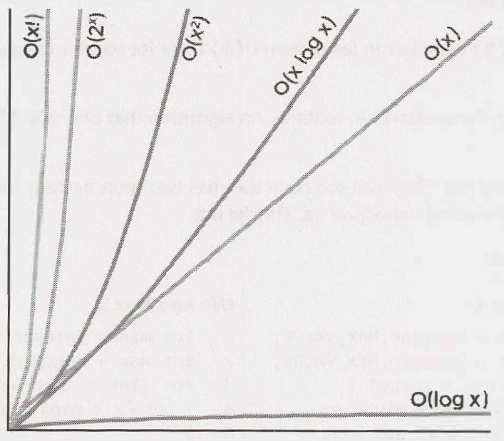
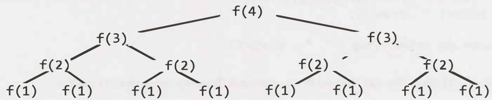

# Big O

## Big O, Big Theta, and Big Omega

* $O$ (Big O)
  * Big O describes an upper bound on the time
* $\Omega$ (Big Omega)
  * Big Omega is the equivalent concept but for lower bound
* $\theta$ (Big Theta)
  * $\theta$ means both $O$ and $\Omega$
  * That is, an algorithm is $\theta(N)$ if it is both $O(N)$ and $\Omega(N)$

## Best Case, Wort Case, and Expected Case

* **Best Case:** If all elements are equal, then quick sort will, on average, just traverse through the array once, which is $O(N)$
* **Worst Case:** What if we get really unlucky and the pivot is repeatedly the biggest element in the array? This will degenerate to an $O(N^2)$ runtime
* **Expected Case:** Usually, though, these wonderful or terrible situations won't happen so that we can expect a runtime of $O(N log N)$
* We rarely ever discuss best case time complexity, because it's not a very useful concept
* For many - probably most - algorithms, the worst case and the expected case are the same

## Space Complexity

* We care about the amount of memory or space required by an algorithm
* Space complexity is a parallel concept to time complexity
  * If we need to create an array of size $n$, this will require $O(n)$ space
  * Stack space in recursive calls counts, too
    * Each call adds a level to the stack

```text
int sum(int n) { /*Ex 1.*/
	if (n <= 0) {
		return 0;
  }
	return n + sum(n-1);
}

sum(4)
	-> sum(3)
		-> sum(2)
			-> sum(l)
				-> sum(0)
```

## Drop the Constants

* It is very possible for $O(N)$ code to run faster than $O(1)$ code for specific inputs
* Big O just describes the rate of increase
* For this reason, we drop the constants in runtime

## Drop the Non-Dominant Terms

* You should drop the non-dominant terms
  * $O(N^2 + N)$ becomes $O(N^2)$
  * $O(N + log N)$ becomes $O(N)$
  * O(5 * 2^N + 1000N^{100}) becomes $O(2^N)$
* We might still have a sum in a runtime. For example, the expression $0(B^2 + A)$ cannot be reduced (without some special knowledge of $A$ and $B$)



## Multi-Part Algorithms: Add vs. Multiply

* If your algorithm is in the form "do this, then, when you're all done, do that"then you add the runtimes
* If your algorithm is in the form "do this for each time you do that"then you multiply the runtimes

## Amortized Time

* An `ArrayList`, or a dynamically resizing array, allows you to have the benefits of an array while offering flexibility in size
* You won't run out of space in the `ArrayList` since its capacity will grow as you insert elements
* When the array hits capacity, the `ArrayList` class will create a new array with double the capacity and copy all the elements over to the new array
* How do you describe the runtime of insertion?
  * If the array contains N elements, then inserting a new element will take $O(N)$ time
  * However, we also know that this doesn't happen very often
  * The vast majority of the time insertion will be in `O(1)` time
* Amortized time describe the worst case happens every once in a while
  * But once it happens, it won't happen again for so long that the cost is "amortized"
* As we insert elements, we double the capacity when the size of the array is a power of 2
* So after X elements, we double the capacity at array sizes $1, 2, 4, 8, 16, \cdots, X$
* What is the sum of $1 + 2 + 4 + 8 + 16 + \cdots + X$?
  * What then is the sum of $X + X/2 + X/4 + X/8 + \cdots + 1$?
    * This is roughly $2X$

## Log N Runtimes

* We commonly see $O(log N)$ in runtimes, but where does it come from
* In binary search, we are looking for an example x in an N-element sorted array

```text
search 9 within {1, 5, 8, 9, 11, 13, 15, 19, 21}
	compare 9 to 11 -> smaller.
		search 9 within {1, 5, 8, 9, 11}
			compare 9 to 8 -> bigger
			search 9 within {9, 11}
				compare 9 to 9
				return
```

* We start off with an N-element array to search
  * Then, after a single step, we're down to $N/2$ elements
  * One more step, and we're down to $N/4$ elements
  * We stop when we either find the value or we're down to just one element
* The total runtime is then a matter of how many steps (dividing $N$ by 2 each time) we can take until $N$ becomes 1

```text
N = 16 /* divide by 2 */
N = 8  /* divide by 2 */
N = 4  /* divide by 2 */
N = 2  /* divide by 2 */
N = 1  /* divide by 2 */
```

* What is $k$ in the expression $2^k = N$?
* This is exactly what $log$ expresses

## Recursive Runtimes

```text
int f(int n) {
	if (n <= 1) {
		return 1;
	}
	return f(n-1) + f(n-1);
}
```



* The tree will have depth N
* Each node (i.e., function call) has two children
* Therefore, each level will have twice as many calls as the one above it
* Therefore, there will be $2^0 + 2^1 + 2^2 + 2^3 + 2^4 + \cdots + 2^N$ (which is $2N^{N+1} - 1$) nodes
* Try to remember this pattern
  * **When you have a recursive function that makes multiple calls, the runtime will often (but not always) look like $O(branches^{depth})$, where branches is the number of times each recursive call branches**
* In this case, this gives us $O(2^N)$
* The space complexity of this algorithm will be $O(N)$
  * Although we have $O(2^N)$ nodes in the tree total, only $O(N)$ exist at any given time
