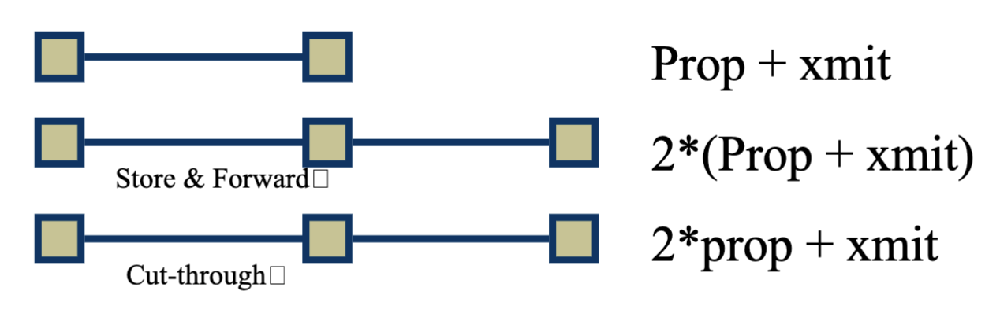
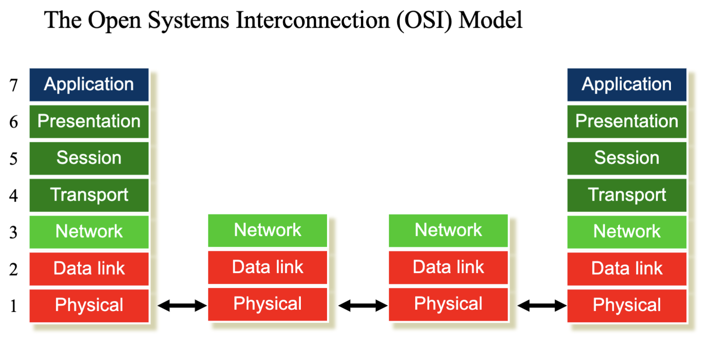
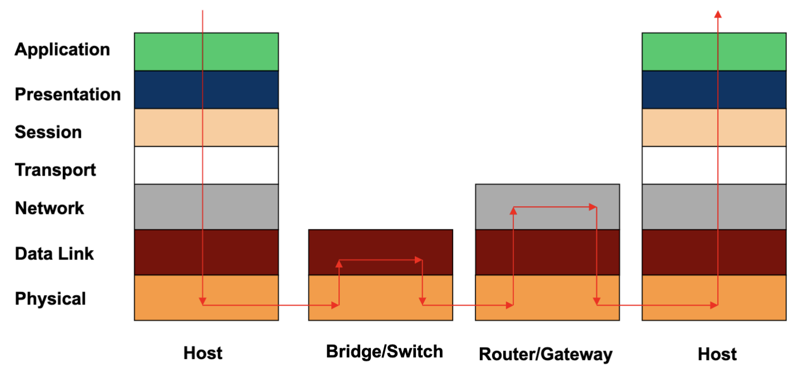
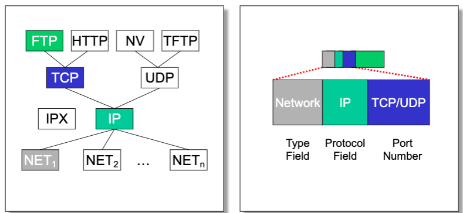

# Lecture 2 Protocol Stack

## Network Applications

### Application and Application Protocols

* Application: communicating, distributed processes
  * Running in network hosts in user space
* Application protocols
  * Define messages exchanged by apps and actions taken
  * User services provided by lower layer protocols

### Client-Server Paradigm

* Typical network app has two pieces: client and server
* Client
  * Typically requests service
* Server
  * Provides a service to client

### HTTP: The Hypertext Transfer Protocol

* Transfer (hypertext) files as they are requested
* Client/server model that allows client to access multiple servers as per their need
* The Hypertext markup language (HTML) allows for describing rich content

### Requirements

* Performance: latency and throughput
* Network reliability
  * Network service must always be available
* Security: for users and the network itself
  * Privacy, authentication, deal with various attacks
* Scalability
  * Scale to large numbers of users, traffic flows
* Manageability: monitoring, enforcing policies, billing
* Data loss/Timing/Bandwidth

### Packet Delay

* Routers have finite speed (processing delay)
* Routers may buffer packets (queueing delay)
* **Packet delay components**
  * Propagation delay proportional to the length of the link
  * Transmission delay proportional to the packet size and 1/link speed
  * Processing delay depends on the speed of the router
  * Queueing delay depends on the traffic load and queue size

### Throughput & Bandwidth Sharing

* Throughput is determined by the slowest stage
* Router before the bottleneck link decides how much bandwidth each user gets

## Internet Architecture

### Protocols

* An agreement between parties on how communication should take place
* e.g., IP, UDP, TCP, FTP, SMTP (Simple mail transfer protocol), HTTP, ARP (Address resolution protocol), BGP (Border gateway protocol), ICMP (Internet control message protocol), DHCP (Dynamic host configuration protocol)

### A Layered Design

* Each layer relies on services from layer below and exports services to layer above
* Interface defines interaction with peer on other hosts - called protocols
* Modules hide implementation - layers can change without disturbing other layers

#### OSI Model

* Application: everything else
* Presentation: byte ordering, security
* Session: how to tie flows together
* Transport: how to send packets end-to-end
* Network: how to route packets
* Data link: how to transmit frames
* Physical: how to transmit bits

### Life of a Packet

#### Multiplexing and Demultiplexing

* Each header includes a demultiplexing field that is used to identify the next layer
* Multiplexing occurs at multiple layers (e.g., IP, TCP)

### Socket API

### IP Based on a Minimalist Approach

* IP provide minimal functionalities to support connectivity
  * Addressing, forwarding, routing
* Transport layer or application performs more sophisticated functionalities
  * Flow control, error control, congestion control
* Advantages
  * Accommodate heterogeneous technologies (Ethernet, modem, wireless)
  * Support diverse applications (telnet, ftp, web)
  * Decentralized network administration