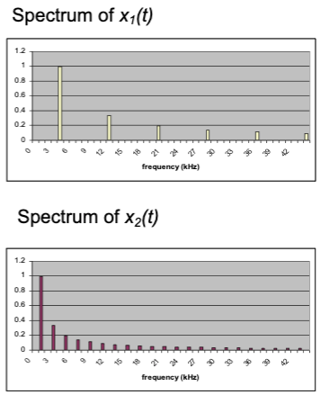
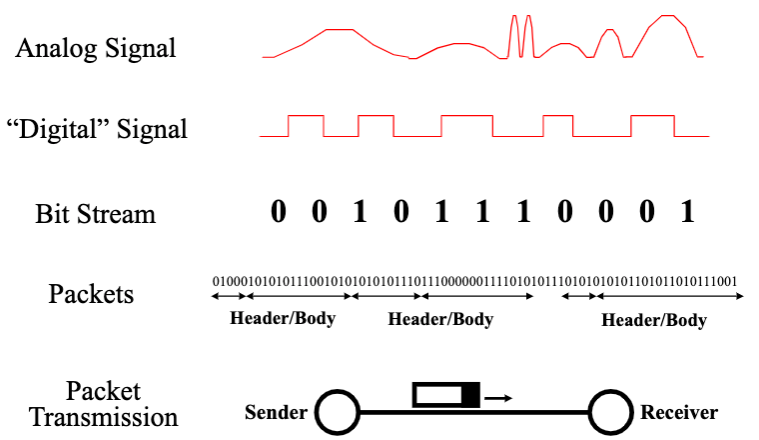
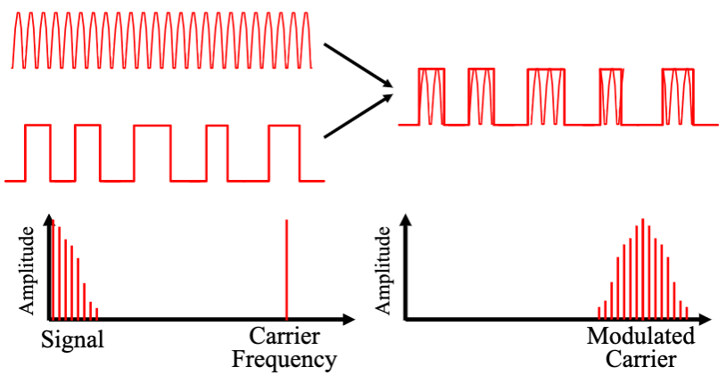
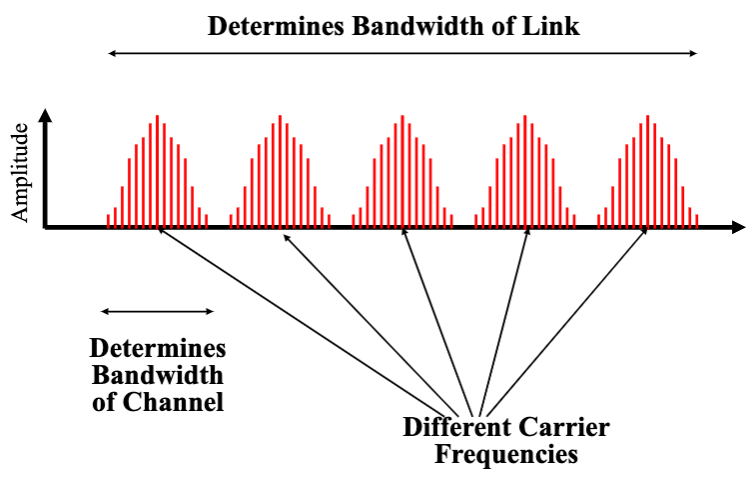
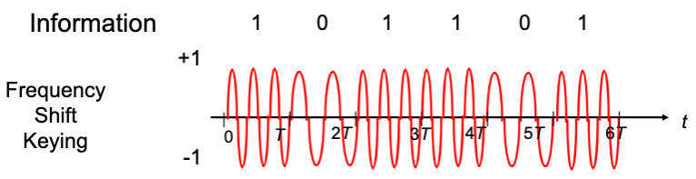

# Lecture 4 Physical Layer II

## Modulation

* Changing a signal to convey information
* Ways to modulate a sinusoidal wave
  * Amplitude Modulation (AM) (e.g., Volume)
  * Frequency Modulation (FM) (e.g., Pitch)
  * Phase Modulation (PM) (e.g., Timing)

## A Communication System

* Transmitter
  * Convert information into a signal suitable for transmission
  * Inject energy into communication medium or channel
* Receiver
  * Receive energy from medium

### Bandwidth

* Bandwidth is width of the frequency range in which the Fourier transform of the signal is non-zero
* dB - short for decibel
  * Defined as $10 * log_{10}(P_1/P_2)$

### The Frequency Domain

* A periodic signal can be viewed as a sum of sine waves of different strengths
* Every signal has an equivalent representation in the frequency domain

### Spectra & Bandwidth

* Spectrum of a signal: measures power of signal as function of frequency

* $x_1(t)$ varies faster in time & has more high frequency content than $x_2(t)$

### Transmission Channel Considerations

* Every medium supports transmission in a certain frequency range
* Transmission and receive hardware will try to maximize the useful bandwidth in this frequency band

## Limits in Digital Transmission

### Limits to Speed and Distance

* Random energy is added to the signal
* Attenuation: some of the energy in the signal leaks away
* Dispersion: attenuation and propagation speed are frequency dependent

### Pulse Transmission Rate

* Objective: maximize pulse rate through a channel
  * How frequently can these pulses be transmitted without interfering with each other?
  * $2W_c$ pulses / sec with binary amplitude encoding where $W_c$ is the bandwidth of the channel

### Bandwidth of a Channel

* $X(t) = a cos(2\pi ft)$ -> Channel -> $Y(t) = A(f) a cos(2\pi ft)$
* Bandwidth $W_c$ is range of frequencies passed by channel

### Noise & Reliable Communication

* All physical systems have noise
* Presence of noise limits accuracy of measurement of received signal amplitude
* Errors occur if digital signal separation is comparable to noise level
* Thus, noise places a limit on how many amplitude levels can be used in pulse transmission
* Signal-to-Noise Ratio (SNR)

### The Nyquist Limit

* A noiseless channel of width H can at most transmit a binary signal at a rate 2 * H
* More aggressive encoding can increase the bandwidth
  * e.g., modulate multi-valued symbols
* Problem: noise
  * The signals representing two symbols are less distinct

### Capacity of a Noisy Channel

* Places upper bound on channel capacity, while considering noise
* **Shannon's theorem**
  * $C = B * log_2(1+S/N)$
  * C: maximum capacity (bps)
  * B: channel bandwidth (Hz)
  * S/N: signal to noise ratio of the channel
  * Often expressed in decibels (db) = $10 log(S/N)$
    * $SNR = 10^{(SNR(db)/10)}$
  * Arbitrarily-reliable communication is possible if the transmission rate R < C

## Digital Modulation

### From Signals to Packets

### Baseband vs. Carrier Modulation

* Baseband modulation: send the bare digital signal
  * Channel must be able to transmit low frequencies
* Carrier modulation: use the signal to modulate a higher frequency signal, called a carrier
  * Can send the signal in a particular part of the spectrum
  * Can modulate the amplitude, frequency or phase

### Signaling Rate and Transmission Bandwidth

* If baseband signal $x(t)$ with bandwidth $B$ Hz, then modulated signal $x(t)cos(2\pi f_ct)$ has bandwidth $2B$ Hz

### Frequency Division Multiplexing: Multiple Channels

### Frequency Modulation

* Use two frequencies to represent bits
  * "1" send frequency $fc+d$
  * "0" send frequency $fc-d$
* Demodulator looks for power around $fc+d$ or $fc-d$

### Phase Modulation

* Map bits into phase of sinusoid:
  * "1" send $A cos(2\pi ft)$ i.e., phase is 0
  * "0" send $A cos(2\pi ft + \pi)$ i.e., phase is $\pi$

### Modulator & Demodulator

* Modulate $cos(2\pi f_ct)$ by multiplying by $A_k$ for $T$ seconds
* Demodulate (recover $A_k$) by multiplying by $2cos(2\pi f_ct)$ for $T$ seconds and lowpass filtering (smoothing)
* Quadrature Amplitude Modulation (QAM) uses two-dimensional signaling