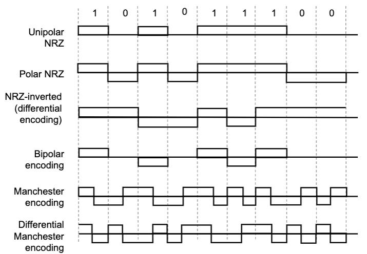
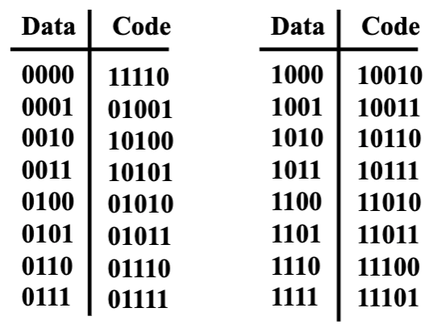
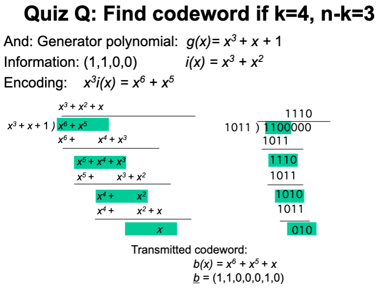

# Lecture 5: Physical Layer III

## Line Coding

### Synchronization

* Synchronization of clocks in transmitters and receivers
  * clock drift causes a loss of synchronization
* Asynchronization transmission
  * Avoids synchronization loss by
    * specifying a short maximum length for the bit sequences (so that clock doesn't drif much within sequence)
    * and resetting the clock in the beginning of each bit sequence (by using a start bit)
  * ASCII code: 7 bits to represent 128 letters, symbols, and control characters
    * Asynchronous transmission sends sequences of 8 bits = one start bit + 7 ASCII bits
* Synchronous transmission
  * Improves efficiency by transmitting longer sequences of bits, called packets (variable length)
  * Requires extra information to indicate the end of the packet

### Encoding

* Encoding converts a binary information sequence into a digital signal
* Encoding can be done one bit at a time or in blocks of multiple bits called a symbol
* Transmission is synchronous, i.e., a clock is used to sample the signal
* Why do we need encoding?
  * To meet certain electrical constraints (e.g., avoid long sequence of zeros/ones)
  * Create control symbols, besides regular data symbols (e.g., start or end of frame)
  * Can do error detection or error correction

#### mB/nB Encoding

* m data bits are coded as symbols of n line bits
* Each valid symbol has at least two 1s: get dense transitions
* Example: FDDI uses 4B/5B

## Error Detection and Correction

### Error Control

* Channels introduce errors in digital communications
* Two basic approaches:
  * Error detection & retransmission (ARQ)
  * Forward error correction (FEC)
* Redundancy: only a subset of all possible blocks can be valid codewords
* Undetectable error: when channel transforms a codeword into another valid codeword
* Good codes should maximize sepration between valid codewords

### Single Parity Check

* Check Bit: $b_{k+1} = b_1 + b_2 + b_3 + \cdots + b_k modulo 2$
* Receiver checks to see if # of 1s is even
* Coverage: all error patterns with odd # of errors can be detected

### Two-Dimensional Parity Check

* Arrange information as columns
* Add single parity bit to each column
* Add a final parity column
* Used in early error control systems

### Internet Checksum

* Several Internet protocols (e.g., IP, TCP, UDP) use check bits to detect errors in the header
* A checksum is calculated for header contents and included in a special field
* Checksum is potentially recalculated at every router, so algorithm selected for ease of implementation in software

### Polynomial Code

* Cyclic redundancy check (CRC)
* Implemented using shift-register circuits
* Most data communication standards use polynomial code for error detection
* $b(x) = x^{n-k}i(x) + r(x)$

