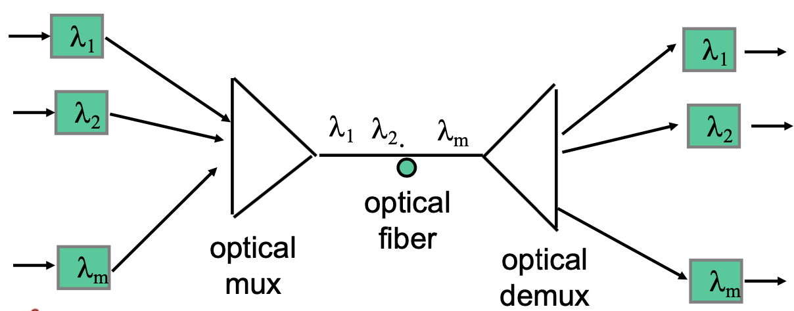
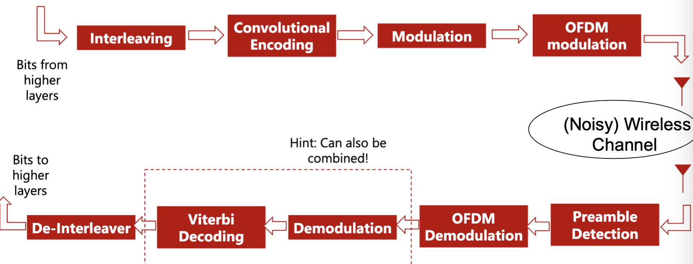
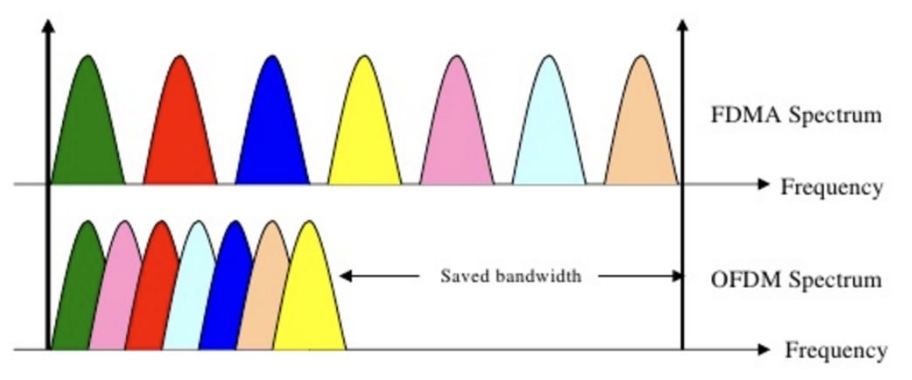
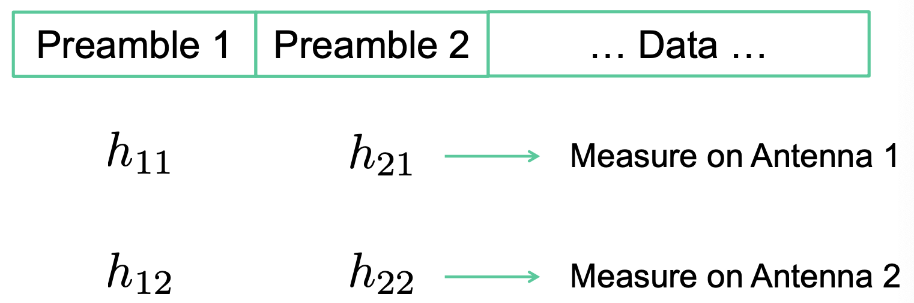
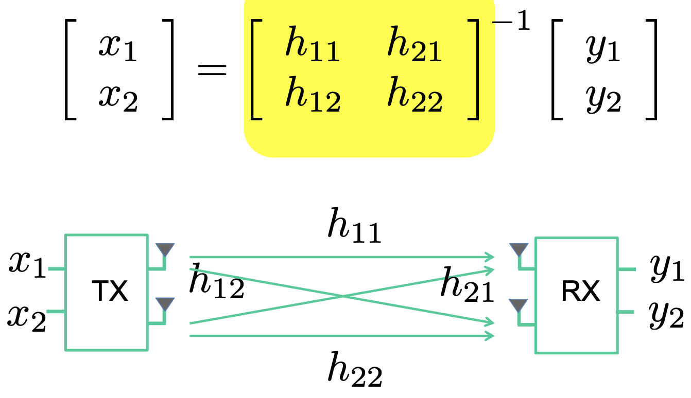

# Lecture 6 Physical Layer IV

## Wired

### Twisted Pair

* Two insulated copper wires arranged in a regular spiral pattern to minimize interference
* Low cost

### Optical Fiber

* Light sources generate pulses of light that are transmitted on optical fiber
* Profound influence on network architecture
  * Dominates long distance transmission
  * Plentiful bandwidth for new services
* Core/Cladding/Jacket
* Multimode fiber: multiple rays follow different paths
* Single-mode fiber: only direct path propagates in fiber
* Optical range from $\lambda_1$ to $\lambda_1+\Delta\lambda$ contains bandwidth $B=f_1-f_2=\frac{v}{\lambda_1} - \frac{v}{\lambda_1+\Delta\lambda}$
* Different wavelengths carry separate signals
  * Multiplex into shared optical fiber
* To extend range, use combinations of optical amplifiers and regenerators

## Wireless

* Wireless is flaky
* Wireless is a broadcast medium
* Wireless is half-duplex

### Wifi

* Basic Equation: $y(t)=hx(t)+n(t)$
* More generally: $y(t)=\Sigma_{i=0}^{i=k}h(i)s(t-i\tau)$
* But time is continuous: $y(t)=\int h(\tau)s(t-\tau)+n(t)=h(t)*s(t)+n(t)$
* How to estimate $h$?
  * Send known $x(t)$ as "preamble"
  * $h=y(t)/x(t)$
* In channel, there is attenuation and phase shift
  * $h=1/d \times e^{j2\pi d/\lambda}$
  * Consistent with $1/d^2$ power fading
  * $d/\lambda = d*f/c = f*t$

### Frequency Division Multiplexing (FDM)

* Divide bandwidth into small chunks: subcarriers
* Orthogonal Frequency Division Multiplexing (OFDM)
  * WiFi, LTE uses OFDM

### Mutiple Input Multiple Output (MIMO)

* SISO: Assuming narrowband, $y=hx+n$
* Estimating channels

* n antennas -> n more data

### Cellular Whirlwind

* To increase network capacity:
  * Multiple low-power transmitters (100W or less)
  * Small transmission radius -> area aplit in cells
  * Each cell with its own frequencies and base station
  * Adjacent cells use different frequencies
* The Hexagonal Pattern
  * A hexagon pattern can provide equidistant access to neighboring cell towers
  * $d=\sqrt3R$
* Cell Sectoring
  * Cell divided into wedge shaped sectors
  * 3-6 sectors per cell, each with own channels
  * Use of directional antennas

### Cellular Standards

* 1G: analog voice
* 2G: digital voice
* 2.5G: voice and data channels
* 3G: voice (circuit-switched) and data (packet-switched)
  * Uses Code Division Multiple Access (CDMA)
* 4G: 10Mbps and up, seamless mobility between different cellular technologies
  * LTE the dominating technology (OFDM-A)
    * Assign each user a chunk of resource blocks coordinated by the cell tower
  * Packet switched
* 5G: mm-wave, more bandwidth, massive MIMO
  * 10-20MHz
  * 5G plays three games to increase based on $C=nB\log(1+S(I)NR)$
    * Increase n: Massive MIMO
    * Increase B: mm-wave frequencies
    * Increase B: buy more spectrum
    * Reduce I: smaller cells