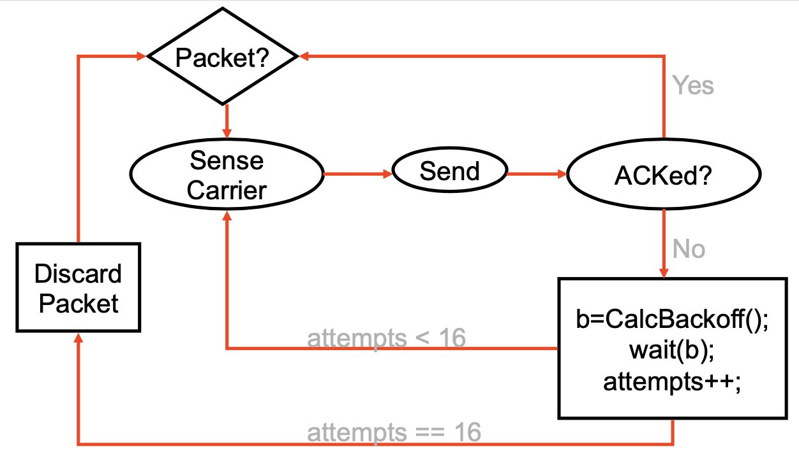

# Lecture 7 Data Link I

## Datalink Functions

* Framing: encapsulating a network layer datagram into a bit stream
* Error control: error detection and correction to deal with bit errors
* Flow control: avoid sender overrunning receiver
* Media Access Control (MAC): which frame should be sent over the link next?
  * Easy for point-to-point links

## Framing

* A link layer function, defining which bits have which function
* Minimal functionality: mark the beginning and end of packets (or frames)
* Delimiter based
  * SYN: sync character
  * SOH: start of header
  * STX/ETX: start of text / end of text

### Character and Bit Stuffing

* Mark frames with specical character
* Mark frames with special bit sequence
  * must stuff a zero any time seven 1s appear

### Ethernet Framing

* Preamble is 7 bytes of 10101010 followed by one byte of 10101011
* Allows receivers to recognize start of transmission after idle channel

## Link Flow Control and Error Recovery

* Dealing with receiver overflow: flow control
* Dealing with packets loss and corruption: error control
* These issues are relevant at many layers
  * Link Layer: sender and receiver attached to the same wire
  * End-to-end: transmission control protocol (TCP) - sender and receiver are the endpoints of a connection

### Flow Control

* Stop-and-wait flow control
  * Sender waits to send the next packet until the previous packet has been acknowledged by the receiver
* Window flow control
  * Receiver provides sender with a window that it can fill with packets
    * The window is backed up by buffer space on receiver
    * Receiver acknowledges the a packet every time a packet is consumed and a buffer is freed
  * Max Throughput = Window Size / RTT

### Error Recovery

* Error Correcting Codes (ECC)
  * Send extra redundant data to help repair losses
* Automatic Repeat Request (ARQ)
  * Receiver sends ACK when it receives packet
  * Sender uses ACKs to identify and resend data that was lost
* Use sequence numbers to recognize retransmissions
* In practice
  * No flow or error control (e.g., 100Mbps Ethernet, just CRC for error detection)
  * Flow control only (e.g., Gigabit Ethernet)
  * Flow and error control (e.g., 802.11 WiFi)
* Flow and error control solutions also used in higher layer protocols
  * e.g., TCP for end-to-end flow and error control

## Datalink Architectures

* Switches connected by point-to-point links - store-and-forward
  * Used in WAN, LAN, and for home connections
  * MAC scheduling
* Multiple access networks - contention based
  * Multiple hosts are sharing the same transmission medium

### Scheduling for Medium Access Control

* Schedule frame transmissions to avoid collision in shared medium
* Reservation Systems
  * Centralized systems: A central controller accepts requests from stations and issues grants to transmit
  * Distributed systems: Stations implement a decentralized algorithm to determine transmission order
  * Transmission organized into cycles (reservation interval + frame transmission)
  * Single or multiple frames per frame
  * Channelized or Random Access Reservations

### Contention-based Access

* Aloha
  * When node has packet to send, transmit at full channel data rate R
  * Two or more transmitting nodes -> collisions
  * Random access MAC protocol specifies:
    * How to detect collisions
    * How to recover from collisions (e.g., via delayed retransmissions)
  * Random from collision by trying after random delay
  * Poisson Process: memory less
* Pure Aloha
  * Total rate of packets attempting transmission = newly generated packets + retransmitted ones = $\lambda' > \lambda$
  * Total traffic intensity: $G = N\lambda'm$
* Slotted Aloha
  * Time is divided into equal size slots - equal to packet retransmission time
  * If collision, retransmit packet in future slots with probability p, until successful
  * The vulnerable period of the packet of size m has been reduced from 2m to only m
  * Can achieve higher throughput
* Ethernet MAC
* Ethernet Frames

### Carrier Sense Multiple Access / Collision Avoidance (CSMA/CA)

* Exponential Backoff
  * Why not random delay with fixed mean?
    * Few senders -> needless waiting
    * Too many senders -> too many collisions
  * Goal: adapt retransmission attempts to estimated current load
  * Delay is set as K slots - control K
    * First collission: choose K from {0, 1}
    * Second collision: choose K from {0, 1, 2, 3}
    * After ten collisions: choose K from {0, 1, 2, 3, ..., 1023}