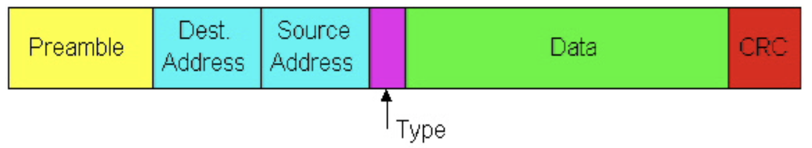
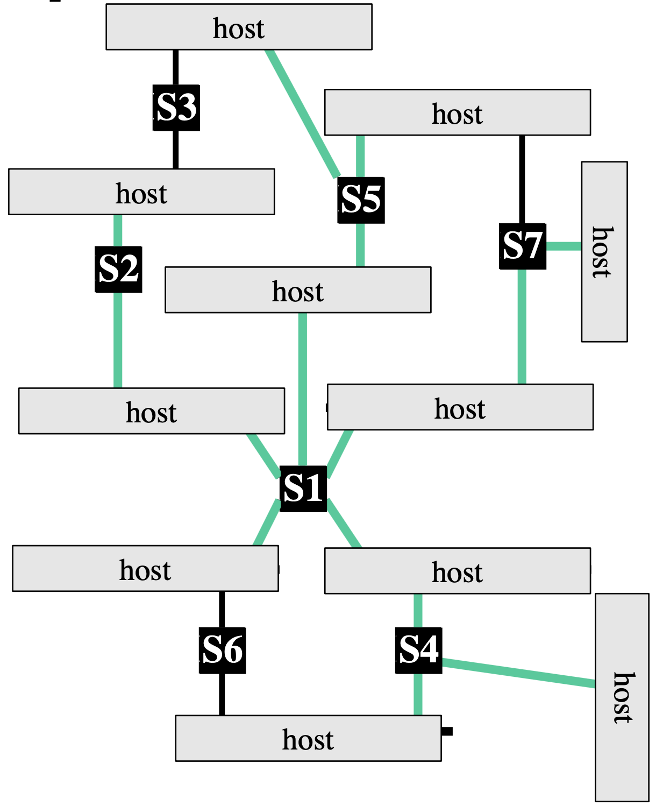

# Lecture 8 Data Link 2

## Ethernet

### Ethernet Frame

* Sending adapter encapsulates IP datagram in Ethernet frame
* WiFi also uses the same structure
* Preamble: 8 bytes
  * Used to synchronize receiver, sender clock rates
* Type: 2 bytes
  * Demultiplexing: indicates the higher layer protocol
* CRC: 4 bytes
  * Checked at receiver, if error is detected, the frame is simply dropped

### Ethernet Address Assignment

* Addressing alternatives
  * Broadcast -> all nodes receive all packets
  * Dynamic addresses (e.g., Appletalk)
  * Static address (e.g., Ethernet)
* Ethernet address assignment
  * Each adapter is given a globally unique 6-byte address at manufacturing time
    * 24 bits identify manufacturer
    * Frame is received by all adapters on a LAN and dropped if address does not match
  * Special addresses
    * Broadcast: FF:FF:FF:FF:FF:FF:FF:FF
    * Range of addresses allocated to multicast

## Bridging and Switching

### Transparent Switches

* Self-configuring without hardware or software changes
* Bridge do not impact the operation of the individual LANs
* Frame forwarding
  * A machine with MAC address lies in the diretcion of number port of the bridge
  * For every packet, the switch looks up the entry for the packets destination MAC address and forwards the packet on that port
  * Timer is used to flush old entries
* Learning addresses / host location
  * Keep track of source address of packets arriving on every link, showing what segment hosts are on
  * Fill in the forwarding table
* Spanning tree switches
  * Elect a single switch as a root switch
    * Root is the switch with the lowest identifier
  * Each switch calculates the distance of the shortest path to the root switch
  * Each LAN identifies a designated switch, the switch closest to the root
    * It will forward packets to the root
  * Each switch determines a root port, which will be used to send packets to the root
  * Identify the ports that form the spanning tree

### Circuit vs. Packet Switching

* Circuit Switching
  * Fast switches can be built relatively inexpensively
  * Inefficient for bursty data
  * Predictable performance
  * Requires circuit establishment before communication
* Packet Switching
  * Switch design is more complex and expensive
  * Allows statistical multiplexing
  * Difficult to provide QoS guarantees
  * Data can be sent without signaling delay and overhead

### Virtual Circuits

* Each wire carries many virtual circuits
* Forwarding based on virtual circuit identifier
* Can support wide range of quality of service
* VC id swapping
  * Look up is based on VC id in header + incoming port number
  * Forwarding table specifies outgoing port and new VC id
  * VC id conflicts can be resolved locally during signaling