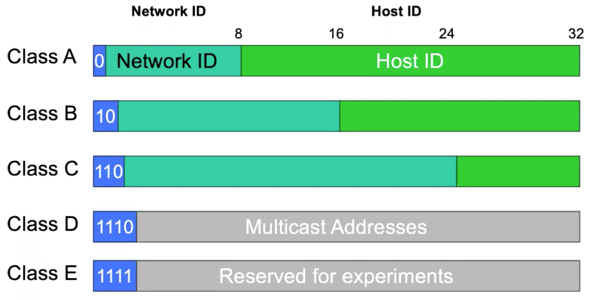
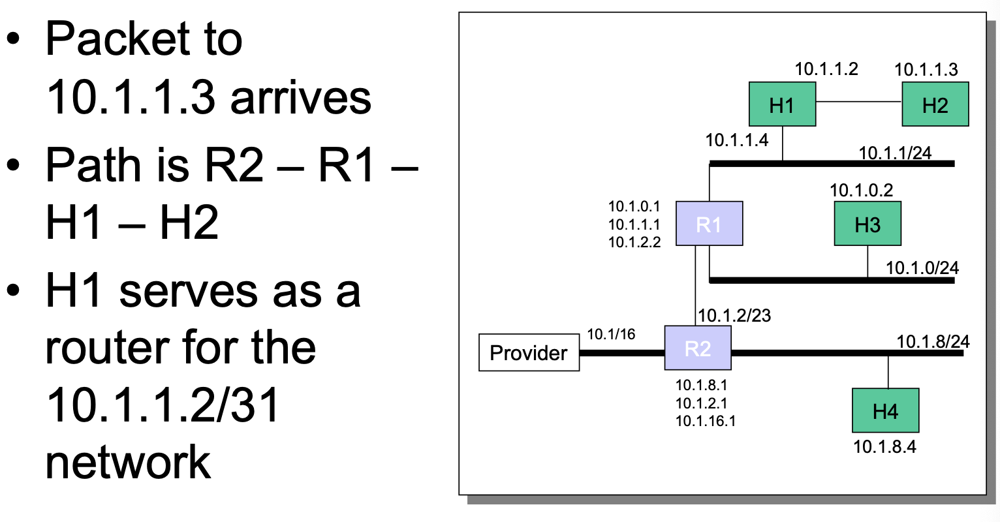
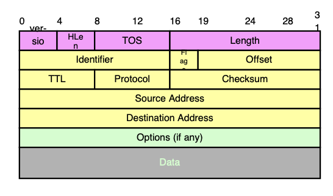

# Lecture 9 IP 1

## Internet Protocol

* Internet - Interconnection of separately managed networks using routers
* Send packets from source to destination by hopping through networks
  * Network layer responsibility
* IP creates abstraction layer that hides underlying technology from network application software
  * Waist of the hourglass

## Traditional IP Addressing

### Forward Packets

* Table of virtual circuits
* Source routing
* Forward table with one entry per global destination address (IP)
  * Routers keep next hop for destination
  * Packets carry destination address

### Source Routing

* List entire path in packet
* Router processing
  * Strip first step from packet and examine next step in directions and forward
* Rarely used
  * Endpoints need to know a lot about the network

### Addressing in IP

* IP addresses identify interfaces
* Domain Name System (DNS) names are names of hosts
* DNS binds hostnames to interfaces
* Routing binds interface addresses to paths

### Address Format Options

* Flat addresses - one address for every host
* Hierarchical - add structure

### Original IP Route Lookup

* Address specifies prefix for forwarding table
* Forwarding table contains
  * List of class + network entries
  * A few fixed prefix lengths (8/16/24)
  * Table is still too large

### Subnet Addressing

* Class A & B networks too big
* Need simple way to get multiple networks
  * Use bridging, multiple IP networks or split up single network address ranges (subnet)
* Add another layer to hierarchy
* Variable length subnet masks
* Subnetting is done internally in the organization

## Classless Inter-Domain Routing (CIDR)

* Arbitrary split between network & host part of address -> more efficient use of address space
  * Use prefix that is propagated by routing protocol
* Merge forwarding entries -> smaller forwarding table
  * Use single entry for range in forwarding tables even if they belong to different destination networks
* Longest prefix match (Legacy)
* e.g., Network is allocated 8 class C chunks, 200.10.0.0 to 200.10.7.255
  * Network address is 21 bits: 201.10.0.0/21
  * Replaces 8 class C routing entries with 1 entry

### How to Get One IP Address

* ISP gets block of addresses from Regional Internet Registries (RIRs)
* A single host's IP address is assigned by sys admin
* Dynamic Host Configuration Protocol (DHCP): dynamically get address
  * Host broadcasts "DHCP discover"
  * DHCP server responds with "DHCP offer"
  * Host request IP address "DHCP request"
  * DHCP server sends address "DHCP ack"

### Host Routing Table

### Routing to the Network

## IP Headers

### IP Service Model

* Datagram
  * Each packet self-contained
* Best effort service
  * Network will do its best to get packet to destination
* Scales very well
* Higher level protocols must make up for shortcomings

### IPv4 Header Fields

* Version: IP Version (4 for IPv4)
  * Header format can change with versions
* HLen: Header length (typically 5)
* TOS: Type of Service (Priority information)
* Length: Packet Length (Bytes including header)
  * Length field limits packets to 65,535 bytes
* Identifier, flags, fragment offset -> used for fragmentation
  * Identification to match up with other fragments
  * Flags (there is a flag for avoiding fragment)
  * Fragment offset (where this fragment lies in entire IP datagram)
* Time to live
  * Packets with TTL=0 are thrown away
* Protocol
  * Demultiplexing to higher layer protocols
  * TCP=6, ICMP=1, UDP=17
* Header checksum
  * Ensures some degree of header integrity
* Source and destination IP addresses
* Options
  * e.g., source routing, record route

### IP Fragmentation

* Every network has own Maximum Transmission Unit (MTU)
  * e.g., Ethernet is 1500 bytes
* When hit network with small MTU, router fragments packet
* Note that IP header occupies 20 bytes

### Fragmentation is Harmful

* Uses resources poorly
  * Poor end-to-end performance
  * Loss of a fragment results in loss of the packet
* Path MTU discovery protocol -> determines minimum MTU along route
  * Uses ICMP error messages