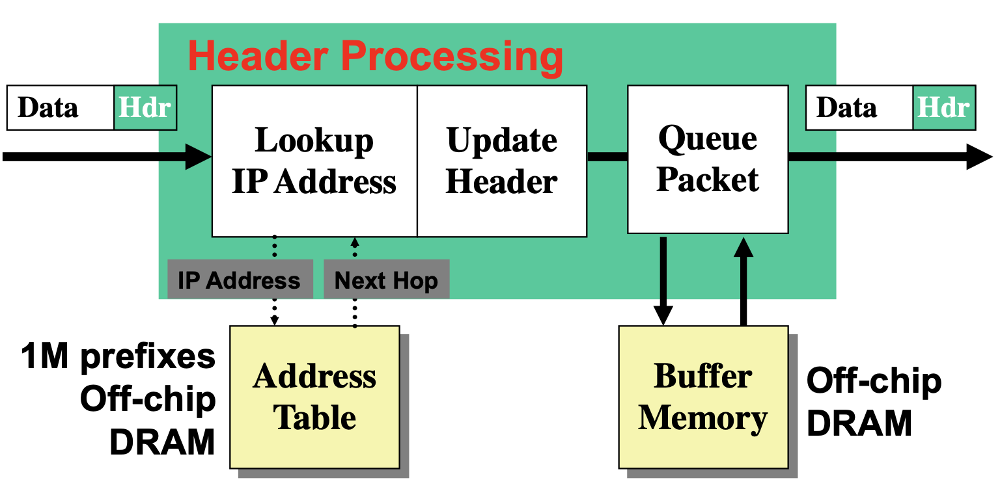
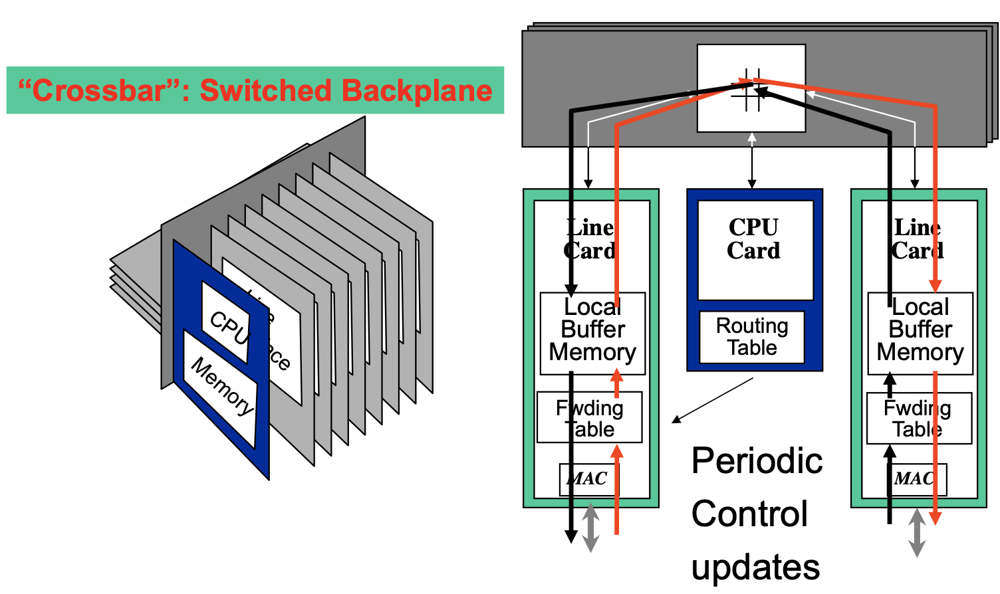
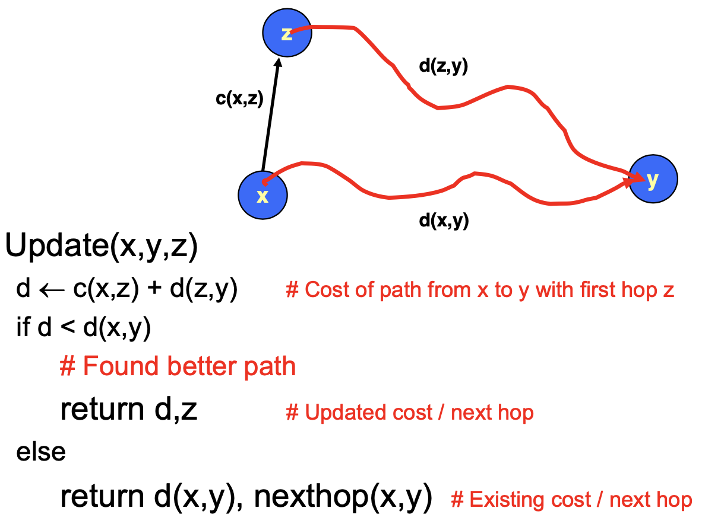

# Lecture 10 IP 2

## IP Routing

### Generic Forwarding Architecture

### Third Generation Routers

### Graph Model

* Represent each router as node
* Direct link between routers represented by edge

### Ways to Compute Shortest Paths

* Centralized
  * Use standard graph algorithm and collect graph structure in one place
* Link-state
  * Every node collects complete graph structure
  * Each computs shortest paths from it
  * Each generates its own routing table
* Distance-vector
  * Nodes construct their own tables iteratively
  * Each sends information about its table to neighbors

### Link State Protocol

* Every node gets complete copy of graph
  * Every node floods network with data about its outgoing links
* Every node computes routes to every other node

#### Dijkstra's Algorithm

* Shortest Path First Algorithm
  * Traverse graph in order of least code from source
  * Determine leaset cost path from source node s to every node v

#### OSPF Routing Protocol

* Open Shortest-path First
* OSPF has fast convergence when configuration changes
* OSPF reliable flooding
  * Transmit link state advertisements
  * When should it be performed
    * Periodically
    * When status of link changes
  * What happens when router goes down and comes back up
    * Router will send out LSAs with number 0

### Distance-Vector Method

* At any time, have cost/next hop of best known path to destination
* Link cost changes:
  * Node detects local link cost change and updates distance table
  * Good news travels fast
  * Bad news travels slow
* Poison reverse
  * Iterations don't converge
  * Count to infinity problem
  * Solution: make "infinite" smaller

#### Bellman-Ford Algorithm

* Repeat
  * For every node x
    * For every neighbor z
      * For every destination y
        * d(x,y) = Update(x, y, z)
* Until converge

### Comparison of Link-state and Distance-vector

* Message complexity
  * Link-state: with n nodes, E links, O(nE) messages
  * Distance-vector: exchange between neighbors only
* Speed of Convergence
  * Link-state: Relatively fast
    * Complex computation, but can forward before computation
    * May have transient loops
  * Distance-vector: convergence time varies
    * May have routing loops
    * Count-to-infinity problem
    * Faster with triggered updates
* Space requirements
  * Link-state: maintains entire topology
  * Distance-vector: maintains only neighbor state
* Robustness (router malfunctions)
  * Link-state: node can advertise incorrect link cost
    * Each node computes its own table
  * Distance-vector: node can advertise incorrect path cost
    * Each node's table used by others (error propagates)

## Internet Control Message Protocol (ICMP)

* Short messages used to send error & other control information
* IP MTU discovery with ICMP
  * When successful, no reply at IP level
* Base-level protocol (IP) provides minimal service level
  * Each step involves determining next hop
* ICMP provides low-level error reporting