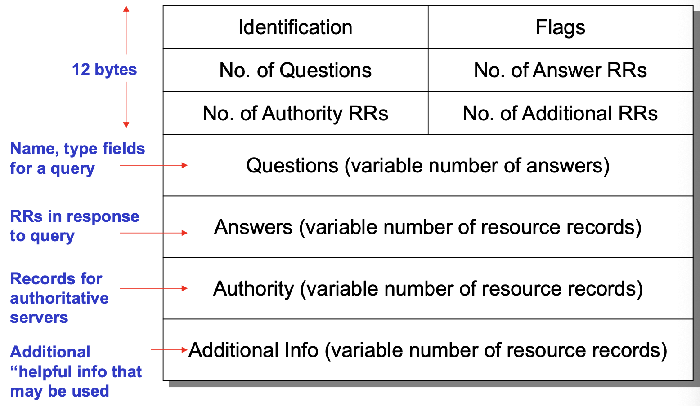
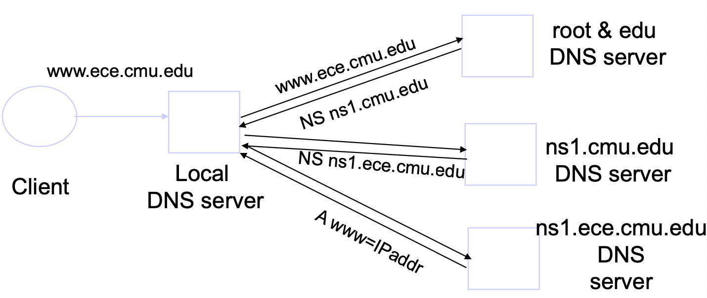
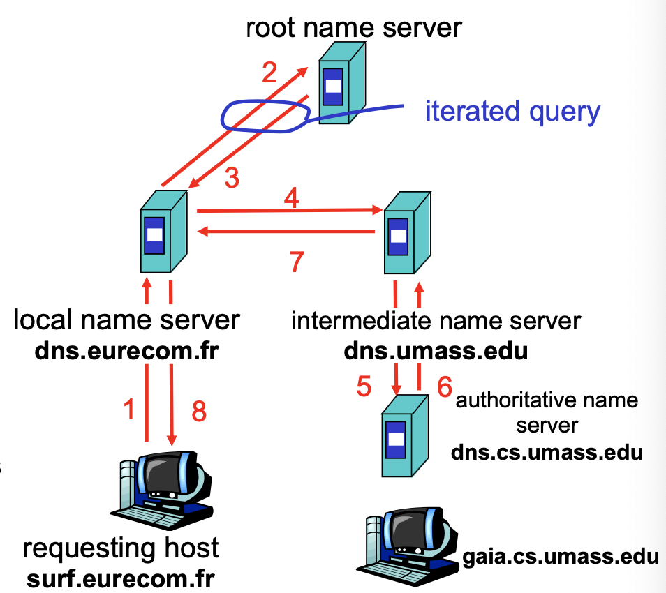

# Lecture 12 IP 4

## Translation: Connect IP to Other Layers

### Address Resolution Protocol (ARP)

* IP to MAC address translation
* Broadcast search for IP address
* Destination responds with appropriate 48-bit Ethernet address
* Caching ARP Entries
  * Eash host maintains cache of ARP Entries
* Proxy ARP
  * Local router sees ARP request
  * Uses IP addressing to locate host, i.e., which subnet
  * Replies with its own MAC address - becomes Proxy for remote host

### Domain Name System (DNS)

* Basically a wide-area distributed database
* Scalability (Decentralized maintenance)
* Conceptually, programmers can view the DNS database as a collection of millions of host entry structures
* Different kinds of mappings are possible

#### DNS Records

* RR format: (class, name, value, type, ttl)
* Type=A
  * name is hostname
  * value is IP address
* Type=NS
  * name is domain
  * value is name of authoritative name server for this domain
* Type=CNAME
  * name is an alias name for some "canonical" name
  * value is canonical name
* Type=MX
  * value is hostname of mailserver associated with name

#### DNS Message Format

* Identification
  * Used to match up request/response
* Flags
  * 1-bit to mark query or response
  * 1-bit to mark authoritative or not
  * 1-bit to request recursive resolution
  * 1-bit to indicate support for recursive resolution

#### DNS Design

* Each node in hierarchy stores a list of names that end with same suffix
* Zone: contiguous section of name space
  * A zone has an associated set of name servers
* Zones are created by convincing owner node (parent) to create/delegate a sub zone
* Root name servers
* Local name servers contact root servers when they cannot resolve a name
* Each host has a resolver linked into application

#### DNS Resolution Steps

* Steps for resolving www.cmu.edu
  * Application calls gethostbyname()
  * Resolver contacts local name server (S1)
  * S1 queries root server S2 for (www.cmu.edu)
  * S2 returns NS record for cmu.edu (S3)
  * What about A record for S3?
    * This is what the addtional information section is for (Prefetching)
  * S1 queries S3 for www.cmu.edu
  * S3 returns A record for www.cmu.edu

#### Workload and Caching

* Not all servers/names are equally popular
* DNS responses are cached
  * Quick response for repeated translations
* DNS negative queries are cached
  * Don't have to repeaet pas mistakes
* Cached data periodically times out
  * TTL of data controlled by owner of data
* Responses can include addtional information
  * Often used for prefetching

#### Reliability

* DNS servers are replicated
  * Queries can be load balanced between replicas
* UDP used for queries
* Try alternate servers on timeout
  * Exponential backoff when retrying same server

