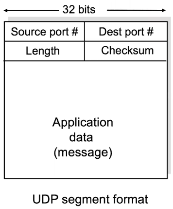
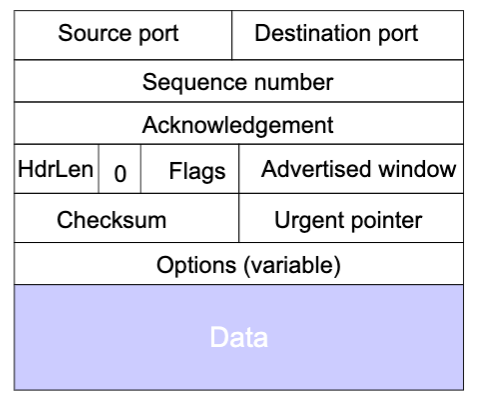
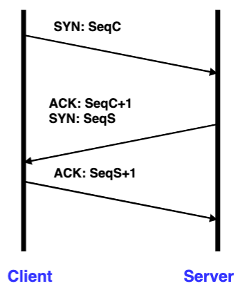
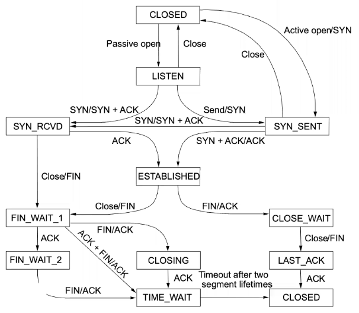
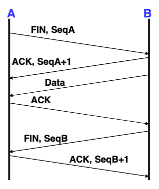
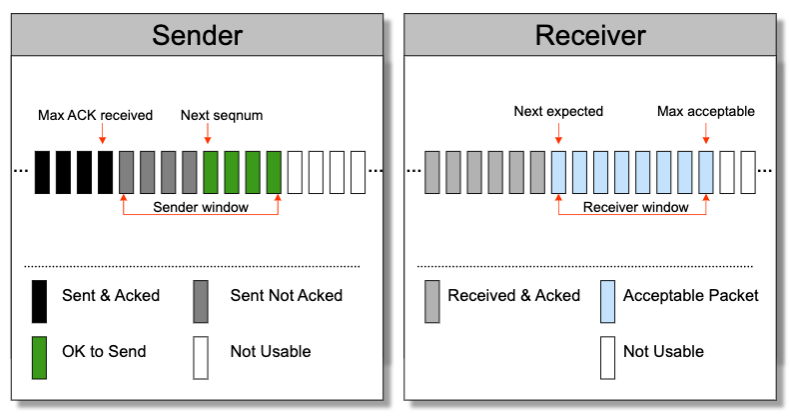
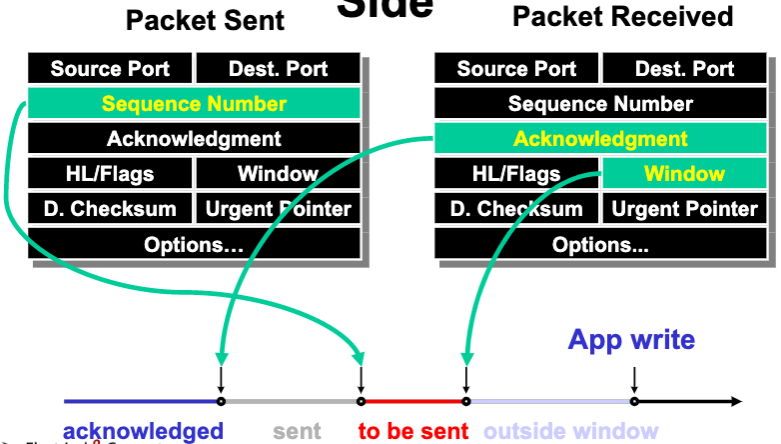

# Lecture 14 Transport 1

## Transport Introduction

* Lowest level end-to-end protocol
* Routers view transport header as part of the payload
* Functionality split
  * Network provides best-effort delivery only
  * End-systems must implement many functions
  * e.g., Demultiplexing, Error detection, Error recovery, In-order delivery, Message boundaries, Connection abstraction, Congestion control

### User Datagram Protocol (UDP)

* Demultiplexing based on ports
* Optional checksum (One's complement add)
* No connection -> no delay, state
* No congestion control -> can lead to unpredictable delays

### TCP and its Header

* Demultiplexing
* Connections (sequence number)
* Reliable (acks, checksum)
* Flow control (window)

## Error Recovery and Flow Control

### Connection Establishment

#### Sequence Number Space

* Each byte in byte stream is numbered
* TCP breaks up the byte stream into packets
  * Packet size is limited to the Maximum Segment Size
* Each packet has a sequence number to indicate where it fits in the byte stream

#### Three-Way Handshakes

* Each side notifies other of starting sequence number it will use for sending
  * Not simply 0 -> Must avoid overlap with earlier incarnation & Security issues
* Each side acknowledges other's sequence number
  * SYN-ACK: Acknowledge sequen number + 1
* Can combine second SYN with first ACK

#### Tearing Down Connection

* Either side can initiate tear down
  * Send FIN signal
* Other side can continue sending data
  * Half open connection
  * Must continue to acknowledge
* Acknowledging FIN
  * Acknowledge last sequence number + 1

### Stop-and-Wait

* Stop and wait offers flow and error control
* Overcome the limitation of one packet per roundtrip time: Sliding Window
* Distinguish new and duplicate packets: Sequence Number
* Max Throughput = Window Size / Roundtrip Time

### ACK and Retransmission Strategies

* ACKs acknowledge exactly one packet
  * Must keep per packet state
* Cumulative acks acknowledge all packets up to a specific packet
* Negative ACKs allow a receiver to ask for a packet that is presumed to be lost
  * Avoids the delay associated with a timeout
* Selective repeat
  * Receiver indivisually acknowledges correctly received packets
  * Sender only resends packets for which ACK not received
* Go-Back-N recovery
  * Receiver sends cumulative ACKs
    * When out of order, send nothing
  * Sender implements Go-Back-N recovery
    * Set timer upon transmission of packet
    * Retransmit all unacknowledged packets on timeout
  * Performance during loss recovery
    * No longer have an entire window in transit
* Duplicate ACKs (Fast Retransmit)
  * Loss, Packet re-ordering, Window update can lead to duplicate ACKs
* Selective ACK (SACK)
  * Add a bitmask of packets received
  * Still need to deal with reordering -> wait for out of order by 3 packets

