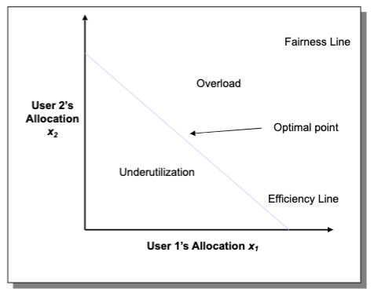
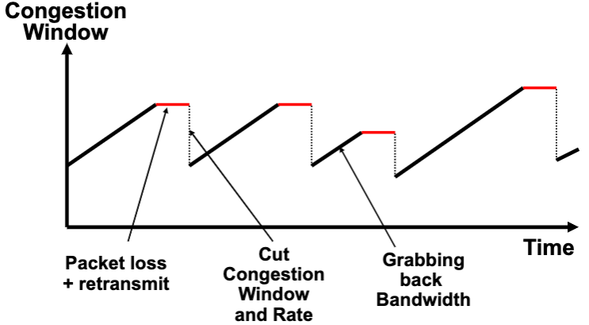
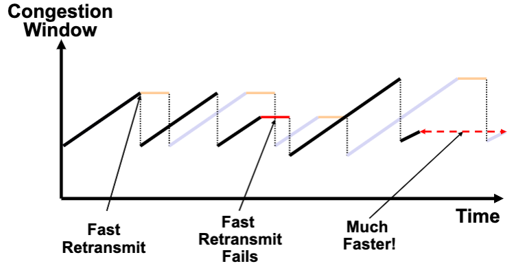

## Lecture 15 Transport 2

## Congestion Control

### Congestion & Causes

* Lost packets (buffer overflow at routers)
* Long delays (queuing in router buffers)
* Can result in throughput less than bottleneck link -> congestion collapse
  * Spurious retransmissions of packets still in flight
  * Undelivered packets
* When packet dropped, any upstream transmission capacity used for that packet was wasted

### Congestion Control and Avoidance

* End-to-end congestion control
  * Congestion inferred from end-system observed loss, delay -> taken by TCP
* Network-assisted congestion control
  * Routers provide feedback to end systems -> makes routers more complicated

### Contestion Control with Binary Feedback (TCP)

* FIFO scheduling with shared buffer pool
* Feedback through packet drops (binary feedback)
* TCP interprets packet drops as signs of congestion and sender slows down
* Sender periodically probes the network to check whether more bandwidth has become available
* Objectives: Simple router behavior, Efficiency, Fairness, Convergence

### Linear Control

* Examine simple linear controls
  * Window(t+1) = a+b Window(t)
* Support various reaction to signals
  * Increase/decrease additively
    * Additive increase improves fairness
    * Additive decrease reduces fairness
  * Increase/decrease multiplicatively
* Constraints limit to AIMD (MAIMD) -> Moves toward optimal point

### TCP Congestion Control

* Implicit feedback and AIMD
* Distributed, fair, and efficient
* Packet loss is seen as sign of congestion and results in a multiplicative rate decrease: factor of 2
* TCP periodically probes for available bandwidth by increasing its rate: by one packet per RTT
* TCP packet pacing
  * Congestion window helps to pace the transmission of data packets
  * In steady state, a packet is sent when an ACK is received

#### Congestion Avoidance

* If loss occurs when cwnd = W
  * Network can handle 0.5W~W segments
  * Set cwnd to 0.5W (multiplicative decrease)
* Upon receiving ACK
  * Increase condo by 1 packet/cwnd (RTT)
* Implements AIMD

### Slow Start

* Slow start packet pacing at start
  * Initialize cwnd = 1
  * Upon receipt of every ack, cwnd = cwnd + 1
  * Packet loss means you are going too fast
* Allows TCP to quickly find a good window size
  * Exponential increase
  * Reaches W in RTT * log_2(W)

### Fast Recovery

* With fast retransmit, TCP can often avoid timeout, but loss signals congestion -> cut window in half
* Each duplicate ACK notifies sender that a single packet has cleared the network
* When < new cwnd packets are outstanding, allow new packets out with each new duplicate acknowledgement

