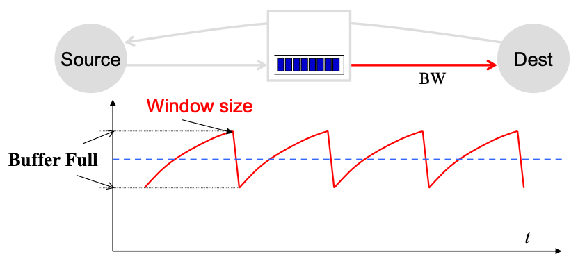

# Lecture 16 Transport 3

## Transport Performance & Congestion Control

* Can TCP saturate a link?
* Congestion control
  * Increase utilization until link becomes congested
  * Buffer should hold enough data to keep pipe full
  * Buffer is full when packet loss occurs: at top and bottom
  * Buffer is empty in middle - when throughput = Bandwidth * RTT
  * But "roundtrip delay" also changes due to queuing delay
* Buffer size
  * With sufficient buffering we achieve full link utilization
  * The window is always above the critical threshold
  * Buffer Size = Height of TCP Sawtooth
  * Rule-of-thumb: buffer=BW*RTT
  * Routers queues play critical role, not just to deal with bustiness of traffic, but also to allow TCP to fully utilize bottleneck links

## TCP Extensions

* How was TCP able to evolve?
  * Change endpoint behavior only
    * Fast retransmit, congestion control (implicit feedback, AIMD)
  * Use options to add information to the header
    * SACK
  * Change the header
    * e.g., Explicit Congestion Notification
* High throughput requires large windows
* Window Scaling (large window option)
* Protection from wraparound timestamp option

### TCP Performance Issues

* Consistently full queues can degrade TCP performance
  * Increased queueing delay
  * Lots of ongoing work on reducing buffer sizes
* Detection of congestion requires a packet loss - seem undesirable
* Bursts of packet losses can synchronize TCP sessions

### Random Early Detection (RED)

* Start randomly dropping packets before queue is full
  * Some flows will observe a single packet loss and slow down, hopefully avoiding queue overflow
* Improves overall network performance by avoiding that queues stay full

### Explicit Congestion Notification (ECN)

* The goal is to provide explicit congestion notification to senders
* Bits 6-7 of the TOS bit form the ECN field
  * ECN-Capable Transport (ECT) bit
  * Congestion Experience (CE) bit
  * Reinterpret bits in header is a major obstacle to deployment
* ECN is received by receiver, who must forward ECN info to the sender
* RED and ECN compliment each other

## TCP Performance Model

* Loss rate: Affects how often window is reduced
* RTT: Affects increase rate and relates bandwidth to window
* RTO (Retransmission Timeouts): Affects performance during loss recovery
* MSS (Maximum segment size): Affects increase rate

## Beyond Basic TCP

### TCP Friendly

* TCP is not going away any time soon
* Any congestion control must compete with TCP

### TCP Reality

* Most file transfers are very small
  * TCP never reaches steady state - slow start dominates
* TCP-fairness is calculated on a per flow basis
  * Many browsers open parallel TCP sessions
* TLS is widely used - adds 1-2 RTT handshake
  * Starts after the TCP handshake
* Motivates the design of new transport protocols