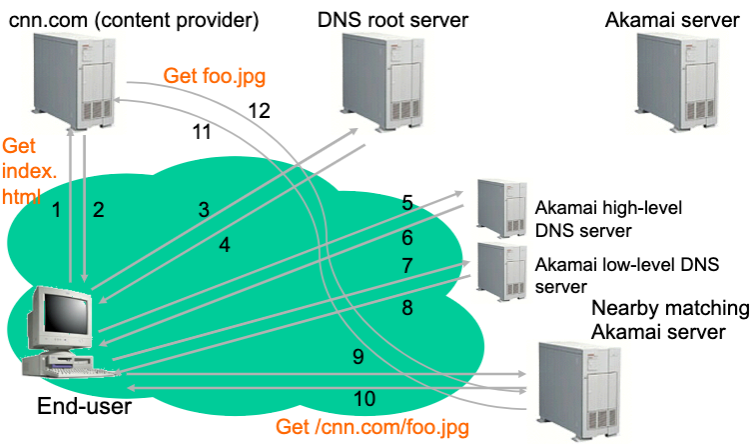
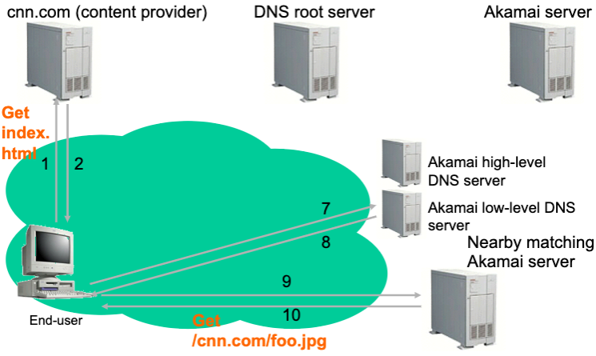

# Lecture 18 Content Delivery 2

## Skype

* Support pc-to-pc, pc-to-phone, phone-to-pc VoIP and IM client communication
* Challenges include dealing with NATs, firewalls and scalability
* NAT and firewall traversal
* Calls between traditional telephone and internet devices
  * SkypeOut (pc-to-phone)
  * SkypeIn (phone-to-pc)
* Scale management of user state

### The Skype Network

* Ordinary host (OH)
  * A Skype client (SC)
* Super nodes (SN)
  * A Skype client (SC) that has public IP address, sufficient bandwidth, CPU and memory
* Login server
  * Store Skype ids, passwords, and buddy lists
  * Used at login for authentication

### Host Cache

* IP address and port number of online Skype nodes (SNs)
* Maximum size: 200 entries (for ordinary nodes)
* Login server IP address and port number

### Skype Components: Ports

* Ne default listening port
* Opens TCP listener sockets at port 80 (HTTP) and port 443 (HTTPS)

### Call Establishement

* Call signaling always carrried over TCP and goes end-to-end
* Public-public call
  * Caller SC establishes a TCP connection with callee SC
* Public-NAT
  * Caller->Super node->Callee
  * TCP connections established between caller, callee, and more than one Skype nodes
* Firewall-firewall call
  * Same as public-NAT but no UDP packets
* Calls to non buddies = search + call

### User Search

* From the Skype website
  * Guaranteed to find a user if it exists and logged in the last 72 hours
* If user does not exist, Skype contacts login server for failed searches
* SN searches for a user behind UDP-restricted firewall

### Media Transfer

* Silence packets
* Putting a call on hold
  * 1 packet / 3 seconds to call-peer or Skype node
* Codec frequency range
  * 50-8,000Hz (total bandwidth of 3 kilobytes/s)
* Reasonable call quality at (4-5 kilobytes/s)

## Zoom

* Similar to Skype - replace supernode by "zoom meeting connector"
* Distributed, cloud (AWS) based services for scaling connectors
* One VM per meeting to multiplex
* Metadata (user data, meeting data) is available at public cloud
* Uses HTTPs or TLS+TCP

### Where Zoom Wins

* Scalability: Up to 1000 users, stems mainly from AWS scalability
  * Spawn more VMs across machines to mediate big meetings
* User interface + cross-platform
* Ease of use (without having a login ID)

## Content Delivery Network (CDN)

* CDNs replicate content for their customers (content providers)
* CDN company installs hundreds of CDN servers throughout Internet
* When provider updates content, CDN updates servers
* Potential benefits
  * Very good scalability (Near infinite if deployed properly)
  * Good economies at large scales
    * Infrastructure is shared efficiently by customers
    * Statistical multiplexing: hot sites use more resources
  * Avoids congestion and long latencies
  * Can be extremely reliable
    * Very high degree of redundancy
    * Can mitigate some DoS attacks

### Edge Servers

* Region - set of caches managed as a cluster
* Availability is a major concern in architecture
* Dealing with server failures (backup server)
* Redundancy at the network level

### Content Delivery Bottlenecks

* First Mile Problem
* Backbone Problem
* Peering Problem
* Last Mile Problem

### Akamai Process Flow

* User requests content and is mapped to optimal edge server
* If content is not present in the region, it is requested from most optimal core region
* Core region makes one request back to origin server
* Core region can serve many edge regions with one request to origin server
* -> Reduce traffic back to origin server
* -> Improve end-user response time

### Mapping: Server Selection

* Which server?
  * Lowest load -> to balance load on servers
  * Best performance -> to improve client performance
  * Any alive node -> to provide fault tolerance
* How to direct clients to a particular server?
  * As part of routing -> anycast, cluster load balancing
  * As part of application -> HTTP redirect
  * As part of naming -> DNS
* Application based
  * HTTP supports simple way to indicate that Web page has moved (30X responses)
  * May introduce additional overhead -> multiple connection setup, name lookups
* Name based
  * Client does name lookup for service
  * Name server chooses appropriate server address
  * Server load/location -> must be collected
* Mapping Algorithms
  * Packet Loss + Throughput + Latency
  * Listed in order of importance

### How Akamai Works

