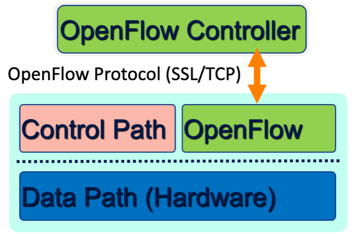

# Lecture 19 SDN & NFV

## Software-Defined Networking (SDN)

* Idea: An OS for Networks
  * Network Operating System + Simple Packet Forwarding Hardware
  * Software-Defined Networking (SDN)

## OpenFlow

* Enabling innovation in campus network
* Like hardware drivers
* Match-Action Paradigm
* Switching/Routing/Firewall
* Standard way to control flow-tables in commercial switches and routers
* Just need to update firmware
* Essential to the implementation of SDN

### Status of SDN

* Centralized/Distributed Control
* Hardware support
* Industry support

## Network Functions Virtualization (NFV)

* Network Functions
  * Reduced Capex
  * Reduced time to market
  * Elastic scaling
  * Targeted services
  * Openness (vendor neutrality)
  * Streamlining operations
* Key Enablers
  * Cloud + Virtualization
  * Commodity/high volume servers

### SDN vs. NFV

* Complementary
* SDN is all about control plane
* NFV can happen without SDN
* SDN enables orchestration, routing
* NFV can be the substrate over which SDN runs

### Consolidation

* Consolidate platform
  * Proxy, Firewall, IDS/IPS, AppFilter
  * Decouple hardware and software
  * Consolidation reduces Capex and sprawl
  * Enables extensibility (reusable modules)
* Consolidate management
  * Enables flexible resource allocation
  * Network-wide distribution reduces load imbalance
* CoMb System Overview
  * Middlebox: complex, heterogeneous, new opportunities
  * Goal: Balance load across network, Leverage multiplexing, reuse, distribution
  * Policy Constraints, Resource Requirements, Routing, Traffic -> Network-wide Controller
  * A simple, tractable linear program -> Very close (< 0.1%) to theoretical optimal