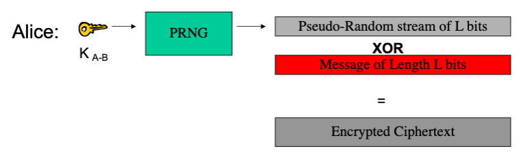
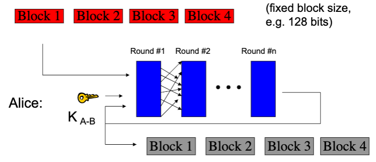
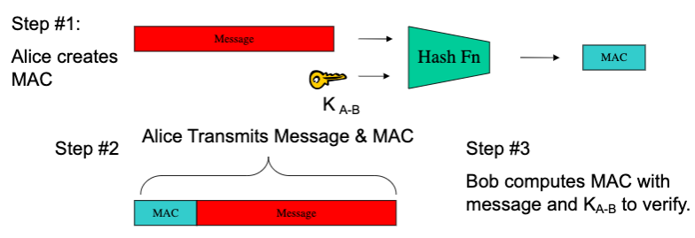
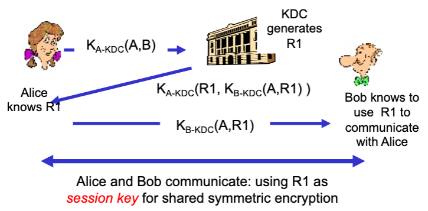
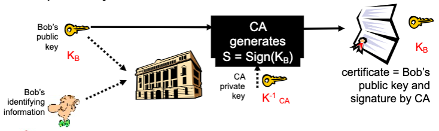
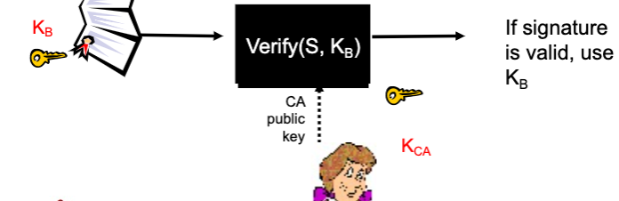
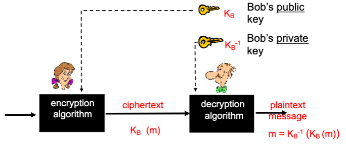
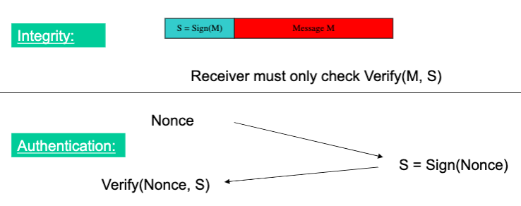
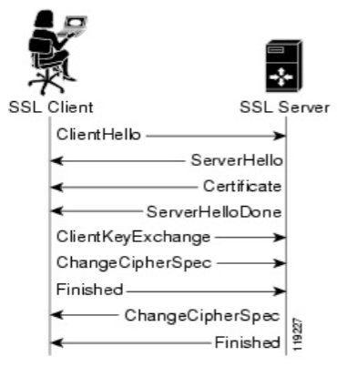

# Lecture 20 Security

## Secure Communication Channel

* Authentication (Who am I talking to?)
* Confidentiality (Is my data hidden?)
* Integrity (Has my data been modified?)
* Availability (Can I reach the destination?)

## Cryptography

|                            | Symmetric Crypto (Private key e.g., AES) | Asymmetric Crypto (Public key e.g., RSA) |
| -------------------------- | ---------------------------------------- | ---------------------------------------- |
| Shared secret              | Yes                                      | No                                       |
| Speed of crypto operations | Fast                                     | Slow                                     |

## Symmetric Key Crypto

### One-time Pad

* One-time Pad (OTP) is proven "information-theoretically secure"
  * No information provided about the message other than its length
* All ciphers suffer from assumptions, but one-time pads are impractical to maintain

### Ciphers

* In pratice, two types of ciphers are used that require constant length keys:
  * Stream Ciphers (e.g., RC4, A5)
    * 
  * Block Ciphers (e.g., DES, AES)
    * 

### Hash Functions

* Consistent: $hash(X)$ always yields same result
* One-way: given Y, can't find X such that $hash(X) = Y$
* Collision resistant: given $hash(W) = Z$, can't find X such that $hash(X) = Z$

### Hash Message Authentication Code (HMAC)

### Nonce

* A random bit string used only once
* Alice sends nonce to Bob as a challenge
* Bob replies with fresh MAC result

### Symmetric Key Crypto Review

* Confidentiality: Stream & Block Ciphers
* Integrity: HMAC
* Authentication: HMAC and Nonce
* Problems:
  * Number of keys scales as $O(n^2)$
  * How to securely share keys in the first place?

### Symmetric Key Distribution

#### Key Distribution Center (KDC)

* Server shares different secret key with each registered user
* Alice, Bob know own symmetric keys, $K_{A-KDC}$, $K_{B-KDC}$, for communicating with KDC
* Centralized trust and point of failure

#### Certification Authorities

* Binds public key to particular entity, E
* An entity E registers its public key with CA
  * E provides "proof of identity" to CA
  * CA creates certificate binding E to its public key
  * Certificate contains E's public key AND the CA's signature of E's public key

* When Alice wants Bob's public key:
  * Gets Bob's certificate
  * Use CA's public key to verify the signature within Bob's certificate, then accepts public key

* Certificate Contents
  * Info algorithm and key value itself
  * Cert owner/issuer
  * Valid dates
  * Fingerprint of signature

## Asymmetric Key Crypto

* Instead of shared keys, each person has a "key pair"
  * 
  * The keys are inverses, so: $K_B^{-1}(K_B(m)) = m$
  * $K_B$ can safely be made public

### Sign & Verify

* If we are given a message M, and a value S such that $K_B(S) = M$
* The message must be from Bob, because it must be the case that $S = K_B^{-1}(M)$, and only Bob has $K_B^{-1}$
* This gives us two primitives:
  * $Sign(M) = K_B^{-1}(M) = Signature S$
  * $Verify(S, M) = test(K_B(S) == M)$
* We can use $Sign()$ and $Verify()$ in a similar manner as our HMAC in symmetric schemes

### Asymmetric Key Review

* Confidentiality: Encrypt with Public Key of Receiver
* Integrity: Sign message with private key of the sender
* Authentication: Entity being authenticated signs a nonce with private key, signature is then verified with the public key

## Transport Layer Security (TLS)

* Used for protocols like HTTPs
* Special TLS socket layer between application and TCP
* Handles confidentiality, integrity, and authentication
* Used hybrid cryptography

### Setup Channel with TLS Handshake

### Network Security Vulnerabilities

* Exist at every layer in the protocol stack
* Network-layer attacks
  * IP-level vulnerabilities
  * Routing attacks
* Transport-layer attacks
  * TCP vulnerabilities
* Application-layer attacks
* Denial of Service attacks

### Basic Tools

* Careful protocol design
  * Built in security
  * Limit resource use
* Firewalls limit access to edge networks
  * Default off policy limits access to network
* Intrusion detection systems monitor traffic
  * Generate signatures for known attacks