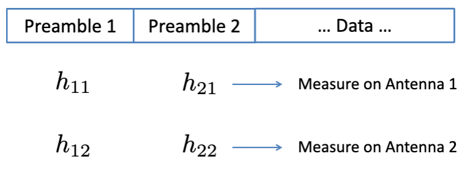
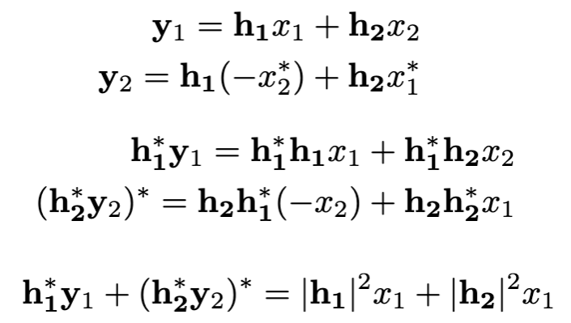
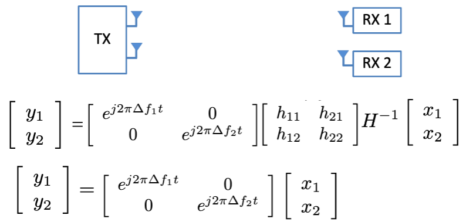
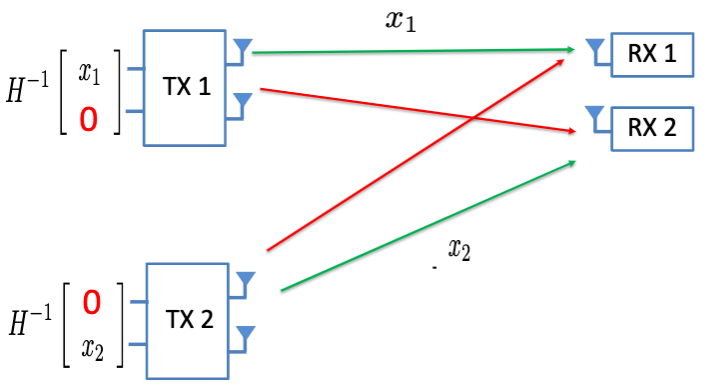
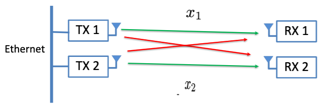

## Lecture 21 5G I

## Massive MIMO

* Multiple Input Multiple Output
* Gains of MIMO: n x more antennas -> n x more data
  * Assumption: H is invertible

### Estimating Channels

### Invertible Matrix

* Inverting large matrices is $O(n^3)$
* Different approach: "Zero forcing"
* Mathematically,
  * $(-h_{12}h_{21} + h_{11}h_{22})x_2 \propto x_2$
  * Advantage: Simple dot product vs. inversion
  * Disadvantage: Loss of power

### Alamouti Codes

### Frequency Offsets

* All frequency offsets are the same

### MU-MIMO

* More antennas = more capacity
  * Multiplexing
  * Power
  * Orthogonality (Invertible)
  * Nothing scales with the number of antennas
* Problem: RX1, RX2 don't care about $x_1$, $x_2$
* Each row has same offset
* Each Receiver can cancel out its own offset

### Null Steering

### Joint Decoding (SAM)

* No precoding at transmitter possible
* Receiver does all the work
* Challenge 1: Packets are asynchronous
  * "Zero-force" packet 1 -> Decode packet 2 -> Subtract packet 2 -> Decode packet 1
* Challenge 2: Medium access
  * Clients must allow collisions provided there are < N simultaneous transmissions
  * Joint decoding does this by "correlating with preamble" and counting users

### Distributed MIMO

### Scalability

* Scalable linear precoding
* No central data dependency
* Argos: Earliest many-antenna beamforming platform