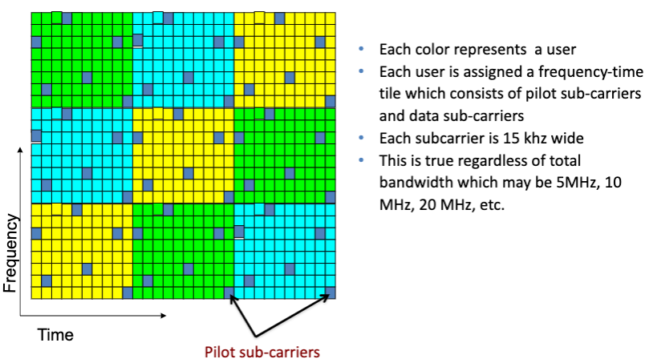

# Lecture 22 5G II

## LTE (OFDM-A)

## 5G NR

* NR uses modulation based on OFDM for both downlink and uplink
* Operation from quite low to very high bands: 0.4 - 100GHz
* Ultra wide bandwidth
* Native support for low latency and ultra reliability
* Flexible and modular RAN architecture
* Native end-to-end support for Network Slicing

## mm-wave

* Pros:
  * Gbps
  * Directional: focus beams
* Cons:
  * Mobility disrupts the network
  * Blockages can kill the link
* Next-generation Millimeter-wave Networks
  * 802.11ad/802.11ay/WirelessHD
  * Center at 60 GHz, up to 7 Gbps bitrate
* Enabling many demanding applications

### Field-of-View

* 60 GHz Phased-Array
  * Directional Steering Beam Patterns
    * But limited Field-of-View
    * Point-to-point, Stationary Links
* Impact of the FoV
  * Device orientation is critical for 60 GHz link performance
* Objective: Seamless Coverage and Mobility Support

### AP Selection

* Naive AP Probing
  * Large probing overhead and link outage
* Pose-Assisted Link Predictor
  * Determine the link condition based on AP's and client's poses
* Predicative AP Switcher
  * Proactively switch AP before link degrades
* Require APs' Poses
* AP-Pose Sensing
  * With only link-level measurement as input
  * Statistical Pose-searching Algorithm

### Interference Management

* Pose-Assisted Spatial Sharing
  * Derive the Beam Strength Vector (BSV) from poses of AP and client
* Dealing with environmental reflectors
  * Beams may be redirected by reflectors
  * Reflector Sensing Scheme
  * Locate positions of major reflectors

### Blockage: mm-wave Flyways

* Goal: Flyways
  * To enable a network with an oversubscribed core to act like a non-oversubscribed network by dynamically injecting high-bandwidth links
* Link Bloackage by small obstacles (> 2.5mm)
* Radio Interference
* 3D Beamforming: Connect racks by reflecting signal off the ceiling
* Impact of Ceiling Height
  * Higher ceiling increases signal arrival angle -> smaller interference region
  * Also has longer propagation path -> signal degradation