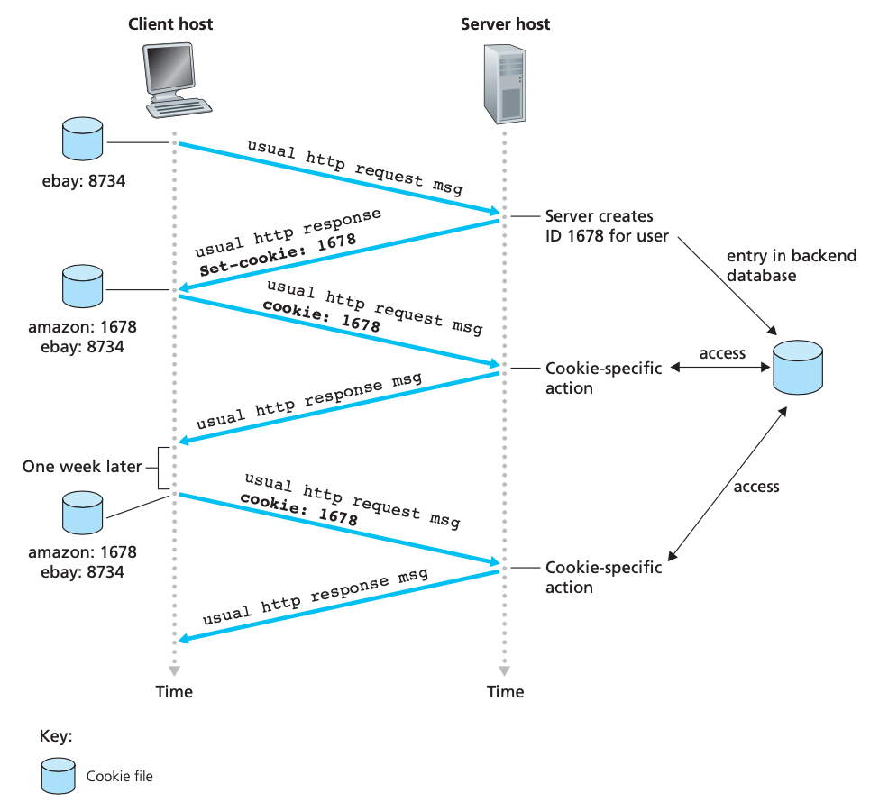
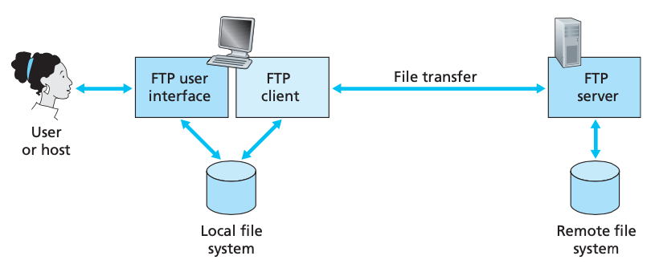
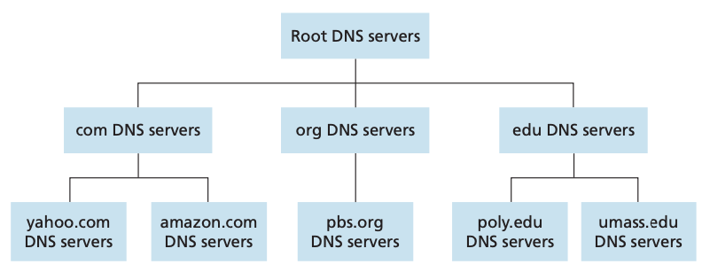
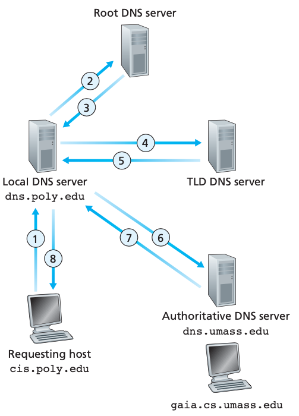

# Chapter 2 Application Layer

## Principles of Network Applications

* At the core of network application development is writing programs that run on different end systems and communicate with each other over the network

### Network Application Architectures

* In a **client-server architecture**, there is an always-on host, called the *server*, which services requests from many other hosts, called *clients*
  * The server has a fixed, well-known address, called an IP address
  * A **data center**, housing a large number of hosts, is often used to create a powerful virtual server
* In a **P2P architecture**, there is minimal (or no) reliance on dedicated servers in data centers
  * The application exploits direct communication between pairs of intermittently connected hosts, called *peers*
  * **self-scalability**
  * Challenges
    * Most residential ISPs have been dimensioned for “asymmetrical” bandwidth usage, that is, for much more downstream than upstream traffic
    * Because of their highly distributed and open nature, P2P applications can be a challenge to secure
    * The success of future P2P applications also depends on convincing users to volunteer bandwidth, storage, and computation resources to the appli- cations

### Processes Communicating

* Processes on two different end systems communicate with each other by exchang- ing **messages** across the computer network
* A sending process creates and sends mes- sages into the network; a receiving process receives these messages and possibly responds by sending messages back
* **Client and Server Processes**
  * In the context of a communication session between a pair of processes, the process that initiates the communication (that is, initially contacts the other process at the beginning of the session) is labeled as the **client**
  * The process that waits to be contacted to begin the session is the **server**
* **The Interface Between the Process and the Computer Network**
  * A process sends messages into, and receives messages from, the network through a software interface called a **socket**
  * A socket is the interface (API) between the application layer and the transport layer within a host
  * The only control that the application developer has on the transport-layer side is
    * the choice of transport protocol
    * perhaps the ability to fix a few transport-layer parameters such as maximum buffer and maximum segment sizes
* **Addressing Processes**
  * The host is identified by its **IP address**
  * A destination **port number** serves the purpose of identifying the receiving process

### Transport Services Available to Applications

* The application at the sending side pushes messages through the socket
* At the other side of the socket, the transport-layer protocol has the responsibility of getting the messages to the socket of the receiving process
* **Reliable Data Transfer**
  * When a transport-layer protocol doesn’t provide reliable data transfer, some of the data sent by the sending process may never arrive at the receiving process
  * This may be acceptable for **loss-tolerant applications**
* **Throughput**
  * Applications that have throughput requirements are said to be **bandwidth-sensitive applications**
  * While bandwidth-sensitive applications have specific throughput requirements, **elastic applications** can make use of as much, or as little, throughput as happens to be available
* **Timing**
  * A transport-layer protocol can also provide timing guarantees
* **Security**
  * Finally, a transport protocol can provide an application with one or more security services

### Transport Services Provided by the Internet

* The Internet (and, more generally, TCP/IP networks) makes two transport protocols available to applications, UDP and TCP

| Application                           | Data Loss     | Throughput                                 | Time-Sensitive    |
| ------------------------------------- | ------------- | ------------------------------------------ | ----------------- |
| File transfer/download                | No loss       | Elastic                                    | No                |
| E-mail                                | No loss       | Elastic                                    | No                |
| Web documents                         | No loss       | Elastic                                    | No                |
| Internet telephony/Video conferencing | Loss-tolerant | Audio: few kbps-1Mbps; Video: 10kbps-5Mbps | Yes: 100s of msec |
| Streaming stored audio/vide           | Loss-tolerant | Same as above                              | Yes: few seconds  |
| Interactive games                     | Loss-tolerant | Few kbps-10kbps                            | Yes: 100s of msec |
| Instant messaging                     | No loss       | Elastic                                    | Yes and no        |

* **TCP Services**
  * Includes a connection-oriented service and a reliable data transfer service
  * After the handshaking phase, a **TCP connection** is said to exist between the sockets of the two processes
  * When one side of the application passes a stream of bytes into a socket, it can count on TCP to deliver the same stream of bytes to the receiving socket, with no missing or duplicate bytes
  * Also includes a congestion-control mechanism
* **UDP Services**
  * UDP is a no-frills, lightweight transport protocol, providing minimal services
  * UDP is connectionless, so there is no handshaking before the two processes start to communicate
  * UDP provides an unreliable data transfer service
  * Furthermore, messages that do arrive at the receiving process may arrive out of order
  * UDP does not include a congestion-control mechanism

### Application-Layer Protocols

* An **application-layer protocol** defines how an application’s processes, running on different end systems, pass messages to each other
  * The types of messages exchanged, for example, request messages and response messages
  * The syntax of the various message types, such as the fields in the message and how the fields are delineated
  * The semantics of the fields, that is, the meaning of the information in the fields
  * Rules for determining when and how a process sends messages and responds to messages

## The Web and HTTP

### Overview of HTTP

* The **HyperText Transfer Protocol (HTTP)**, the Web’s application-layer protocol, is at the heart of the Web
* HTTP is implemented in two programs: a client program and a server program
* A **Web page** (also called a document) consists of objects
  * Most Web pages consist of a **base HTML file** and several referenced objects
* Each URL has two components: the hostname of the server that houses the object and the object’s path name
* HTTP defines how Web clients request Web pages from Web servers and how servers transfer Web pages to clients
  * HTTP uses TCP as its underlying transport protocol
    * The HTTP client first initiates a TCP connection with the server
    * Once the connection is established, the browser and the server processes access TCP through their socket interfaces
* HTTP is said to be a **stateless protocol**

### Non-Persistent and Persistent Connections

* Non-persistent connections close the connection after the server sends the object
* Typically, the HTTP server closes a con- nection when it isn’t used for a certain time (a configurable timeout interval)
* The default mode of HTTP uses persistent connections with pipelining

### HTTP Message Format

#### HTTP Request Message

```text
GET /somedir/page.html HTTP/1.1
Host: www.someschool.edu
Connection: close
User-agent: Mozilla/5.0

```

* **Request line**
  * Method field, URL field, HTTP version field
  * `GET`/`POST`/`HEAD`/`PUT`/`DELETE`
    * `HEAD`: leaves out requested object, often for debugging
    * `PUT`: publishing, uploading a file to a Web server
    * `DELETE`: delete objects on a Web server
* **Header lines**
  * `Host`: required by Web proxy caches
  * `Connection: close`: doesn't keep persistent connections
  * User-agent: specifies the user agent, that is, the browser type that is making the request to the server
* **Blank line** (cr;lf)
* **Entity body**
  * Empty with GET method, but used with POST method when user fills out a form

#### HTTP Response Message

```text
HTTP/1.1 200 OK
Connection: close
Date: Tue, 09 Aug 2011 15:44:04 GMT
Server: Apache/2.2.3 (CentOS)
Last-Modified: Tue, 09 Aug 2011 15:11:03 GMT Content-Length: 6821
Content-Type: text/html

(data data data data data ...)
```

* **Status line**
  * Protocol version field, a status code, a corresponding status message
  * Status code
    * 200 OK: Request succeeded and the information is returned in the response
    * 301 Moved Permanently: Requested object has been permanently moved; the new URL is specified in `Location:` header of the response message
      * The client software will automatically retrieve the new URL
    * 400 Bad Request: This is a generic error code indicating that the request could not be understood by the server
    * 404 Not Found: The requested document does not exist on this server
    * 505 HTTP Version Not Supported: The requested HTTP protocol version is not supported by the server
* **Header lines**
  * `Connection: close`: tells the client that the server is going to close the TCP connection after sending this message
  * `Server`: Analogous to the `User-agent`
  * `Last-Modified`: critical for object caching, both in the local client and in network cache servers (also known as proxy servers)
  * `Content-Length`: the number of bytes in the object being sent
* **Entity body**
  * The requested object itself

### User-Server Interaction: Cookies

* Cookies allow sites to keep track of users
  * The server wishes to restrict user access or because it wants to serve content as a function of the user identity
* Cookie technology has four components
  * a cookie header line in the HTTP response message
  * a cookie header line in the HTTP request message
  * a cookie file kept on the user’s end system and managed by the user’s browser
  * a back-end database at the Web site



### Web Caching

* A **Web cache**—also called a **proxy server**—is a network entity that satisfies HTTP requests on the behalf of an origin Web server
* The Web cache has its own disk storage and keeps copies of recently requested objects in this storage
* A user’s browser can be configured so that all of the user’s HTTP requests are first directed to the Web cache
* Through the use of **Content Distribution Networks (CDNs)**, Web caches are increasingly playing an important role in the Internet
* A CDN company installs many geographically distributed caches throughout the Internet, thereby localizing much of the traffic

### The Conditional GET

* HTTP has a mechanism **conditional GET** that allows a cache to verify that its objects are up to date
* The request message includes an `If-Modified-Since` in header line
* Importantly, the cache also stores the last-modified date along with the object
* This conditional GET is telling the server to send the object only if the object has been modified since the specified date

## File Transfer: FTP

* The user interacts with FTP through an FTP user agent to transfer files to or from a remote host
* The user first provides the hostname of the remote host, causing the FTP client process in the local host to establish a TCP connection with the FTP server process in the remote host
* The user then provides the user identification and password, which are sent over the TCP connection as part of FTP commands
* Once the server has authorized the user, the user copies one or more files stored in the local file system into the remote file system (or vice versa)



* HTTP and FP both run on top of TCP
  * FTP uses two parallel TCP connections to transfer a file, a **control connection** and a **data connection**
  * The control is used for sending control information between the two hosts—information such as user identification, password, commands to change remote directory, and commands to “put” and “get” files
  * The data connection is used to actually send a file
* FTP sends exactly one file over the data connection and then closes the data connection
* If, during the same session, the user wants to transfer another file, FTP opens another data connection
* The FTP server must maintain **state** about the user
* Keeping track of this state information for each ongoing user session significantly constrains the total number of sessions that FTP can maintain simultaneously

### FTP Commands and Replies

* `USER username`: Used to send the user identification to the server
* `PASS password`: Used to send the user password to the server
* `LIST`: Used to ask the server to send back a list of all the files in the current remote directory
* `RETR filename`: Used to retrieve a file from the current directory of the remote host
* `SROR filename`: Used to store a file into the current directory of the remote host
* There is typically a one-to-one correspondence between the command that the user issues and the FTP command sent across the control connection
* Each command is followed by a reply, sent from server to client
* The replies are three-digit numbers, with an optional message following the number

## Electronic Mail in the Internet

* E-mail is an asynchronous communication medium
* Three major components: user agents, mail servers, Simple Mail Transfer Protocol (SMTP)
  * User agents allow user to read, reply to, forward, save, and compose messages
  * Mail servers form teh core of the e-mail infrastructure
  * Message queue holds the message and attempt to re-transfer the message if failure happens
  * **SMTP** is the principal application-layer protocol for Internet electronic mail
  * Both the client and server sides of SMTP run on every mail server
  * SMTP uses persistent connections
  * SMTP is primarily a **push protocol**—the sending mail server pushes the file to the receiving mail server
  * Mail access protocols include **Post Office Protocol—Version 3 (POP3)**, **Internet Mail Access Protocol (IMAP)**, and HTTP
  * A mail access protocol, such as **POP3**, is used to transfer mail from the recipient’s mail server to the recipient’s user agent
    * POP3 progresses through three phases: authorization, transaction, and update
  * IMAP maintains a folder hierarchy on a remote server that can be accessed from any computer

## DNS—The Internet’s Directory Service

* Hosts are identified by IP addresses

### Services Provided by DNS

* Domain name system (DNS)
  * A distributed database implemented in a hierarchy of DNS servers
  * An application-layer protocol that allows hosts to query the distributed database
* The DNS protocol runs over UDP and uses port 53
* The desired IP address is often cached in a nearby DNS server, which helps to reduce DNS network traffix as well as the average DNS delay
* DNS provides several services
  * **Host aliasing**
  * **Mail server aliasing**
  * **Load distribution**
    * DNS is also used to perform load distribution among replicated servers, such as replicated Web servers

### Overview of How DNS Works

* All DNS query and reply messages are sent within UDP datagrams to port 53
* **A Distributed, Hierarchical Database**
  * The DNS uses a large numebr of servers, organized in a hierarchical fashion and distributied around the world
  * No single DNS server has all of the mappings for all of the hosts in the Internet
  * There are three classes of DNS servers—root DNS servers, top-level domain (TLD) DNS servers, and authoritative DNS servers



* **Root DNS servers**
  * In the Internet there are 13 root DNS servers
* **Top-level domain (TLD) servers**
  * These servers are responsible for top-level domains such as com, org, net, edu, and gov, and all of the country top-level domains such as uk, fr, ca, and jp
* **Authoritative DNS servers**
  * Every organization with publicly accessible hosts on the Internet must provide publicly accessible DNS records that map the names of those hosts to IP addresses
* **Local DNS server**
  * A local DNS server does not strictly belong to the hierarchy of servers but is nevertheless central to the DNS architecture
  * When a host makes a DNS query, the query is sent to the local DNS server, which acts a proxy, forwarding the query into the DNS server hierarchy



* **DNS Caching**
  * DNS extensively exploits DNS caching in order to improve the delay performance and to reduce the number of DNS messages ricocheting around the Internet
  * DNS servers discard cached information after a period of time

### DNS Records and Messages

* The DNS servers store **resource records** (RRs)
  * (Name, Value, Type, TTL)
  * If Type=A, then Name is a hostname and Value is the IP address for the hostname
  * If Type=NS, then Name is a domain (such as foo.com) and Value is the hostname of an authoritative DNS server that knows how to obtain the IP addresses for hosts in the domain
  * If Type=CNAME, then Value is a canonical hostname for the alias hostname Name
  * If Type=MX, then Value is the canonical name of a mail server that has an alias hostnameName

## Peer-to-Peer Applications

*  Pairs of intermittently connected hosts communicate directly with each other

### P2P File Distribution

* In client-server file distribution, the server must send a copy of the file to each of the peers—placing an enormous burden on the server and consuming a large amount of server bandwidth
* In P2P file distribution, each peer can redistribute any portion of the file it has received to any other peers