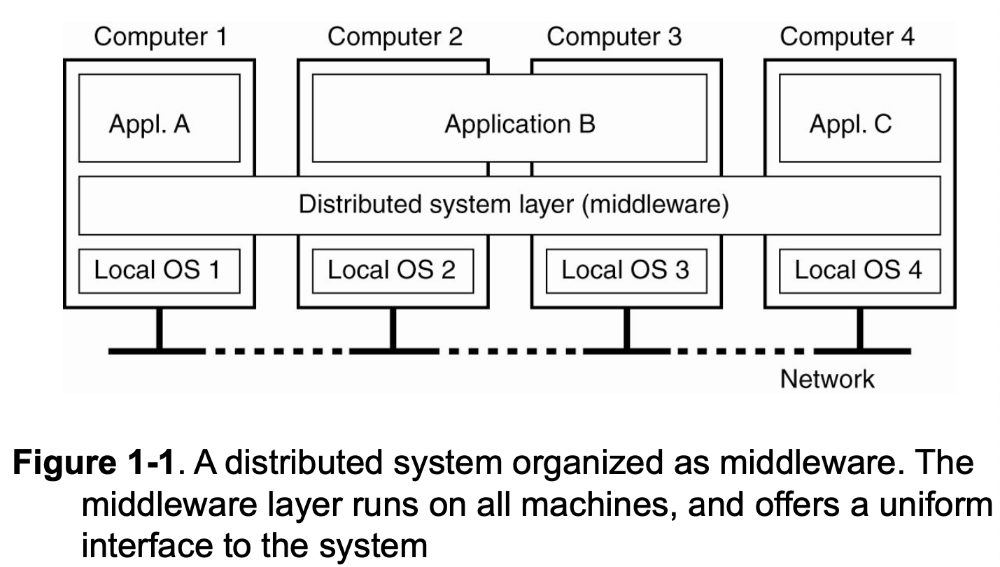
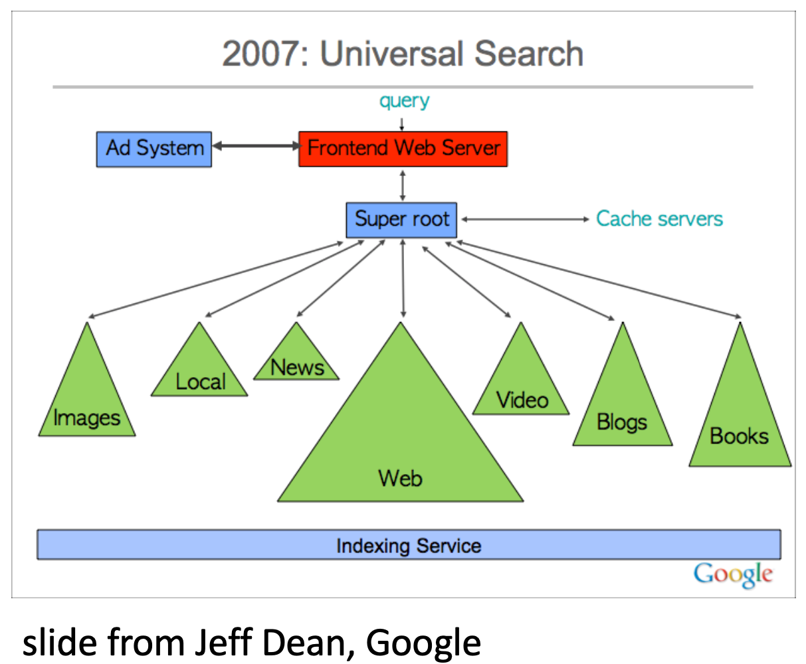

# Lecture 1 Intro

## What Is A Distributed System

* A collection of **independent computers** that appears to its users as a **single coherent system**
* Features:
  * No shared memory – message-based communication
  * Each runs its own local OS
  * Heterogeneity
* Characteristics:
  * Present a single-system image
    * Hide internal organization, communication details
    * Provide uniform interface
  * Easily expandable
    * Adding new servers is hidden from users
  * Continuous availability
    * Failures in one component can be covered by other components
  * Supported by middleware

### Goals of Distributed Systems

* Goal 1 – **Resource Availability**
  * Support user access to remote resources and the fair sharing of the resources
  * Performance enhancement
  * Resource sharing introduces security problems

* Goal 2 – **Transparency**
  * Software hides some of the details of the distribution of system resources
  * A distributed system that appears to its users & applications to be a single computer system is said to be **transparent**
  * Transparency has several dimensions

| Transparency | Description                                                  |
| ------------ | ------------------------------------------------------------ |
| Access       | Hide differences in data representation & resource access (enables interoperability) |
| Location     | Hide location of resource (can use resource without knowing its location) |
| Migration    | Hide possibility that a system may change location of resource (no effect on access) |
| Replication  | Hide the possibility that multiple copies of the resource exist (for reliability and/or availability) |
| Concurrency  | Hide the possibility that the resource may be shared concurrently |
| Failure      | Hide failure and recovery of the resource. How does one differentiate between. slow and failed? |
| Relocation   | Hide that resource may be moved during use                   |

* Goal 3 - **Openness**
  * The interfaces to an open distributed system are clearly specified and freely available
  * **Interface Definition/Description Languages (IDL):**
    * Used to describe the interfaces between software components, usually in a distributed system
    * Support communication between systems using different OS/programming languages
    * Communication is usually RPC-based
  * Open system support:
    * **Interoperability**: the ability of two different systems or applications to work together
    * **Portability**: an application designed to run on one distributed system can run on another system which implements the same interface
    * **Extensibility**: Easy to add new components, features
* Goal 4 - **Scalability**
  * Dimensions that may scale:
    * With respect to size
    * With respect to geographical distribution
    * With respect to the number of administrative organizations spanned
  * A scalable system **still** performs well as it scales up along any of the three dimensions

## Example: Domain Name System (DNS)

* Decentralized - admins update own domains without coordinating with other domains
* Scalable - used for hundreds of millions of domains
* Robust - handles load and failures well

* How do you index the web?
  * Crawling -- download those web pages
  * Indexing -- harness 10s of thousands of machines to do it
  * Profiting -- we leave that to you
  * **Data-Intensive Computing**

### MapReduce / Hadoop

* Why? Hiding details of programming 10,000 Computers machines
* Programmer writes two simple functions:
  * `map(data item) -> list(tmp values)`
  * `reduce(list(tmp values)) -> list(out values)`
* MapReduce system balances load, handles failures, starts job, collects results, etc
