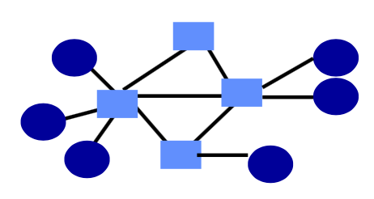
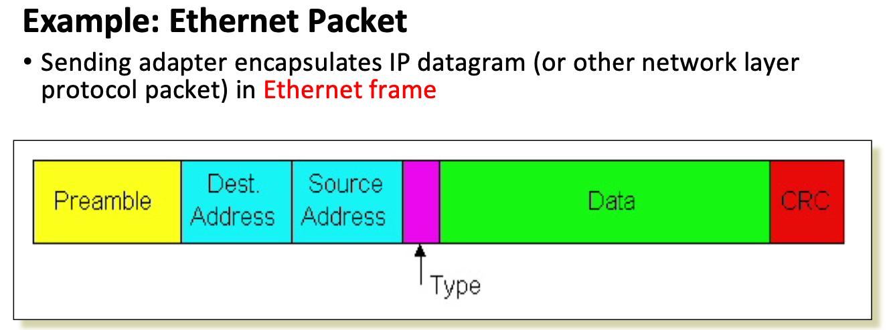
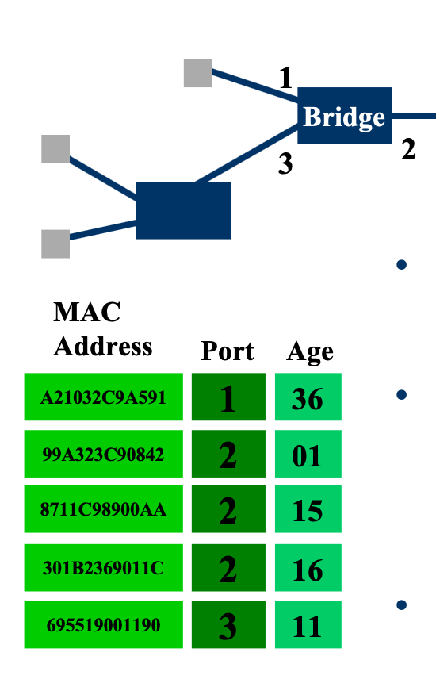
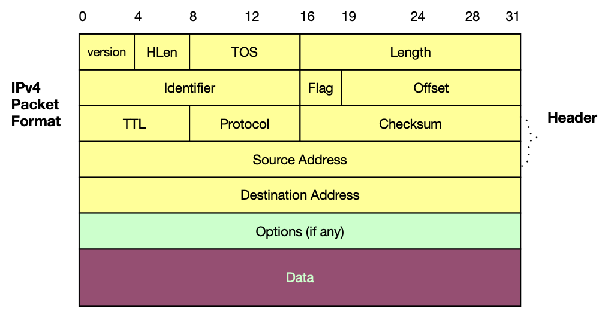

# Lecture 2 Communication

## Network Links and LANs

### Multiplexing

* Need to share network resources
* How? **Switched network**
* Interior nodes act as “Switches”

#### Packet Switching

* Source sends information as self-contained **packets** that have an address
* Each packet travels **independently** to the destination host
  * Switches use the address in the packet to determine how to forward the packets
  * Store and forward
* Switches arbitrate between inputs
  * Links never idle when traffic to send
* What if Network is **Overloaded**?
  * **Buffering** and **Congestion Control**
    * Short bursts: buffer
    * What if buffer overflows?
      * Packets dropped
      * Sender adjusts rate until load = congestion control

#### Example: Ethernet Packet

#### Frame Forwarding

* A machine with **MAC Address** lies in the direction of number **port** of the bridge
* For every packet, the bridge “looks up” the entry for the packets destination MAC address and forwards the packet on that port
  * **Other packets are broadcast**
* Timer is used to flush old entries

### Model of a Communication Channel

* Latency - how long does it take for the first bit to reach destination
* Capacity - how many bits/sec can we push through? (often termed “bandwidth”)
* Jitter - how much variation in latency?
* Loss / Reliability - can the channel drop packets?
* Packet reordering

#### Packet Delay

* Sum of a number of different delay components:
  * Propagation delay on each link
  * Transmission delay on each link
  * Processing delay on each router
  * Queuing delay on each router

#### Sustained Throughput

* When streaming packets, the network works like a pipeline
* Throughput is determined by the slowest stage
  * Called the bottleneck link
* Does not really matter why the link is slow

### Stop & Wait Protocol

* Sender sends a single packet to receiver & waits for an acknowledgment

## Inter-network Communication

* An inter-net: a network of networks
* The Internet: the interconnected set of networks of the Internet Service Providers (ISPs)

### How to Find Nodes

* Need naming and routing
* DNS server translates human readable names to logical endpoints
* Routers send packet towards destination

### IP Packet / Service Model

* Low-level communication model provided by Internet
* Datagram
  * Each packet self-contained
    * All information needed to get to destination
    * No advance setup or connection maintenance

#### How to Get One IP Address

* Get allocated portion of ISP’s address space
  * ISPs get blocks of addresses from Regional Internet Registries
* How about a single host?
  * Hard-coded by system admin in a file
  * **DHCP**: Dynamic Host Configuration Protocol
