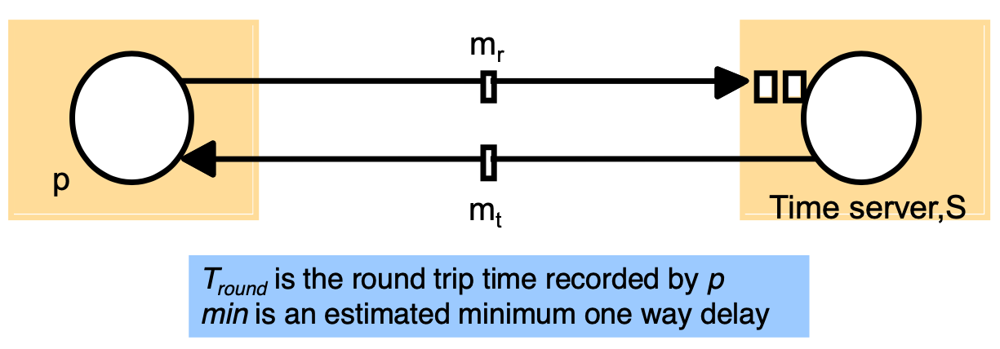
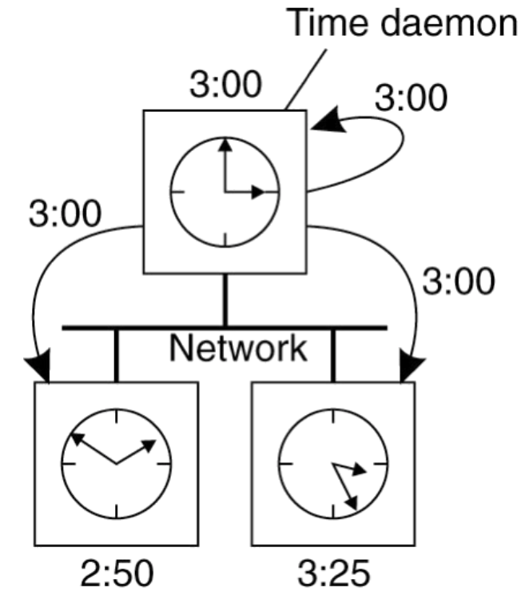
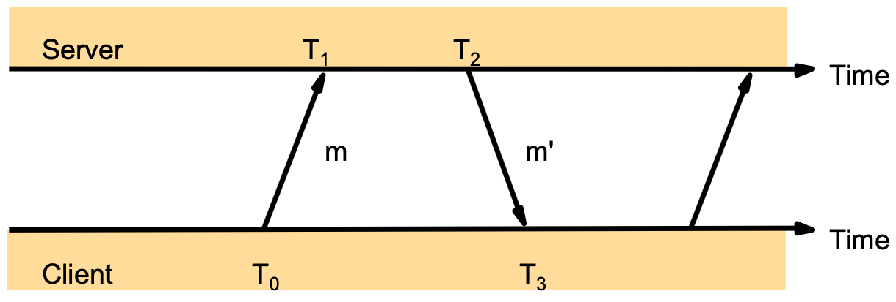
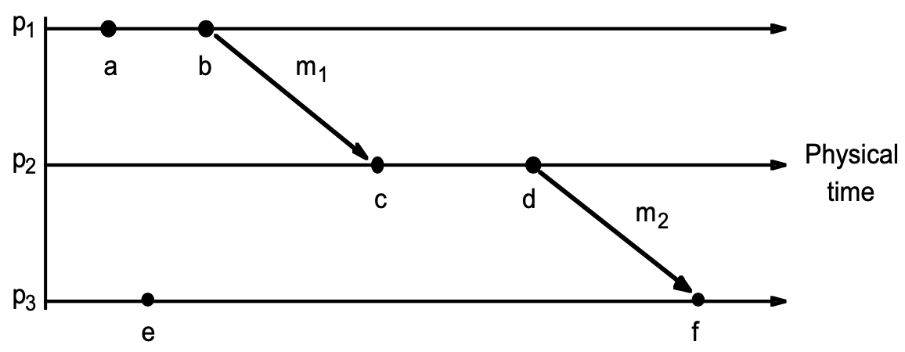
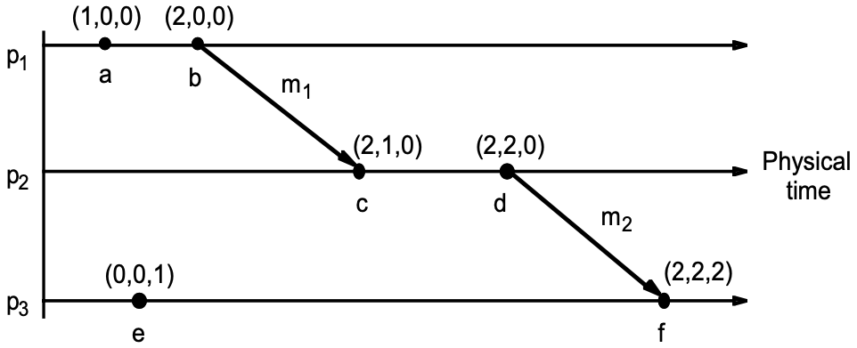

# Lecture 5 Time Synchronization

## Need for Time Synchronization

### Time Standards

* UT1 (**Universal Time**)
  * Based on astronomical observations
  * “Greenwich Mean Time”
* TAI (**Temps Atomique International**)
  * Started Jan1,1958
  * Each second is 9,192,631,770 cycles of radiation emitted by Cesium atom
  * Has diverged from UT1 due to slowing of earth’s rotation
* UTC (**Temps universel coordonne**)
  * TAI + leap seconds to be within 0.9s of UT1
  * Currently 35

### Clocks in a Distributed System

* Computer clocks are not generally in perfect agreement
  * **Skew**: the difference between the times on two clocks (at any instant)
* Computer clocks are subject to clock drift (they count time at different rates)
  * **Clock drift rate**: the difference per unit of time from some ideal reference clock

## Time Synchronization Techniques

### Perfect Networks

* Messages always arrive, with propagation delay exactly d
  * Synchronization is exact

### Synchronous Networks

* Messages always arrive, with propagation delay at most D
* Sender sends time T in a message
* Receiver sets clock to T+D/2
  * Synchronization error is at most D/2

### Synchronization in the Real World

* Real networks are asynchronous
  * Message delays are arbitrary
* Real networks are unreliable
  * Messages don’t always arrive

### Cristian's Time Sync

* A time server *S* receives signals from a UTC source
  * Process p requests time in $m_r$ and receives t in $m_t$ from S
  * p sets its clock to t+RTT/2
  * Accuracy ± (RTT/2 - min)
* It **does not** deal with faulty servers

### Berkeley Algorithm

* An algorithm for internal synchronization of a group of computers
* A master polls to collect clock values from the others (slaves)
* The master uses round trip times to estimate the slaves’ clock values
* It takes an average (eliminating any above average round trip time or with faulty clocks)
* It sends the required adjustment to the slaves (better than sending the time which depends on the round trip time)

### Network Time Protocol (NTP)

* Time service
  * Primary servers are connected to UTC
  * Secondary servers are synchronized to primary servers
  * Synchronization subset - lowest level servers in users' computers
* Uses a hierarchy of time servers
  * Class 1 servers have highly-accurate clocks
    * connected directly to atomic clocks, etc
  * Class 2 servers get time from only Class 1 and Class 2 servers
  * Class 3 servers get time from any server
* Synchronization similar to Cristian’s algorithm
  * Modified to use multiple one-way messages instead of immediate round-trip
* Accuracy: Local 1ms, Global 10ms
* All modes use UDP
* Each message bears timestamps of recent events:
  * Local times of Send and Receive of previous message
  * Local times of Send of current message
* Recipient notes the time of receipt T3 (we have T0, T1, T2, T3)

### How to Change Time

* Can’t just change time
* Change the update rate for the clock
  * Changes time in a more gradual fashion
  * Prevents inconsistent local timestamps

## Lamport Clocks

### Logical Time

* Capture just the “happens before” relationship between events

### Logical Clocks

* If two events occurred at the same process $p_i$ (i = 1, 2, ... N) then they occurred in the order observed by $p_i$, that is the definition of: “→ i” (“happened before” i)
* When a message, m is sent between two processes, send(m) happens before receive(m)
* The “happened before” relation is transitive
* The happened before relation is the relation of **causal ordering**
* **Not all** events are related by →

### Lamport Clock

* Each process $p_i$ has a logical clock, $L_i$ which can be used to apply logical timestamps to events
  * Rule 1: $L_i$ is incremented by 1 before each event at process $p_i$
  * Rule 2:
    * (a) when process $p_i$ sends message m, it carries by $t = L_i$
    * (b) when $p_j$ receives $(m,t)$ it sets $L_j := max(Lj, t)$ and applies rule 1 before timestamping the event receive $(m)$
* The global time $L(e)$ of an event $e$ is just its local time
  * For an event e at process $i$, $L(e) = L_i(e)$
* $e \rightarrow e'$ implies $L(e) < L(e')$
* The converse is not true
* $L(e) = L(e')$ implies $e || e'$ for distinct $e$, $e'$
  * $e || e'$ doesn't imply $L(e) = L(e')$
  * i.e., Lamport clocks arbitrarily order some concurrent events

#### Total-order Lamport Clocks

* Many systems require a total-ordering of events, not a partial-ordering
* Use Lamport’s algorithm, but break ties using the process ID
  * $L(e) = M * L_i(e) + i$
    * $M$ = maximum number of processes
    * $i$ = processID

## Vector Clocks

* Goal
  * Want ordering that matches causality
  *  $V(e) < V(e')$ **if and only if** $e \rightarrow e'$
* Method
  * Label each event by vector $V(e) [c_1, c_2, \cdots, c_n]$
    * $c_i$ = # events in process $i$ that causally precede $e$

### Vector Clock Algorithm

* Initially, all vectors $[0,0,...,0]$
* For event on process $i$, increment own $c_i$
  * Label message sent with local vector
  * When process $j$ receives message with vector $[d_1, d_2, ..., d_n]$:
    * Set local each local entry $k$ to $max(c_k, d_k)$
    * Increment value of $c_j$

* Note that $e \rightarrow e'$ implies $V(e) < V(e')$
  * The converse is also true

## Clock Sync Important Lessons

* Clocks on different systems will always behave differently
  * Skew and drift between clocks
* Time disagreement between machines can result in undesirable behavior
* Two paths to solution: **synchronize clocks** or **ensure consistent clocks**
* Clock synchronization
  * Rely on time-stamped network messages
  * Clocks never exactly synchronized
  * Often inadequate for distributed systems
* Logical Clocks
  * Encode causality relationship
  * Lamport clocks provide only one-way encoding
  * Vector clocks provide exact causality information
