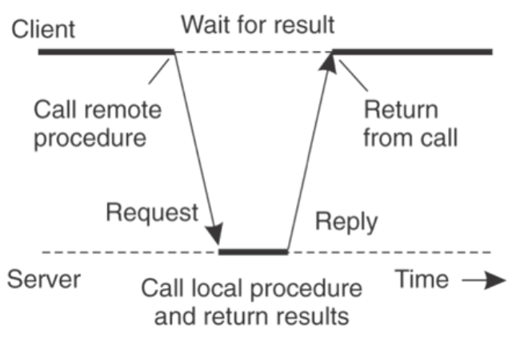
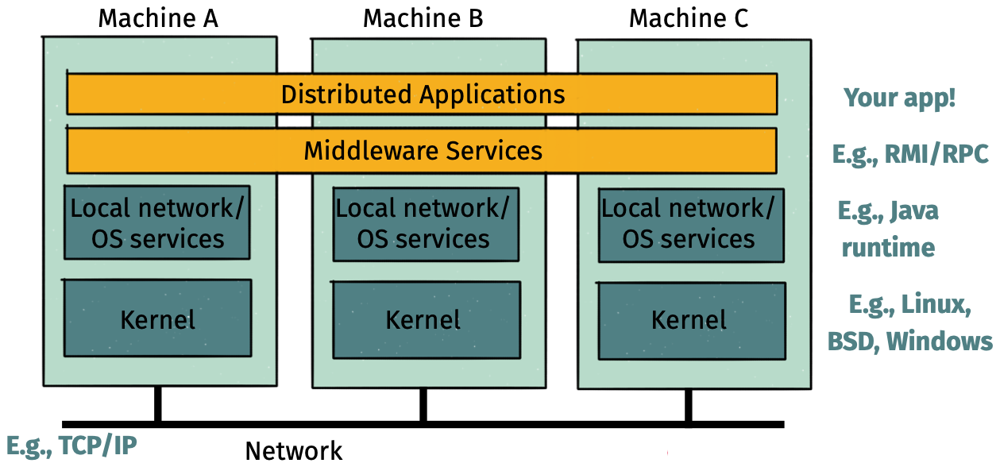
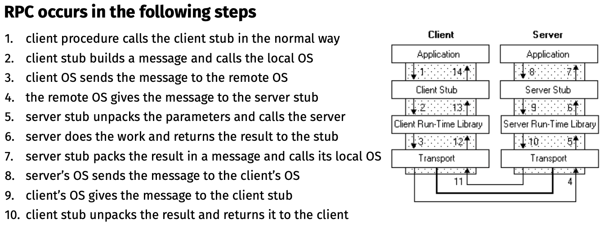

# Lecture 6 Remote Procedure Calls

## Remote Procedure Calls (RPC)

* A type of client/server communication
* Attempts to make remote procedure calls look like local ones

* Programmer simply invokes a procedure but it executes on a remote machine (the server)
* RPC subsystem handles message formats, sending & receiving, handling timeouts, etc
* Aim is to make distribution (mostly) transparent
  * Certain failure cases wouldn’t happen locally
  * Distributed and local function call performance different

### How RPC Works

### Stubs

* Compiler generates from API stubs for a procedure on the client and server
* **Client stub**
  * **Marshals** arguments into machine-independent format
  * Sends request to server
  * Waits for response
  * **Unmarshals** result and returns to caller
* **Server stub**
  * **Unmarshals** arguments and builds stack frame
  * Calls procedure
  * Server stub **marshals** results and sends reply
* Write a description of the function signature using an IDL - interface definition language
* Endianness matters

## RPC Implementations

* **Shallow integration**
  * Must use lots of library calls to set things up
  * How to format data
  * Registering which functions are available and how they are invoked
* **Deep integration**
  * Data formatting done based on type declarations
  * Almost all public methods of object are registered
* Go is the **latter**

## Key Challenges of RPC

* 3 properties of distributed computing that make achieving transparency difficult:
  * **Memory access**
  * **Partial failures**
  * **Latency**
* RPC semantics in the face of
  * Communication failures
    * delayed and lost messages
    * connection resets
    * expected packets never arrive
  * Machine failures
    * Server or client failures
    * Did server fail before or after processing the request?
  * Might be impossible to tell communication failures from machine failures

### Partial Failures

* In distributed computing:
  * If a machine fails, part of application fails
  * One cannot tell the difference between a machine failure and network failure

### Strawman Solution

* Make remote behavior identical to local behavior:
  * Every partial failure results in complete failure
  * You abort and reboot the whole system
  * You wait patiently until system is repaired
* Problems with this solution:
  * Many catastrophic failures
  * Clients block for long periods
  * System might not be able to recover

### Real Solution: Break Transparency

* **At-least-once**: Just keep retrying on client side until you get a response
  * Server just processes requests as normal, doesn‘t remember anything
* **At-most-once**: Server might get same request twice
  * Must re-send previous reply and not process request (implies: keep cache of handled requests/responses)
  * Must be able to identify requests
  * Keep sliding window of valid RPC IDs, have client number them sequentially