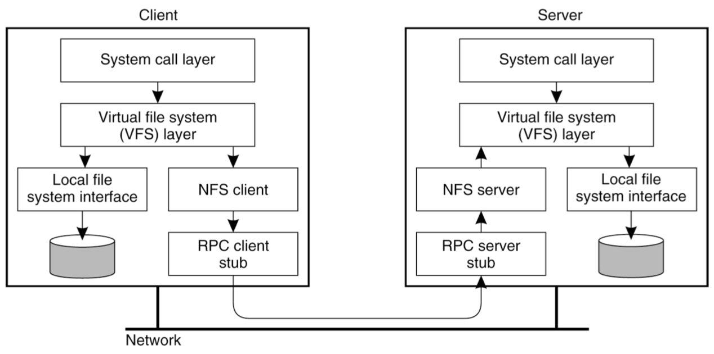
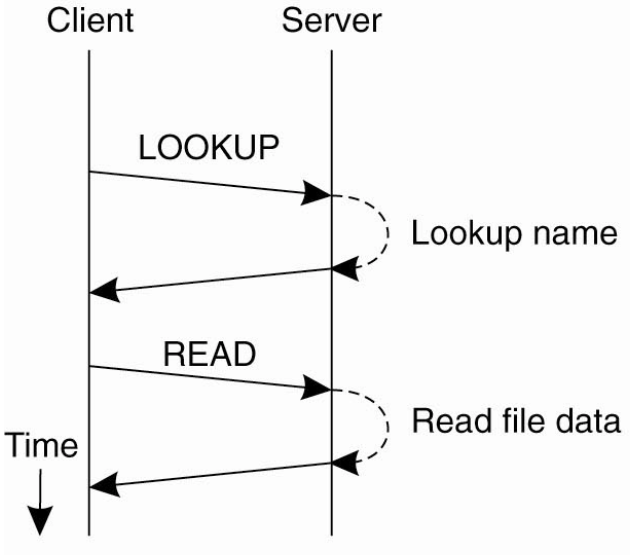
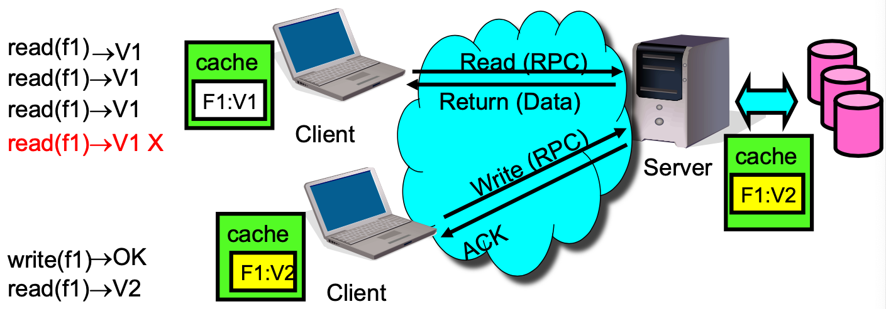

# Lecture 7 Distributed File Systems

## Why Distributed File System

* Goal:
  * Have a consistent namespace for files across computers
  * Allow any authorized user to access their files from any computer
* Why are DFSs Useful?
  * Data sharing among multiple users
  * User mobility
  * Location transparency
  * Backups and centralized management

### Example: Andrew File System (AFS)

* Andrew and AFS target the campus network, not the wide-area
* Prioritized goals / Assumptions
  * Often very useful to have an explicit list of **prioritized goals**
  * Distributed filesystems almost always involve **trade-offs**
* Scale
* User-centric workloads
  * Most files are personally owned
  * Not too much concurrent access; user usually only at one or a few
    machines at a time
  * Sequential access is common; reads much more common that writes
  * There is locality of reference

## Basic Mechanisms for Building DFSs

* Components in a DFS
  * Client side
  * Communication layer
  * Server side

### Virtual File System (VFS)

* Use RPC to forward every filesystem operation to the server
  * Server serializes all accesses, performs them, and sends back result
* Same behavior as if both programs were running on the same local filesystem
* What about failures?
  * Consider file descriptors and how they are used

### NFS V2 Design

* Stateless servers with smart clients
* Protable across different OSes
* Low implementation cost
* Small number of clients
* Single administrative domain
* NFS RPCs using **External Data Representation** (XDR) over

| Proc.  | Input args                     | Results                  |
| ------ | ------------------------------ | ------------------------ |
| LOOKUP | `dirfh, name`                  | `status, fhandle, fattr` |
| READ   | `fhandle, offset, count`       | `status, fattr, data`    |
| CREATE | `dirfh, name, fattr`           | `status, fhandle, fattr` |
| WRITE  | `fhandle, offset, count, data` | `status, fattr`          |

* `fhandle`: 32-byte opaque data (64-byte in v3)
* `mountd`: provides the initial file handle for the exported directory
  * Client issues `nfs_mount` request to `mountd`
  * `mountd` checks if the pathname is a directory and if the directory should be exported to the client
* `nfsd`: answers the RPC calls, gets reply from local file system, and sends reply via RPC
  * Usually listening at port 2049
* Both `mountd` and `nfsd` use underlying RPC implementation

* Lookup takes directory+name and return file handle

### NFS V2 Operations

* NULL, GETATTR, SETATTR
* LOOKUP, READLINK, READ
* CREATE, WRITE, REMOVE, RENAME
* LINK, SYMLINK
* READIR, MKDIR, RMDIR
* STATFS (get file system attributes)

### Cell/Volume Architecture

* Cells correspond to administrative groups
  * `/afs/andrew.cmu.edu` is a cell
* Cells are broken into **volumes** (miniature file systems)
  * One user's files, project source tree
  * Typically stored on one server
  * Unit of disk quota administration, backup
* Client machine has **cell-server database**
  * **protection server** handles authentication
  * **volume location server** maps volumes to servers

## Design Choices and Their Implications

### Client-Side Caching

* Caching read-only file data and directory data is easy
* However, if we cache, it always risk making things inconsistent
  * When is data written to the server?
  * How to know that the data has changed?
  * Is there any pre-fetching?

#### Failures

* Server crashes
  * Data in memory but not disk -> lost
  * What if client does
    * `seek() ; /* SERVER CRASH */; read()`
* Lost messages: what if we lose acknowledgement for `delete(􏰂foo􏰃)`
  * And in the meantime, another client created a new file called foo?
* Client crashes
  * Might lose data in client cache

#### Client Caching in NFS V2

* Cache both clean and dirty file data and file attributes
* File attributes in the client cache expire after 60 seconds (file data doesn't expire)
* File data is checked against the modified-time in file attributes (which could be a cached copy)
* Dirty data are buffered on the client machine until file close or up to 30 seconds
  * If the machine crashes before then, the changes are lost

#### Implications of NFS V2 Client Caching

* No network traffic if open/read/write/close can be done locally
* Data consistency guarantee is very pooer
* Generally clients **do not** cache data on local disks

### NFS's Failure Handling

* Files are state
* Server exports files without creating extra state
* Crash recovery is “fast”
  * Reboot, let clients figure out what happened
* State stashed elsewhere
  * Seperate MOUNT protocol
  * Seperate NLM locking protocol in NFSv4
* Stateless protocol: requests specify exact state
* Operations are **idempotent**
* **Write-through caching**:
  * When file closed, all modified blocks sent to server
  * `close()` does not return until bytes safely stored

#### Client Caching in AFS

* **Callbacks**! Clients register with server that they have a copy of file
  * Server tells them: 􏰂Invalidate!􏰃 if the file changes
  * This trades state for **improved** consistency
* What if server crashes?
  * Lose all callback state!
  * Reconstruct callback information from client: go ask everyone “who has which files cached?”
* What if client crashes?
  * Must revalidate any cached content it uses since it may have missed callback

#### AFS V2 RPC Procedures

* Procedures that are not in NFS
  * `Fetch`: return status and optionally data of a file or directory, and place a callback on it
  * `RemoveCallBack`: specify a file that the client has flushed from the local machine
  * `BreakCallBack`: from server to client, revoke the callback on a file or directory
  * `Store`: store the status and optionally data of a file
* Rest are similar to NFS calls

### File Access Consistency

* In UNIX local filesystem, concurrent file reads and writes have “sequential” consistency semantics
* Neither NFS nor AFS provides such concurrency control
* What it means:
  * A file write is visible to processes on the same box immediately, but not visible to processes on other machines until the file is closed
  * When a file is closed, changes are visible to new opens, but are not visible to “old” opens
  * All other file operations are visible everywhere immediately
* Implementation
  * Dirty data are buffered at the client machine until file close, then flushed back to server, which leads the server to send “break callback” to other clients

#### AFS Write Policy

* Write back cache
  * Store chunk back to server
    * When cache overflows
    * On last user close()
  * Or don't if client machine crashes
* Results for AFS:
  * **Lower server load** than NFS
    * More files cached on clients
    * Callbacks: server not busy if files are read-only (common case)
  * But maybe **slower**: Access from local disk is much slower than from another machine􏰀s memory over LAN
* AFS authors argued that apps with highly concurrent, shared access, like databases, needed a different model
* For both AFS and NFS:
  * Central server is bottleneck: all reads and writes hit it at least once
  * is a single point of failure
  * is costly to make them fast, beefy, and reliable servers