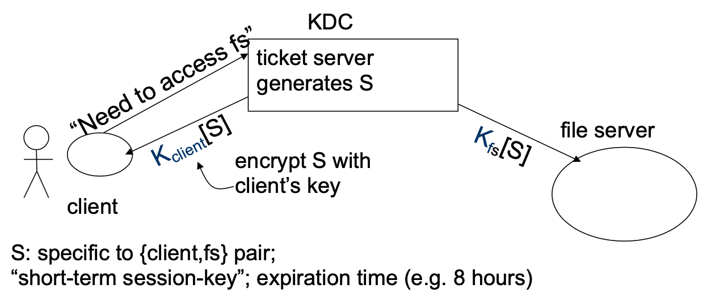
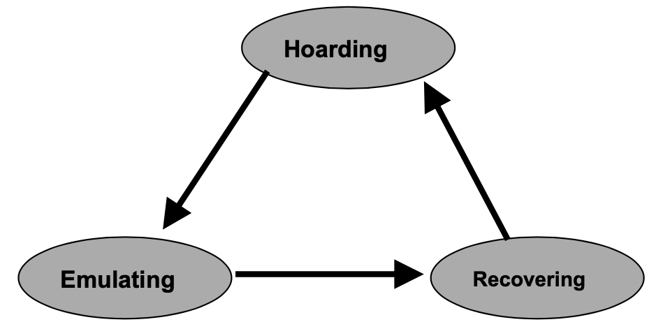
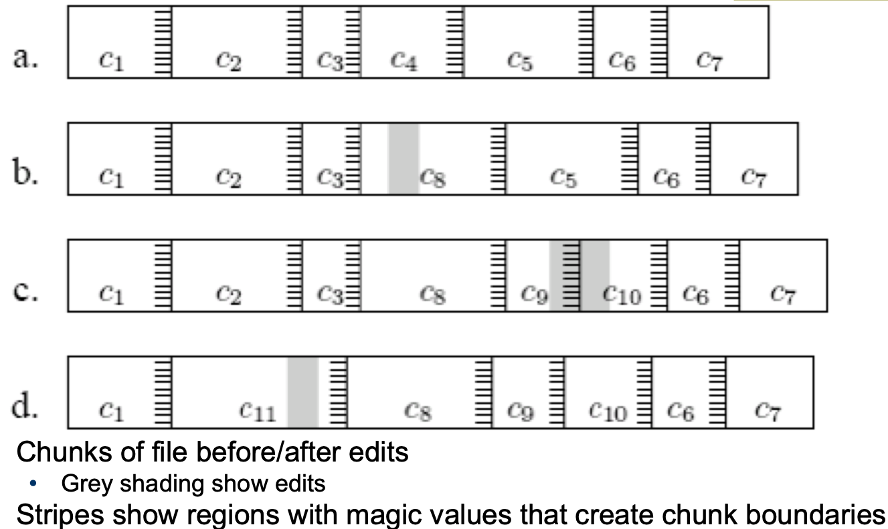
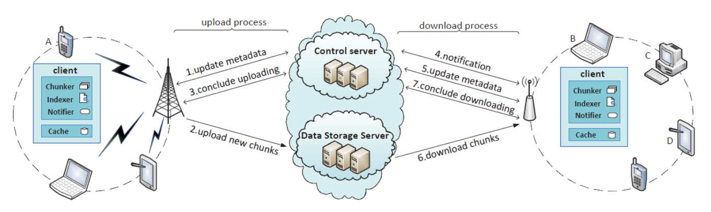
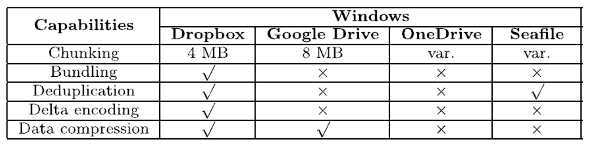

# Lecture 8 Distributed File Systems 2

## Review of Classical DFSs

* Implementation: VFS interception and RPCs
  * Caching strategy
    * NFS: writethrough caching
    * AFS: writeback caching
  * Access consistency:
    * UNIX: “sequential” consistency semantics
    * NFS: “sometime within 30 +60 seconds”
    * AFS: session semantics with callbacks
  * Scalability:
    * NFS: low (but simple failure handling)
    * AFS: better (server failure requires more work)

## Naming in NFS/AFS

* NFS: clients mount NFS volume where they want
  * Server: `export /root/disk1`
  * Client1: `mount server:/root/disk1 /remote`
* AFS: namespace consistent across clients (= global)
  * Client1: `/afs/andrew.cmu.edu/disk1/`
  * Client2: `/afs/andrew.cmu.edu/disk1/`
  * moving volumes is transparent
  * All AFS servers keep a copy of “volume location database”, which is a table of vol_id -> server_ip mapping

## User Authentication and Access Control

* User X logs onto workstation A, wants to access files on server B
  * How does A tell B who X is?
  * Should B believe A?
* Choice made in NFS V2
  * All servers and all client workstations share the same <uid,
    gid> name space -> B send X’s <uid, gid> to A
    * Problem: root access on any client workstation can lead
      to creation of users of arbitrary <uid, gid>
    * Server believes client workstation unconditionally
      * Problem: if any client workstation is broken into, the protection of data on the server is lost
      * <uid, gid> sent in clear-text over wireàrequest packets can be faked easily
* How do we fix the problems in NFS V2?
  * Use a centralized **Authentication/Authorization/Access-control (AAA) system**

### Kerberos

* Basic idea: **shared secrets**
  * User proves to Key Distribution Center (**KDC**) who he is; KDC generates shared secret between client and file server

## CODA

* Successor of the very successful Andrew File System (AFS)
* AFS
  * First DFS aimed at a campus-sized user community
  * Key ideas include
    * open-to-close consistency
    * callbacks
* Hardware Model
  * CODA and AFS assume that client workstations are personal computers controlled by their user/owner
    * **Fully autonomous**
    * **Cannot be trusted**
  * CODA allows owners of laptops to operate them in **disconnected mode**
    * **Opposite of ubiquitous connectivity**
* Accessibility
  * Must handle two types of failures
    * **Server failures**:
      * Data servers are replicated
    * **Communication failures** and **voluntary disconnections**
      * Coda uses **optimistic replication** and **file hoarding**
* Design Rationale
  * Scalability
    * Callback cache coherence (inherit from AFS)
    * Whole file caching
    * Fat clients (security, integrity)
    * Avoid system-wide rapid change
  * Portable workstations
    * User’s assistance in cache management

### Replica Control

* Pessimistic
  * Disable all partitioned writes
  * Require a client to acquire control (lock) of a cached object **prior** to disconnection
* Optimistic
  * Assuming no others touching the file
  * Little conflict detection
  * Fact: low write-sharing in Unix
  * High availability: access anything in range
* **Pessimistic replication control protocols** guarantee the consistency of replicated in the presence of **any non-Byzantine failures**
  * Typically require a quorum of replicas to allow access to the replicated data
  * Would **not** support disconnected mode
* Would require client to acquire **exclusive** (RW) or **shared** (R) control of cached objects before accessing them in disconnected mode
  * Acceptable solution for voluntary disconnections
* Leases
  * We could grant exclusive/shared control of the cached objects for a **limited amount of time**
  * Works very well in **connected mode**
  * Would only work for very short disconnection periods
* **Optimistic replica control** allows access in **every** disconnected mode
  * Tolerates temporary inconsistencies
  * Promises to detect them later
  * Provides **much higher data availability**
* Defines an **accessible universe:** set of files that the user can access
  * Accessible universe varies over time

### CODA States

* Hoarding:
  * Normal operation mode
* Emulating:
  * Disconnected operation mode
* Reintegrating:
  * Propagates changes and detects inconsistencies

#### Hoarding

* Hoard useful data for disconnection
* Balance the needs of connected and disconnected operation
  * Cache size is restricted
* Uses user specified preferences + usage patterns to decide on files to keep in hoard
* Prioritized algorithm:
  * User defined hoard priority p: how important is a file to you?
  * Recent Usage q
  * Object priority = f(p,q)
  * Kick out the one with lowest priority

#### Emulation

* Attempts to access files that are not in the client caches appear as failures to application
* All changes are written in a persistent log, the client modification log (CML)
* Coda removes from log all obsolete entries like those pertaining to files that have been deleted

#### Reintegration

* When workstation gets reconnected, Coda initiates a reintegration process
  * Performed one volume at a time
  * Venus ships replay log to all volumes
  * Each volume performs a log replay algorithm
* Only care about write/write conflict
  * Conflict resolution succeeds?
    * Yes. Free logs, keep going
    * No. Save logs to a tar. Ask for help

## LBFS (Low Bandwidth File System)

* Exploits similarities between files or versions of the same file
* Also uses conventional compression and caching
* Requires 90% less bandwidth than traditional network file systems
* LBFS server divides file it stores into chunks and indexes the chunks by hash value
* Client similarly indexes its file cache

### Indexing & Chunk

* Uses the SHA-1 algorithm for hashing
  * It is **collision resistant**
* Central challenge in indexing file chunks is keeping the index at a reasonable size while dealing with shifting offsets
* Considers only non-overlapping chunks
* Sets chunk boundaries based on file contents rather than on position within a file
* Examines every overlapping 48-byte region of file to select the boundary regions called **breakpoints** using Rabin fingerprints
  * When low-order 13 bits of region’s fingerprint equals a chosen value, the region constitutes a breakpoint

* Pathological cases
  * Very small chunks
    * Sending hashes of chunks would consume as much bandwidth as just sending the file
  * Very large chunks
    * Cannot be sent in a single RPC
* LBFS imposes minimum (2K) and maximum chunk (64K) sizes
* The Chunk Database
  * Indexes each chunk by the first 64 bits of its SHA-1 hash
  * To avoid synchronization problems, LBFS always recomputes the SHA-1 hash of any data chunk before using it
  * Recomputed SHA-1 values are also used to detect hash collisions in the database

## DFS in Read Life

* Chunking: splitting a large file into multiple data units
* Bundling: multiple small chunks as a single chunk
* Deduplication: avoiding sending existing content in the cloud
* Delta-encoding: transmit only the modified portion of a file

