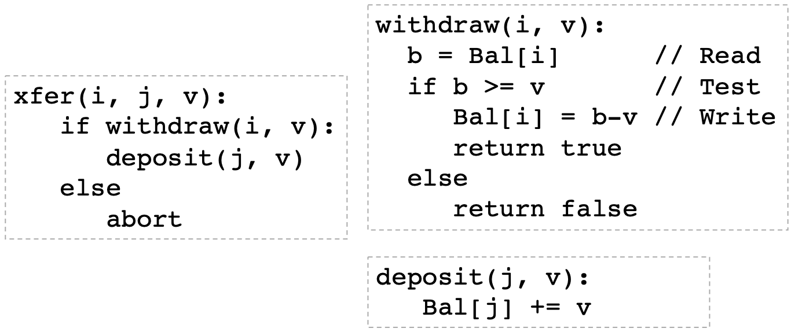
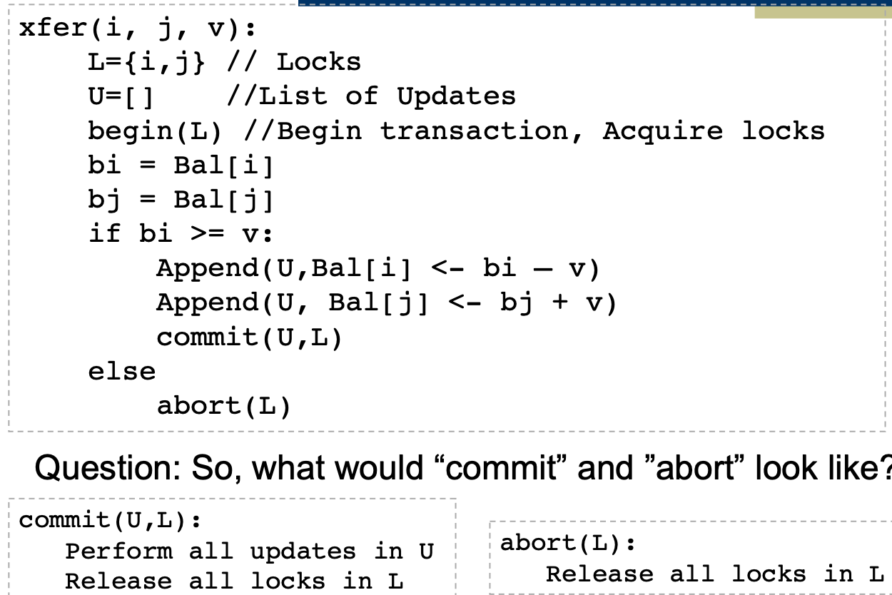
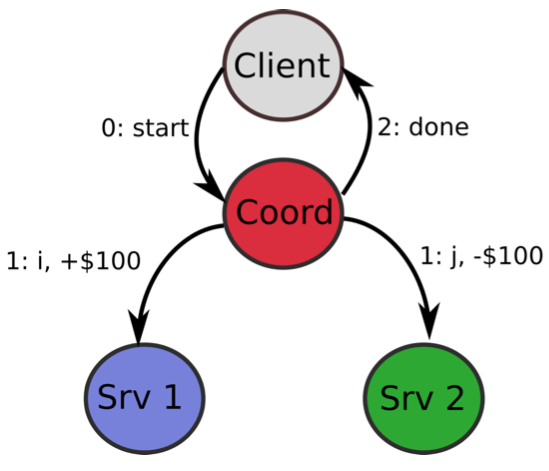
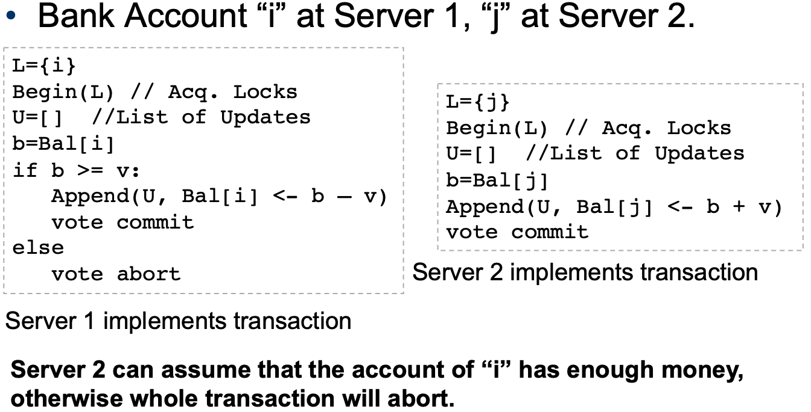
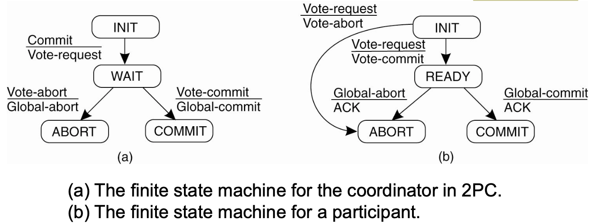

# Lecture 10 Distributed Concurrency Management

## Transactions and Consistency

### A Transaction Example: Bank



* For consistency, use locks to wrap `xfer`
  * Need **unique global order** for acquiring locks
  * Motivation for 2-Phase Locking

```text
xfer(i, j, v):
	lock(min(i,j))
	lock(max(i,j))
	if withdraw(i, v):
		deposit(j, v)
		unlock(i)
		unlock(j)
  else
  	unlock(i)
  	unlock(j)
  	abort
```

* Can a cycle occur if we acquire locks in unique order?
  * No. Label edges with its lock ID. For any cycle, there must be some pair of edges $(i, j)$, $(j, k)$ labeled with values x & y. As k holds y, but waits for x: $y<x$
  * Transaction j is holding lock x and it wants lock y, so y > x
  * Implies that j is not acquiring its lock in proper order

## 2-Phase Locking

* General 2-phase locking
  * Phase 1: Acquire or Escalate Locks (e.g. read -> write)
  * Phase 2: Release or de-escalate lock
* Strict 2-phase locking
  * Phase 1: (same as before)
  * Phase 2: Release WRITE lock at end of transaction only
* **Strong Strict 2-phase locking**
  * Phase 1: (same as before)
  * Phase 2: Release ALL locks at the end of transaction only
  * **Most common version, required for ACID properties**
* Why not always use strong-strict 2-phase locking?
  * A transaction may not know the locks it needs in advance 
* Handle deadlocks
  * Lock manager builds a waits-for graph and on finding a cycle, choose offending transaction and force abort
  * Use timeouts: transactions should be short and thus if hit time limit, find transaction waiting for a lock and force abort

### Transactions - Split into 2 Phases

* Phase 1: Preparation
  * Determine what has to be done, how it will change state, without actually altering it
  * Generate Lock set "L"
  * Generate List of Updates "U"
* Phase 2: Commit or Abort
  * Everything OK, then update global state
  * Transaction cannot be completed, leave global state as is
  * **In either case, release all locks**



## Distributed Transactions

### Enabling Distributed Transactions

* Client initiates transaction
* Make use of coordinator
* All other relevant servers operate as participants
* Coordinator assigns unique transaction ID (TID)

### Strawman Solutiuon



* Even without failures, a lot can go wrong
  * Account j on Src 2 has only $90
  * Account j doesn't exist

### 2-Phase Commit

* Phase 1: Prepare & Vote
  * Participants figure out all state changes
  * Each determines if it can complete the transaction
  * Communicate with coordinator
* Phase 2: Commit
  * Coordinator broadcasts to participants: Commit / Abort
  * If Commit, participants make respective state changes
* Acquire lock at start of prep process, release at Commit / Abort
* Performance **bad** in case of failure (Timeouts)



#### Distributed deadlock

* In 2PC this can happen if participants unable to respond to voting request (e.g. still waiting on a lock on its local resource)
* Handled with a timeout
  * Participants times out, then votes to abort
* However, dange of **Livelock** - keep trying
* Participants could wait forever after VoteCommit
* Solution: ask another participant (gossip protocol)
  * Learn coordinator's decision: do the same
    * Assumption: non-byzantine failure model
  * Other participant hasn't voted: abort is safe
    * Coordinator has not made decision yet
  * No reply or other participant also VoteCommit: wait
    * 2PC is blocking protocol -> 3PC

### Two-Phase Commit Model



* What if a READY participant does not receive the global commit?
  * Ask other participant for what message a coordinator may have sent
* For recovery, must save state to persistent storage (e.g. log), to restart/recover after failure

#### 2PC: Actions by Coordinator

```text
write START_2PC to local log;
multicast VOTE_REQUEST to all participants;
while not all votes have been collected {
	wait for any incoming vote;
	if timeout {
		write GLOBAL_ABORT to local log;
		multicast GLOBAL_ABORT to all participants;
		exit;
	}
	record vote;
}
if all participants sent VOTE_COMMIT and coordinator votes COMMIT {
	write GLOBAL_COMMIT to local log;
	multicast GLOBAL_COMMIT to all participants;
} else {
	write GLOBAL_ABORT to local log;
	multicast GLOBAL_ABORT to all participants;
}
```

#### 2PC: Actions by Participant

```text
write INIT to local log;
wait for VOTE_REQUEST from coordinator;
if timeout {
	write VOTE_ABORT to local log;
	exit;
}
if participant votes COMMIT {
	write VOTE_COMMIT to local log;
	send VOTE_COMMIT to coordinator;
	wait for DECISION from coordinator;
	if timeout {
		multicast DECISION_REQUEST to other participants;
		wait until DECISION is received;
		write DECISION to local log;
	}
	if DECISION == GLOBAL_COMMIT {
		write GLOBAL_COMMIT to local log;
	} else if DECISION == GLOBAL_ABORT {
		write GLOBAL_ABORT to local log;
	}
} else {
	write VOTE_ABORT to local log;
	send VOTE_ABORT to coordinator;
}
```

#### 2PC: Handling Decision Request

```text
/* executed by separate thread */
while true {
	wait until any incoming DECISION_REQUEST is received;
	read most recently recorded STATE from the local log;
	if STATE == GLOBAL_COMMIT {
		send GLOBAL_COMMIT to requesting participant;
	} else if STATE == INIT or STATE == GLOBAL_ABORT {
		send GLOBAL_ABORT to requesting participant;
	} else {
		skip;
	}
}
```

* Note that participant can only help others if it has reached a global decision and committed it to its log
