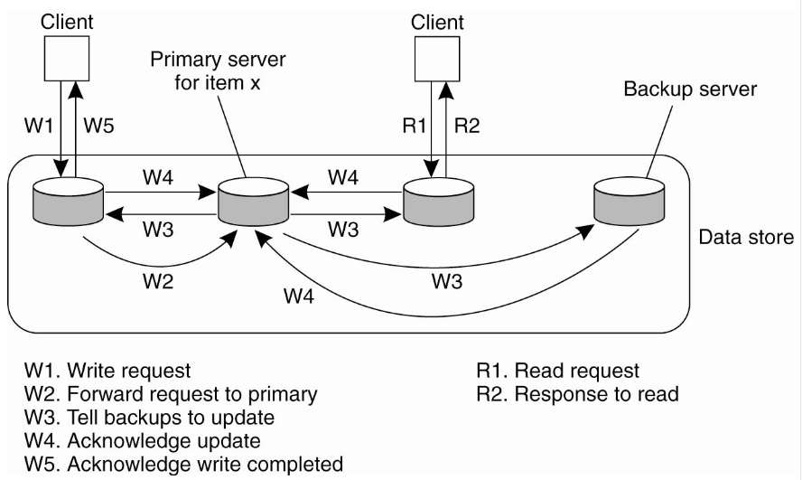
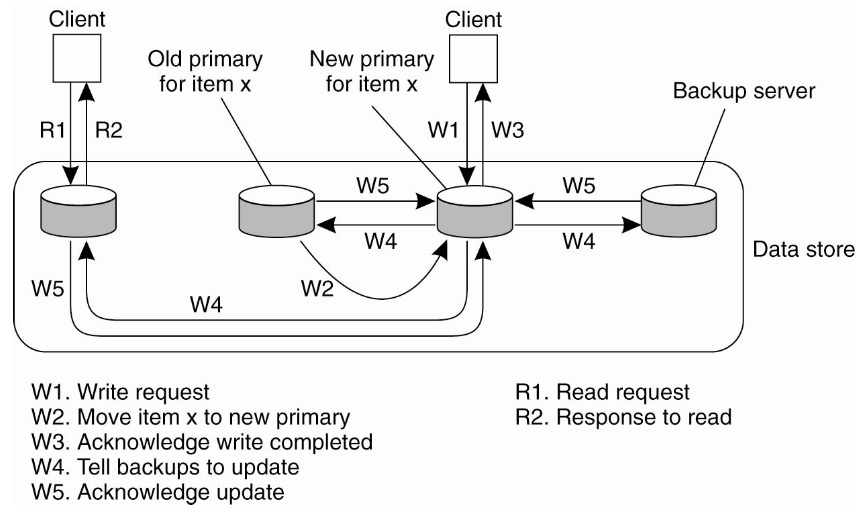
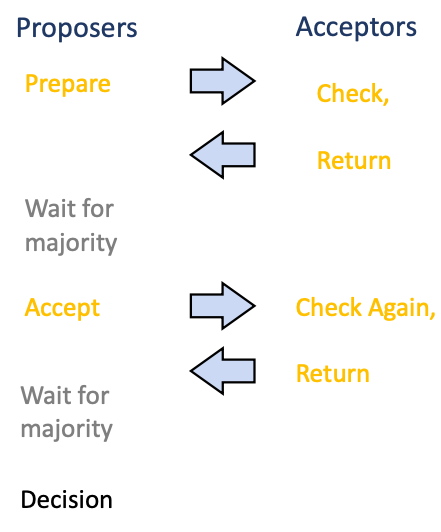
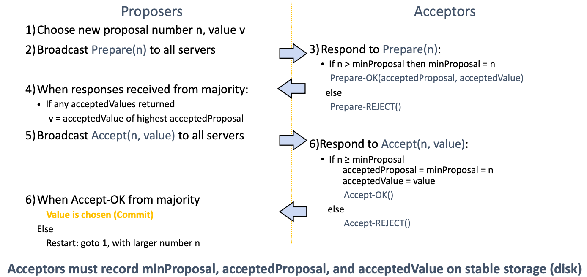
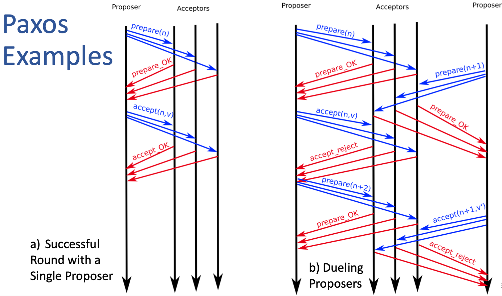

# Lecture 12 Distributed Replication

## Consistency when Content is Replicated

### Consistency Levels

* Read-only content
  * Easy to replicate
  * Locality; can fail-over
* Read-write data
  * **Strict Consistency**
    * Read always returns value from latest write
  * **Sequential Consistency**
    * Operations of each process appear in-order in this sequence
  * **Causal Consistency**
    * All nodes see potentially causally related writes in same order
    * But concurrent writes may be seen in different order on different machines
  * **Eventual Consistency**
    * All nodes will learn eventually about all writes, in the absence of updates

### Replication Strategies

* **What to replicate: State vs. Operation**
  * Propagate only a **notification of an update**
    * Sort of an invalidation protocol
  * **Transfer data** from one copy to another
    * Read-to-write ratio high, can propagate logs (save bandwidth)
  * Propagate the **update operation** to other copies
    * Only operations, but not data modifications
* **When to replicate: Push vs Pull**
  * Pull Based
    * Replicas/Clients poll for updates (caches)
  * Push Based
    * Server pushes updates (stateful)

## Primary-Backup Replication Model

* Assumptions
  * Group membership manager
  * Fail-stop (not Byzantine) failure model
    * Servers might crash, might come up again
    * Delayed/lost messages
  * Failure detector
    * e.g., process-pair monitoring, etc
* With N servers, can tolerate loss of N-1 copies
* Must wait for failure detector and cannot satisfy very tight response time

### Remote Write Protocol

* **Write always go to primary, read from any backup**
* Stream the log

### Local Write Primary-Backup Protocol

* Primary migrates to the process wanting to process update
* For performance, use non-blocking op

## Consensus Replication Model

### Quorum Based Consensus

* Designed to have fast response time even under failures
* To handle f failures, must have 2f+1 replicas
* For replicated-write, write to all replicas, but not just one
* Usually boils down to Paxos (Lamport)

### The Paxos Approach

* **Basic Paxos** (Single decree)
  * One or more servers propose values
  * System must agree on a single value as chosen
  * Only one value is ever chosen
* Multi-Paxos
  * Combine several instances of Basic Paxos to agree on a series of values forming the log
* Faul Tolerance
  * If less than N/2 nodes fail, the rest should reach agreement eventually
  * Liveness is **not** guaranteed
* **Fischer-Lynch-Paterson Result**
  * It is impossible for a set of processors in an asynchronous system to agree on a binary value, even if only a single processor is subject to an unannounced failure

#### Paxos Components

* **Proposers**
  * Active: put forth particular values to be chosen
  * Handle client requests
* **Acceptors**
  * Passive: respond to messages from proposers
  * Responses represent votes that form consensus
  * Store chosen value, state of the decision process
* **Learner**
* **Round**: proposal, messages/voting, decision
  * May need several rounds

#### Single Decree Paxos

* Phase 1: Prepare message
  * Find out about any chosen values
  * Block older proposals that have not yet completed
* Phase 2: Accept message
  * Ask acceptors to accept a specific value
* Phase 3: Proposer decides
  * If majoirty again: chosen value, commit
  * If no majority: delay and restart Paxos

* Only proposer knows chosen value (majority accepted)
* Only a single value is chosen -> Multi-Paxos
* No guarantee that proposer's original value v is chosen by itself
* Number n is basically a Lamport clock -> always unique n
* Key invariant:
  * If a proposal with value 'v' is chosen, all higher proposals must have value 'v'
* Dueling proposer
  * Resolved using number n in prepare
