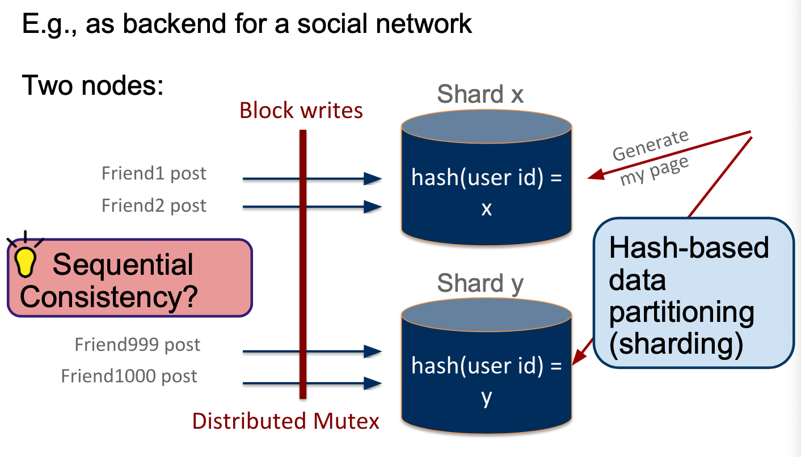
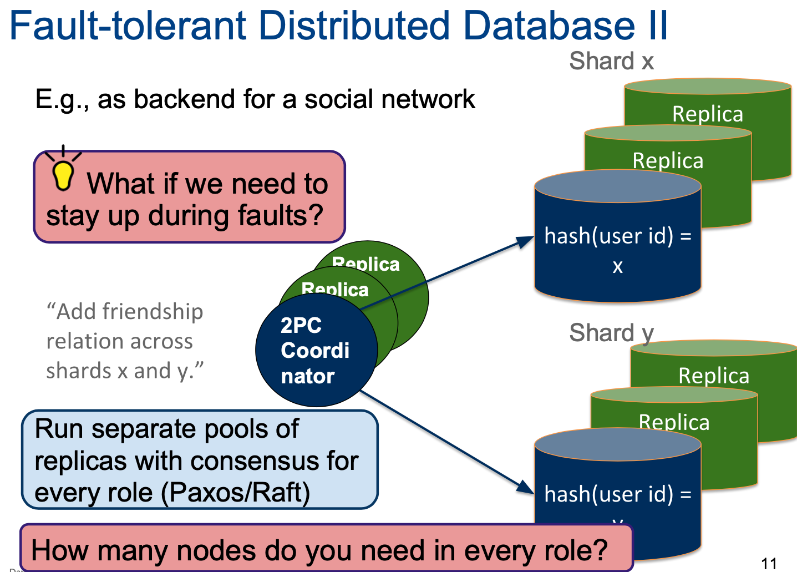
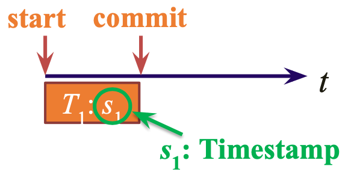
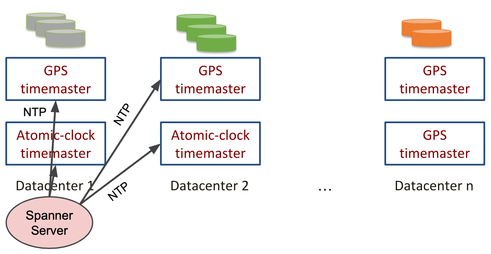
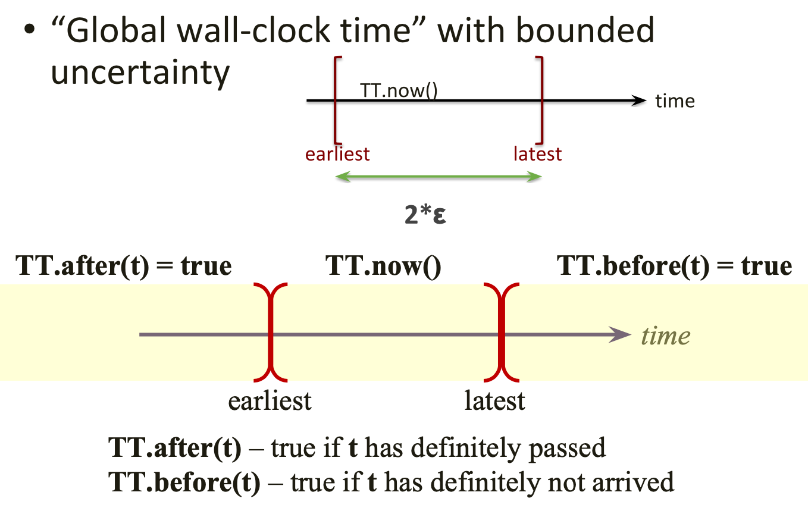
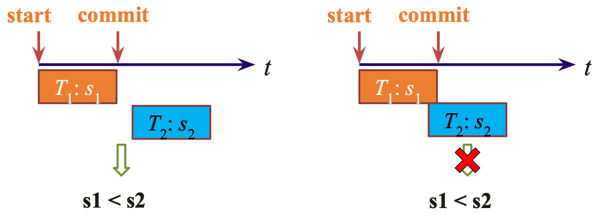

# Lecture 14 Distributed Databases: Case Study

## Consistent Distributed Database

|                   | Use Case                                         | Problems                     |
| ----------------- | ------------------------------------------------ | ---------------------------- |
| Distributed Mutex | Distributed KV without transactions              | Failures + Slow              |
| 2PC               | Disrtibuted DB with transactions (e.g., Spanner) | Failures                     |
| Primary-Backup    | Cost-efficient fault tolerance (e.g., FaRM)      | Correlated failures          |
| Paxos             | Staying up no matter the cost (e.g., Spanner)    | Delay and huge cost overhead |
| RAID, Checksums   | Every system                                     | Node failures                |

### Practical Constraints

* When availability over consistency
  * Challenge: Version reconcilation (parallel writes)
  * Practical approach (Dynamo): Vector Clocks
* Trend: Stronger-than-sequential consistency
  * Resurgence of consistent distributed DBs
  * Workloads are read heavy
* Cannot guarantee 100% availability

### Reading from Single Machine

* **Read lock**
  * Block all writes until read has finished
* **Snapshot**
  * Read from DB-copy, writes continue to original DB
* **Multi-version Concurrency Control (MVCC)**
  * New commit -> add as (timestamp, value)
  * Keep old (timestamp, value) tuples
  * Snapshot: read latest tuples with timestamp < now
* When reading from mutiple machines, must create distributed snapshots at exactly the same time
* e.g., PostgreSQL
  * Need synchronized clocks across all nodes
  * Need highly accurate time synchronization
  * Time sync error proportional to RTT
  * Global Internet RTTs in 100s of milliseconds

### Spanner: Google's Globally-Distributed Database

* Feature: **Lock-free** distributed read transactions
* Property: **External consistency** of distributed transactions
* Implementation: WAL + 2PC + Paxos + Snapshots
* **TrueTime: Interval-based global time**

* Strict two-phase locking for write transactions
* Assign timestamp while locks are held

* Challenge: time sync errors even with GPS/atomic clocks
* Conceptually must wait until all write transactions visible (their timestamps have passed)

* Global wall-clock time with bounded uncertainty

* If a transaction T1 commits before another transaction T2 starts, then T1's commit timestamp is smaller than T2
* Similar to how we reason with wall-clock time
