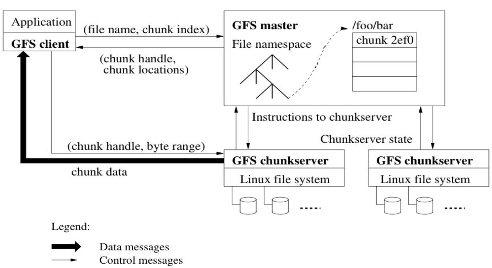
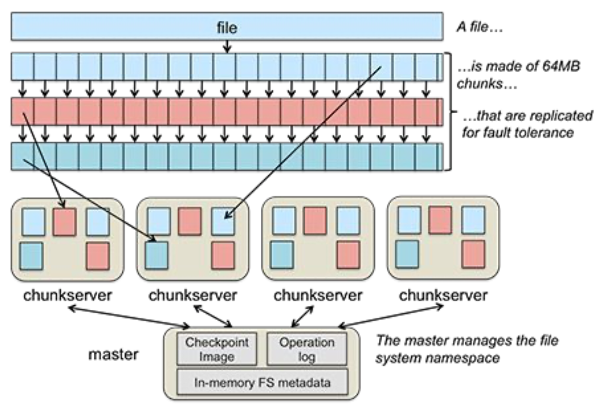
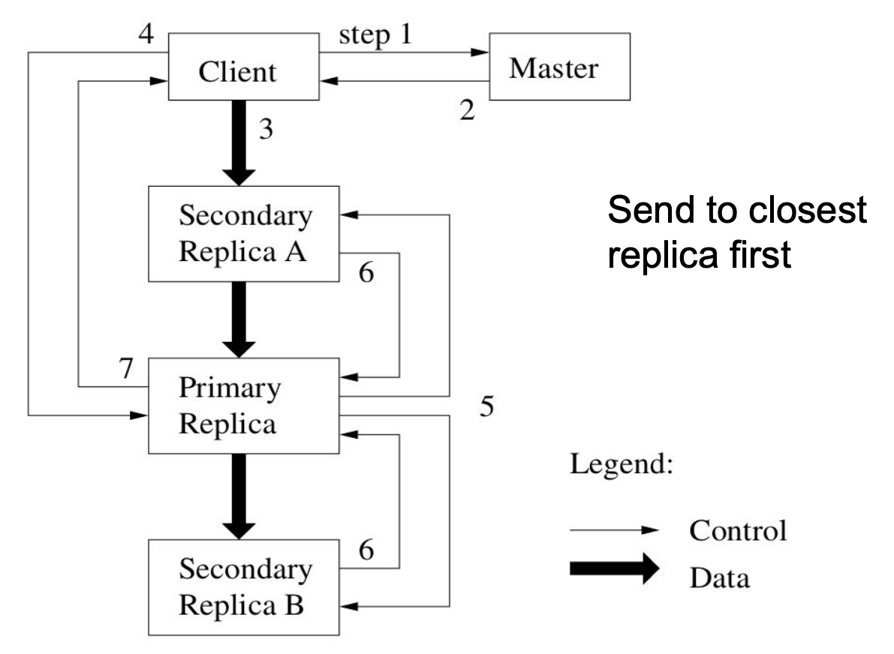
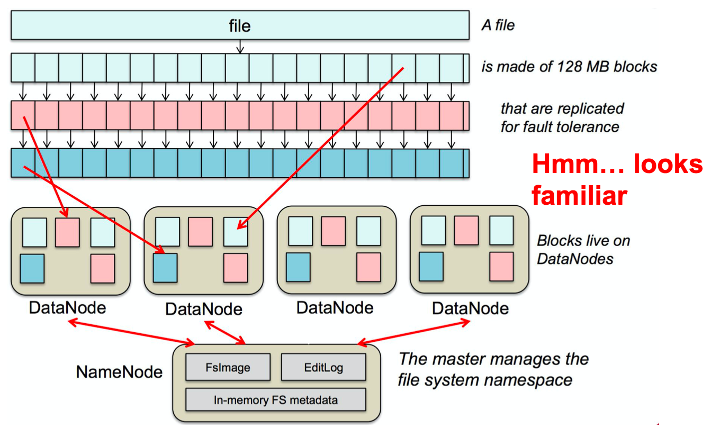

# Lecture 15 Cluster File Systems: The Google File System

## Cluster File Systems Case Study

* Design a new distributed file system for large clusters
* GFS: Google's distributed fault-tolerant file system
  * WAL + Checksums + Primary-Backup + new tricks
  * Focus on maintainability & data center environment
* GFS Operation Environment
  * Hundreds of thousands of commodity servers
  * Millions of commodity disks
  * Failures are normal (expected)
* GFS: Workload Assumptions
  * Large files: >= 100 MB in size
  * Large streaming reads: >= 1 MB in size
  * Large sequential writes that append write once
  * Concurrent appends by multiple clients want atomicity for appends without synchronization overhead among clients
* GFS Design Goals
  * Maintain high data and system availability
  * Handle failures gracefully and transparently
  * Low synchronization overhead between entities of GFS
  * Exploit parallelism of numerous disks/servers
  * Choose high sustained throughput over low latency for individual reads/writes
  * Co-design filesystem and applications (GFS client library)

## GFS Architecture

* **One master server**
  * State replicated on backups
* Many chunk servers (100s-1000s)
  * Chunk: 64 MB portion of file, identified by 64-bit, globally unique ID
  * Spread across racks; intra-rack between greater than inter-track
* Many clients accessing different files stored on same cluster

### GFS Master Server

* Holds all metadata in RAM; very fast operations on file system metadata
* Metadata:
  * Namespace (directory hierarchy)
  * Access control information (per file)
  * Mapping from files to chunks
  * Current locations of chunks (chunkservers)
* Delegates consistency management
* Garbage collects orphaned chunks
* Migrates chunks between chunk servers

### GFS Chunk Servers

* Stores 64 MB file chunks on local disk using standard Linux filesystem (like Ext4), each with version number and checksum
  * Why 64 MB? GFS overhead per chunk
* Read/write requests specify chunk handle and byte range
* Chunks replicated on configurable number of chunk servers (default: 3)
* No caching of file data (beyond standard Linux buffer cache)
* Send periodic heartbeats to Master

### GFS Client

* Issues control (metadata) requests to master server
* Issues data requests directly to chunk servers
  * This exploits parallelism and reduces master bottleneck
* **Caches metadata**
* **No caching of data**
  * No consistency difficulties among clients
  * Streaming reads (read once) and append writes (write once) don't benefit much from caching at client
* User-level API is provided
  * Does not support all the features of POSIX file system access - but looks familiar (i.e. open, close, read)
* Two special operations are supported
  * **Snapshot**: efficient way to copy an instance of a file or directory tree
  * **Append**: append data to file as an atomic operation without having to lock a file
    * Multiple processes can append to the same file concurrently without fear of overwriting one another's data

#### GFS Client Read

* Client sends to master:
  * `read(filename, chunk index)`
* Master's reply:
  * chunk ID, chunk version number, locations of replicas
* Client sends to closest chunk server with replica:
  * `read(chunk ID, byte range)`
  * Closest determined by IP address on simple rack-based network topology
* Chunk server replies with data

#### GFS Client Write

* 3 replicas for each block -> must write to all
* When block created, master decides placement
  * Two within single rack
  * Third on a different rack
  * Access time / safety tradeoff
* Some chunk server is primary for each chunk
  * Master grants lease to primary
  * Leases renewed using periodic heartbeat messages between master and chunk servers
* Client asks master for primary and secondary replicas for each chunk
* Client sends data to replicas in daisy chain
  * Pipelined: each replica forwards as it receives
  * Take advantage of full-duplex Ethernet links

#### GFS Record Append Operation

* Use large files as queues between multiple producers and consumers
* Client pushes data to last chunk's replicas
* Client sends request to primary
* Common case: request fits in last chunk
  * Primary appends data to own chunk replica
  * Primary tells secondaries to do same at same byte offset in their chunk replicas
  * Primary replies with success to client
* When data won't fit in last chunk
  * Primary fills current chunk with padding
  * Primary instructs other replicas to do same
  * Primary replies to client, "retry on next chunk"
* If record append fails at any replica, client retries operation
  * Data written at least once in atomic unit

### GFS File Deletion

* When client deletes file
  * Master records deletion in its log
  * File renamed to hidden name including deletion timestamp
* Master scans file namespace in background
  * Removes files with such names if deleted for longer than 3 days (configurable)
  * In-memory metadata erased
* Master scans chunk namespace in background
  * Removes unreferenced chunks from chunk servers

### GFS Logging at Master

* Master logs all client requests to disk sequentially (WAL)
* Replicates log entries to remote backup servers (Primary-Backup Replication)
* Only replies to client after log entries safe on disk on self and backups
* Logs cannot be too long
* Periodic checkpoints as on-disk B-tree

### GFS Chunk Leases and Version Numbers

* If no outstanding lease (chunk primary), when client requests write, master grants new one
* Chunks have version numbers
  * Stored on disk at master and chunk servers
  * Each time master grants new lease, increment version and inform all replicas
* Network partitioned chunk servers, primaries
* Master can revoke leases
  * e.g., when client requests rename or snapshot a file
* Detect outdated chunk server with version number

### GFS Consistency Model

* Changes to namespace (i.e., metadata) are **atomic**
  * Master uses WAL to define global total order of namespace changing operations
* Changes to data are **ordered** as chosen by a **primary**
  * But multiple writes from the same client may be interleaved or overwritten by concurrent operations from other clients
* Record append completes **at least once**, at offset of GFS's choosing
  * Applications must cope with possible duplicates
* Failures can cause inconsistency
  * e.g., different data across chunk servers (failed append)

### GFS Fault Tolerance

* Replays log from disk
  * Recovers namespace (directory) information
  * Recovers file-to-chunk-ID mapping (but not location of chunks)
* Asks chunk servers which chunks they hold
  * Recovers chunk-ID-to-chunkserver mapping
* If chunk server has older chunk, it's stale
  * Chunk server down at lease renewal
* If chunk server has newer chunk, adopt its version number
  * Master may have failed while granting lease
* Master notices missing heartbeats
* Master decrements count of replicas for all chunks on dead chunkserver
* Master re-replicates chunks missing replicas in background

### GFS Limitations

* Does not mask all forms of data corruption
  * Requires application-level checksum
* Master biggest impediment to scaling
  * Performance and availability bottleneck
  * Solution: Multiple master nodes, all sharing set of chunk servers but not a uniform namespace
* Large chunk size
* Security
  * Trusted environment, but users can interfere

## GFS Summary

* Success: used actively by Google
  * Availability and recoverability on cheap hardware
  * High throughput by decoupling control and data
  * Supports massive data sets and concurrent appends
* Semantics not transparent to apps
  * Must verify file contents to avoid inconsistent regions, repeated appends (at-least-once semantics)
* Performance not good for all apps
  * Assumes read-once, write-once workload (no client caching)
* Successor: Colossus
  * Eliminates master node as single point of failure
  * Storage efficiency: Read-Solomon (1.5x) instead of Replicas (3x)
  * Reduces block size to be between 1-8 MB
  * Few detailed public

## GFS and HDFS

| GFS                                                          | HDFS (Apache Hadoop Distributed File System)                 |
| ------------------------------------------------------------ | ------------------------------------------------------------ |
| Master                                                       | NameNode                                                     |
| Chunk server                                                 | DataNode                                                     |
| Operation log                                                | Journal, edit log                                            |
| Chunk                                                        | Block                                                        |
| Random file writes possible                                  | Only append is possible                                      |
| Multiple writer, multiple reader model                       | Single writer, multiple reader model                         |
| Chunk: 32 bit checksum over 64 KB data pieces (1024 per chunk) | per HDFS block, two files created on a DataNode: data file & metadata file (checksums, timestamp) |
| Default block size: 64 MB                                    | Default block size: 128 MB                                   |
