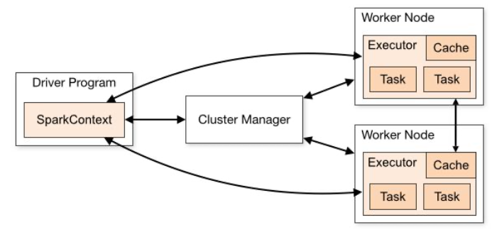
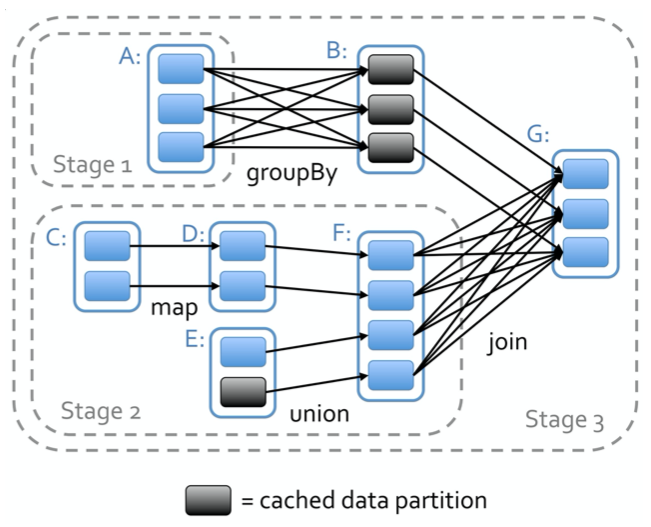
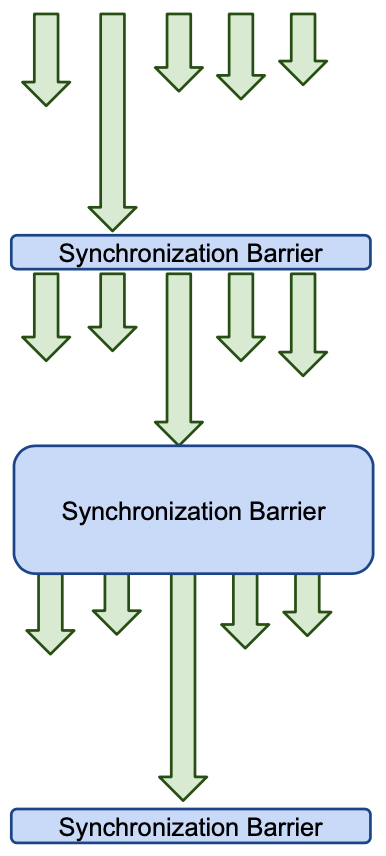
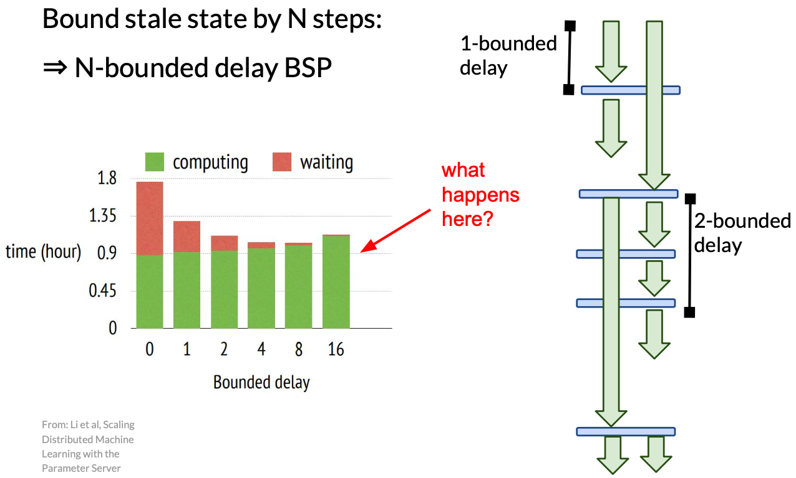
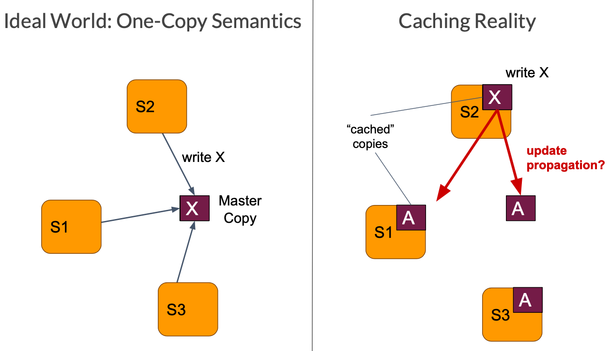

# Lecture 17 Fault-tolerant In-memory Computation

## Going Beyond MapReduce

* MapReduce (Hadoop) Framework:
  * Key features: **fault tolerance** and **high throughput**
  * Simplified data analysis on large, unreliable clusters
  * Store input/output after every step on disk
  * I/O penalty makes interactive data analysis impossible
  * Real-world applications require iterating MapReduce steps
    * We need many iterations
      * 90% spent to I/O to disks and over network
      * 10% spent computing actual results
  * Does not work for iterative applications
  * MapReduce abstraction not expressive enough

## In-memory Computation (Spark)

* Berkeley Extension to Hadoop -> Apache Spark
* Key idea: keep and share data sets in main memory
* Much faster response time (in practice: 10x-100x)
* However, traditional fault tolerance techniques can be expensive (10x-100x slowdown)

### Spark Approach: RDDs and Lineage

* **Resilient Distributed Datasets**
  * Limit update interface to coarse-grained operations
    * Map, group-by, filter, sample
  * Efficient fault recovery using lineage
    * Data is partitioned and each operation is applied to every partition
    * Individual operations are cheap
    * Recompute lost partitions on failure

* RDDs are immutable objects
* Immutability: Object's state can't be modified after creation
* Why immutability?
  * Enables lineage
    * Recreate any RDD any time
    * More strictly: RDDs need to be deterministic functions of input
  * Simplifies consistency
    * Caching and sharing RDDs across Spark nodes
  * Compatibility with storage interface (HDFS)
    * HDFS chunks are append only

### RDD Operations in Spark

* Transformations: create new RDD from existing one
  * map, filter, sample, groupByKey, sortByKey, union, join, cross
  * Lazy evaluation - triggered by Actions
* Actions: return value to caller
  * count, sum, reduce, save, collect
* Persist RDD to memory

### Apache Spark Deployment

* Master server ("driver")
  * Lineage and scheduling
* Cluster manager (not part of Spark)
  * Resource allocation
  * Mesos, YARN, K8S
* Woker nodes
  * Executors isolate concurrent tasks
  * Cache persists RDDs

### Spark Pipeline and Scheduler

* Support for directed graphs of RDD operations
* Automatic pipelining of functions within a stage
* Partitioning/Cache-aware scheduling to minimizes shuffles

### Spark Real World Challenges

* RDD Lineage
  * What if need lineage grows really large?
* RDDs Immutability
  * Deterministic functions of input
* Needs lots of memory (might not be able to run your workload)
* High overhead: copying data (no mutate-in-place)

## Towards a New Unified Framework

* In-memory computation and data-sharing
  * 10x-100x faster than disks or network
  * Key problem: Fault tolerance
* Unified computation abstraction
  * Power of iterations (local work + message passing)
  * Key problem: ease-of-use and generality

### BSP Computation Abstraction

* Bulk Synchronous Parallel Model
* Any distributed system can be emulated as local work + message passing = BSP
* Spark is not a good fit for
  * Non-batch workloads
    * Applications with fine-grained updates to shared state
  * Datasets that don't fit into memory
  * If you need high efficiency, SIMD/GPU

## Distributed Machine Learning

* Machine Learning algorithms are **iterative** in nature
* Three key challenges:
  * lots of data
  * lots of parameters
  * lots of iteration

### Scaling Out Distributed Machine Learning

* 10-100s nodes enough for data/model
* Scale out for throughput
* Goal: more iterations/sec
* Communication overhead sales badly with number of machines (N)
  * Centralized server
    * 2N overhead instead of N!
    * Limited scalability of central server
  * P2P file sharing (BitTorrent-like)
    * Higher network overhead
    * Better scalability
    * Needs to be data center aware

### Challenges of Synchronization Overhead

* BSP model:
  * No computation during barrier
  * No communication during computation
* Fundamental limitation in BSP model:
  * Constantly waiting for **stragglers**
* Idea: nodes can accept slightly stale state
* ML algorithms are robust since they converge even with some stale state
* If we fully remove BSP's synchronization barriers (Asynchronous communication), iterative algorithms won't converge
* **Bound stale state by N steps** can help

## Cache Update Propagation Mechanisms

### Cache Update Propagation Techniques

* Enforce Read-Only (Immutable Objects)
* Broadcast Invalidations
  * Every potential caching site notified on every update
  * Wasted traffic if no readers
  * Usage: CDNs
* Check on use
  * Reader checks master copy before each use
  * Usage: AFS-1, HTTP (Cache-control: must-revalidate)
* Callbacks
* TTLs (Faith-based caching)
  * Assume cached data is valid for a while
    * Check after timer expires: Time-to-live (TTL) field
    * No communication during trust (TTL) period
  * No server state (no need to know caching node)
  * Usage: CDNs, DNS, HTTP (Cache-control: max-age=30)
