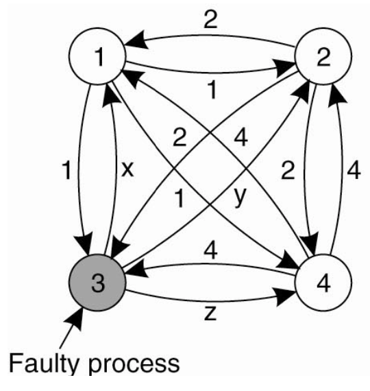
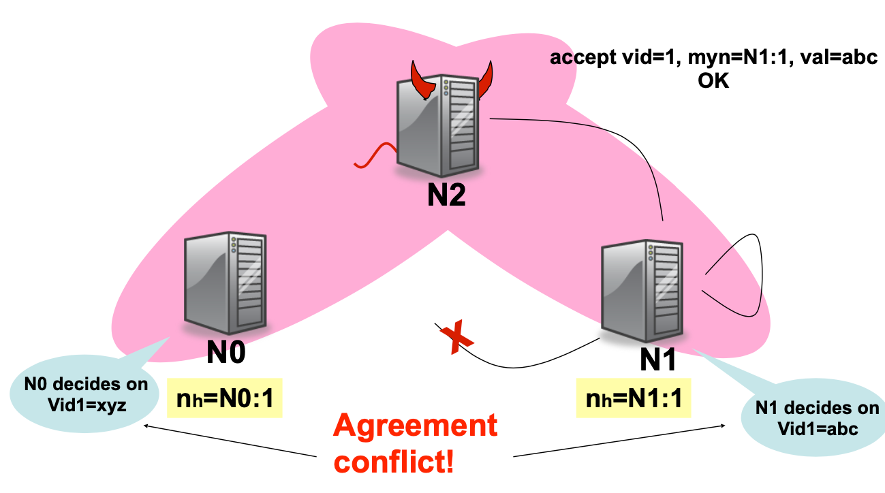
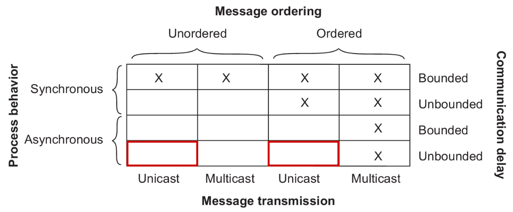
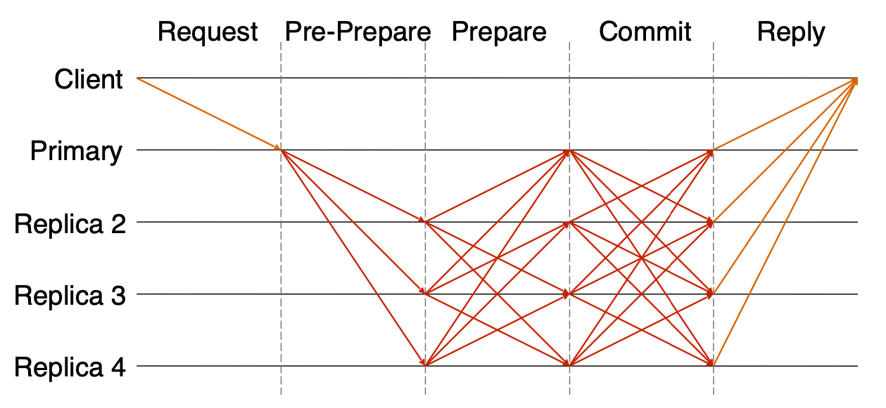

# Lecture 21 Byzantine Fault Tolerance

## Fault Tolerance

### Failure Models

| Type of failure   | Description                                                  |
| ----------------- | ------------------------------------------------------------ |
| Crash failure     | A server halts, but is working correctly until it halts      |
| Omission failure  | A server fails to responds to incoming requests              |
| Timing failure    | A server's response lies outside the specified time interval |
| Response failure  | A server's response is incorrect                             |
| Arbitrary failure | A server may produce arbitrary responses at arbitrary times  |

## Byzantine Fault Tolerance

### Byzantine Agreement Problem

* System of N processes, where each process i will provide a value vi to each other
* Some number of these processes may be incorrect (or malicious)
* Goal: Each process learn the true values sent by each of the correct processes

### Replicated State Machine (RSM)

* Traditional replicated state machine (RSM) tolerates benign failures
  * Node crashes / Network partitions
* A RSM with $2f+1$ replicas can tolerate $f$ simultaneous fail-stop failures
* Paxos uses a majority accept-quorum to tolerate $f$ benign faults out of $2f+1$ nodes
* Bad node tells different things to different quorums

* For liveness, the quorum size must be at most $N-f$
* For correctness, any two quorums must intersect at least one honest node: $(N-f)+(N-f)-N \leq f+1$
* No solution for three processes can handle a single traitor

### Agreement in Faulty Systems

* Possible characteristics of the underlying system:
  * Synchronous versus asynchronous systems
  * Communication delay is bounded or not
  * Message delivery is ordered or not
  * Message transmission is done through unicasting or multicasting

* Byzantine Agreement [Lamport, Shostak, Pease, 1982]
* Assumptions:
  * Every message that is sent is delivered correctly
  * The receiver knows who sent the message
  * Message delivery time is bounded

### Byzantine Agreement Algorithm

* Phase 1: Each process sends its value to the other processes
  * Correct processes send the same value to all
  * Faulty processes may send different valuesto each if desired (or no message)
* Phase 2: Each process uses the messages to create a vector of responses - must be a default value for missing messages
* Phase 3: Each process sends its vector to all other processes
* Phase 4: Each process the information received from every other process to do its computation

### Power of Cryptographic Signing

* Fundamental challenge of Byzantine Agreement Problem: traitors can lie
* Message signatures can help to solve this problem

## Async. BFT

* Why async?
  * Faulty network can violate timing assumptions
  * But can also prevent liveness

### Practical BFT

* Replicate service across many nodes
  * Assumption: only a small fraction of nodes are Byzantine
  * Rely on a super-majority of votes to decide on correct computation
  * Makes some weak synchrony (message delay) assumptions to ensure liveness
* PBFT property: tolerates <= $f$ failures if using a RSM with $3f+1$ replicas
* Static configuration (same 3f+1 nodes)
* Primary-Backup Replication + Quorums
* To deal with malicious primary
  * Use a 3-phase protocol to agree on sequence number
* To deal with loss of agreement
  * Use a bigger quorum (2f+1 out of 3f+1 nodes)
  * New primary (new view)
* Need to authenticate communications

#### Replica State

* A replica id $i$ (between $0$ and $N-1$)
* A view number v#, initially 0
* Primary is the replica with id i = v# mod N
* A log of <op, seq#, status> entries
  * Status = pre-prepared or prepared or committed

#### Normal Case

* Client sends request to Primary
* Primary sends *pre-prepare* message to all who contains <v#, seq#, op>
  * Records operation in log as *pre-prepared*
  * Use a duplicate seq# for op to avoid sned different seq# maliciously
* Replicas check the *pre-prepare*
  * If pre-prepare is ok:
    * Record operation in log as *pre-prepared*
    * Send *prepare* messages to all
    * Prepare contains <i, v#, seq#, op>
  * All to all communication
* Replicas wait for $2f+1$ matching prepares
  * Record operation in log as *prepared*
  * Send *commit* message to all
  * *commit* contains <i, v#, seq#, op>
  * Thus, all honest nodes that are prepared prepare the same value and at least $f+1$ honest nodes have sent *prepare*/*pre-prepare*
* Replicas wait for $2f+1$ matching commits
  * Absent view-change, a node only needs $f+1$ matching commits, but under the view change logic, $2f+1$ ensures eventual convergence even if operations were committed in different views
  * Record operation in log as *committed*
  * Execute the operation
  * Send result to the client
* Clients waits for $f+1$ matching relies
  * Ensures that at least one honest node has committed and executed
  * Ensures $2f+1$ matching commits
    * At least $f+1$ honest nodes have committed

#### View Change

* Replicas watch the primary
* Request a view change
  * Send a do-viewchange request to all
  * Nodes will echo a view-change request once they have seen f+1 valid view-change requests for a view greater than their current one
  * New primary requires $2f+1$ request (including its own) to accept new role
  * Sends new-view with proof that it got the previous messages
* Commit point: when $2f+1$ replicas have prepared
