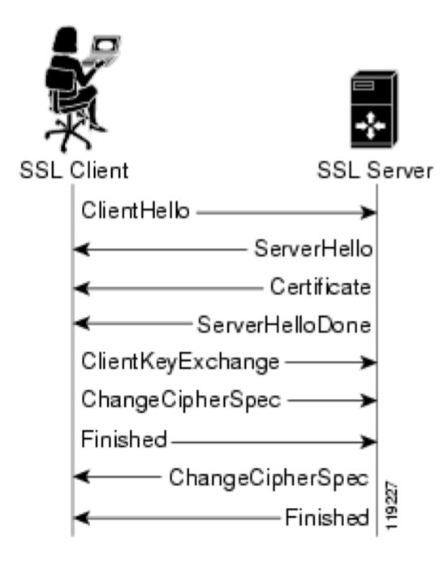
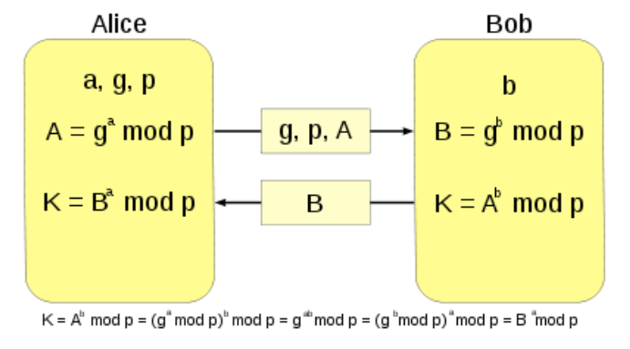
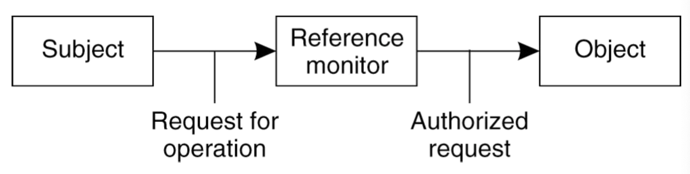
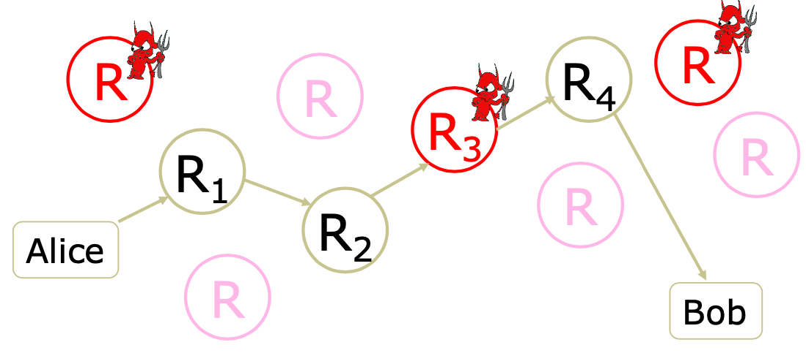
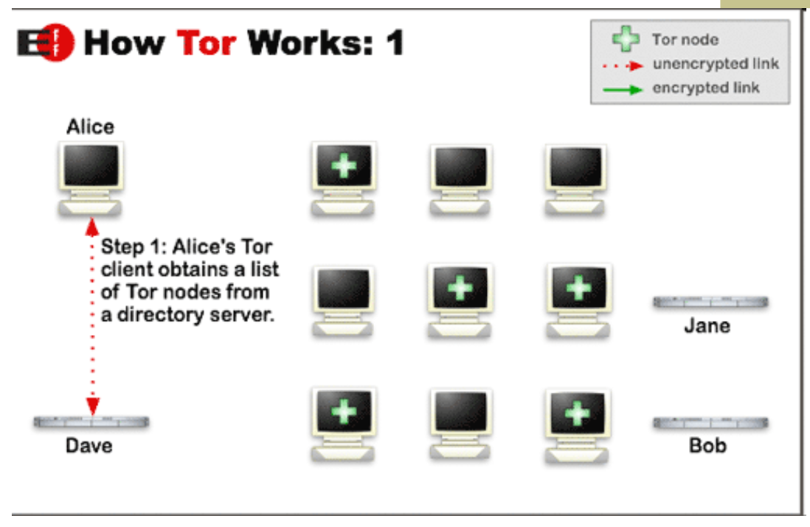
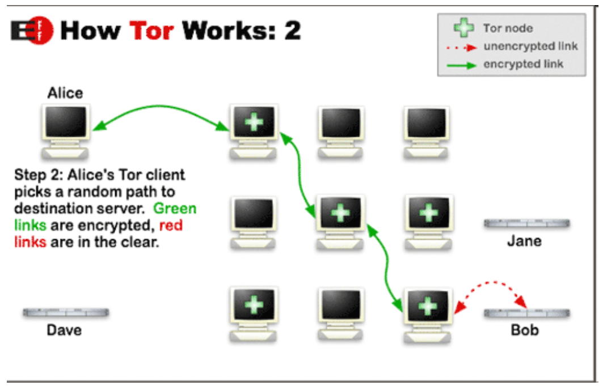
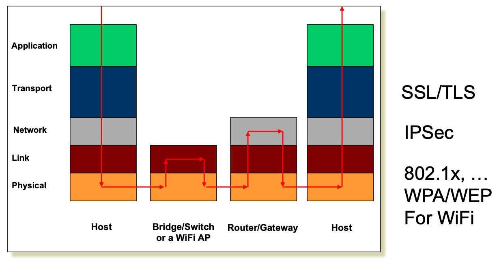

# Lecture 23 Security Protocol II

## Effective Secure Channel

### Transport Layer Security (TLS) aka Secure Socket Layer (SSL)

* Used for protocols like HTTPs
* Special TLS socket layer between application and TCP
* Handles confidentiality, integrity, and authentication
* Uses hybrid cryptography

### Setup Channel with TLS Handshake

* Clients and server negotiate exact cryptographic protocols
* Client's validate public key certificate with CA public key
* Client encrypt secret random value with server's key, and send it as a challenge
* Server decrypts, proving it has the corresponding private key
* This value is used to derive symmetric session keys for encryption & MACs

### How TLS Handles Data

* Data arrives as a stream from the application via the TLS Socket
* The data is segmented by TLS into chunks
* A session key is used to encrypt and MAC each chunk to form a TLS record, which includes a short header and data that is encrypted, as well as a MAC
* Records from a byte stream that is fed to a TCP socket for transmission

### Important Lessons

* PKI let us take the trusted third party **offline**
* But trade-off abillity for fast revocation
  * Usual trick: **Certificate expires**
* Better scaling: CA must only **sign once** no matter how many connections the server handles
* If CA is compromised, attacker can trick clients into thinking they're the real server
* Hybrid Engryption leverages strengths of both
* Great complexity exists in securely acquiring keys
* Alternative for PKI is the **ssh** model, which we call **trust on first use** (TOFU)

### Forward Secrecy

* In KDC design, if key $K_{server-KDC}$ is compromised a year later
  * from the traffic log, attacker can extract session key (encrypted with auth server keys)
  * attacker can decode all traffic retroactively
* In SSL, if CA key is compromised a year later
  * Only new traffic can be compromised
* In SSL, if server's key is compromised
  * Old logged traffic can still be compromised

### Diffie-Hellman Key Exchange

* How to generate keys between two people, securely, no trusted party, even if someone is listening in
* But vulnerable to man-in-the-middle attack
* Attacker pair-wise negotiates keys with each of A and B and decrypts traffic in the middle
* No authentication?
  * There are protocols that give us authentication
  * Auth protocols prevent man-in-the-middle attack if keys aren't yet compromised
  * Diffie-Hellman means that an attacker can't recover the real session key from a traffic log, even if they can decrypt that log
  * Client and server discard the Diffie-Hellman parameters and session key after use, so can't be recovered later
* This is called **perfect forward secrecy**

## Access Control

### The Access Control Matrix (ACM)

* A model of protection systems
  * Describes who (subject) can do what (rights) to what/whom (object/subject)
  * Example: A TA can grade homework
* Allowed Operations (Rights): r, x, w

|         | File 1 | File 2 | File 3 |
| ------- | ------ | ------ | ------ |
| Ann     | rx     | r      | rwx    |
| Bob     | rwx    | r      | --     |
| Charlie | rx     | rw     | w      |

* Real systems have to be fast and not use excessive space
* Order by columns (ACL) or rows (Capability List)

#### Access Control Lists

* An ACL stores non-empty elements of each column with its object
* Example: file1: {(Andy,rx), (Betty,rwx), (Charlie,rx}
* Given an object, what subjects can access it, and how?

#### Capability Lists

* Rows of access control matrix
* Andy: {(file1,rx), (file2,r), (file3,rw)}
* Given a subject, what objects can it access, and how?

## Privacy and Tor

### Randomized Routing

* Hide message source by routing it randomly
* Routers don't know for sure if the apparent source of a message is the true sender or another router

#### Onion Routing

* Sender chooses a random sequence of routers
  * Some routers are honest, some controlled by attacker
  * Sender controls the length of the path

### How Does Tor Work

### Tor Circuit Setup

* Client proxy establish a symmetric session key and circuit with Onion Router #1
* Client proxy extends the circuit by establishing a symmetric session key with Onion Router #2
  * Tunnel through Onion Router #1
* Routing info for each link encrypted with router's public key
* Each router learns only the identity of the next router

### Tor

* Second-generation onion routing network
* Specifically designed for low-latency anonymous Internet communications

## Encryption Used Across the Networking Stack

