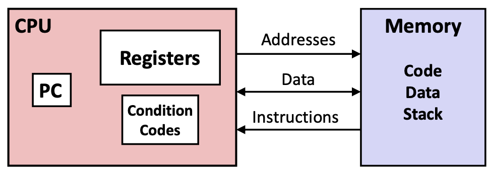
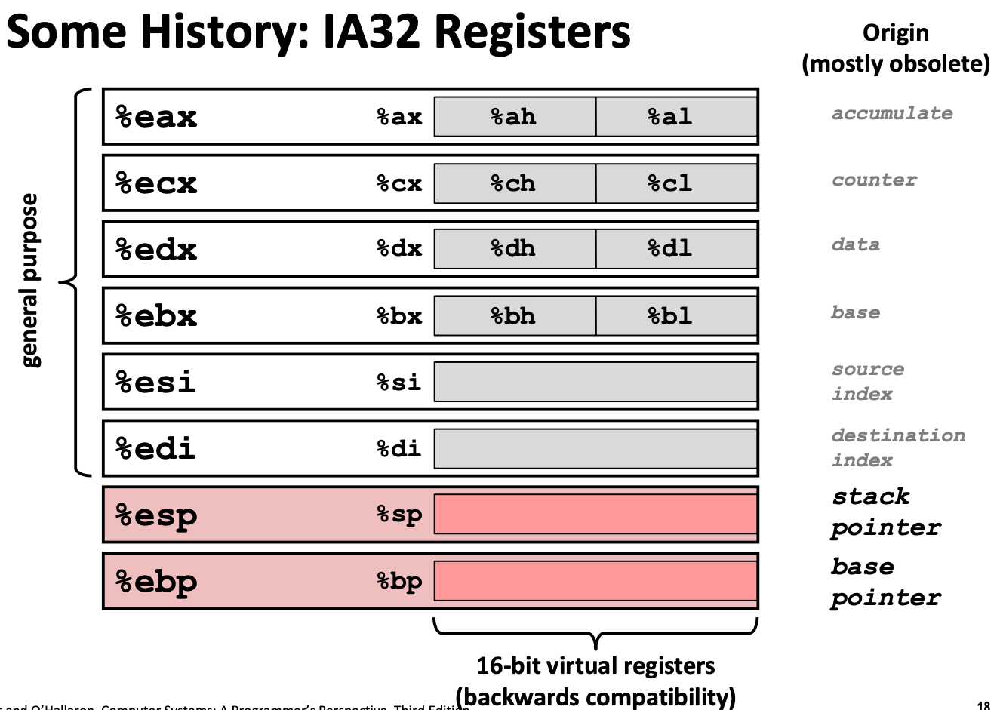
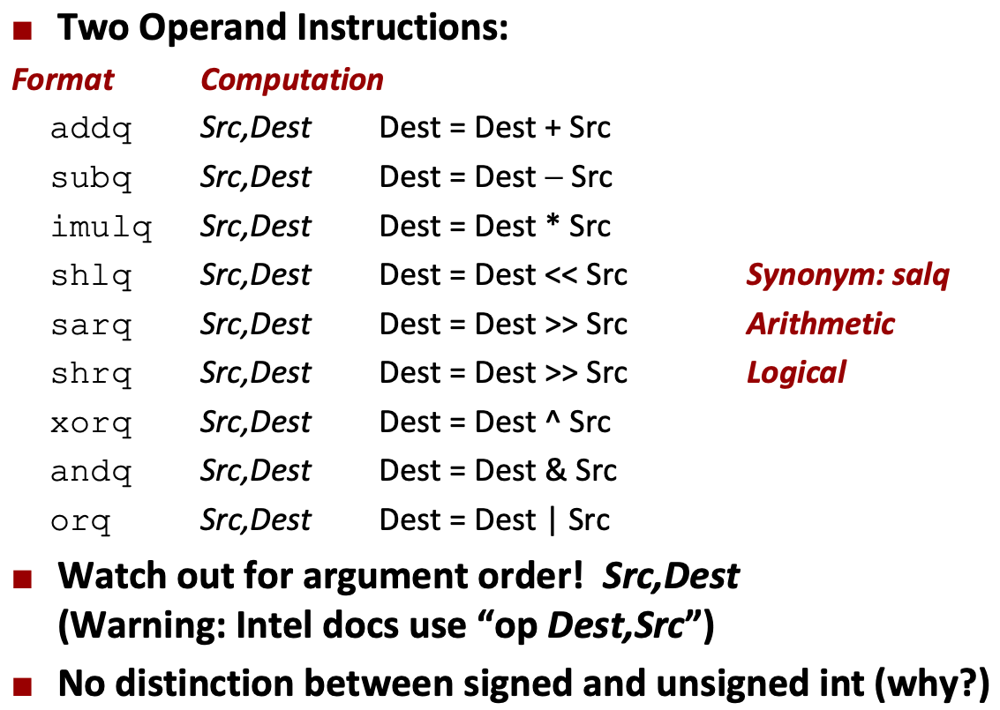
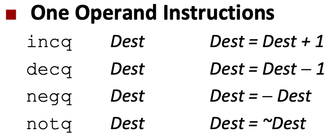
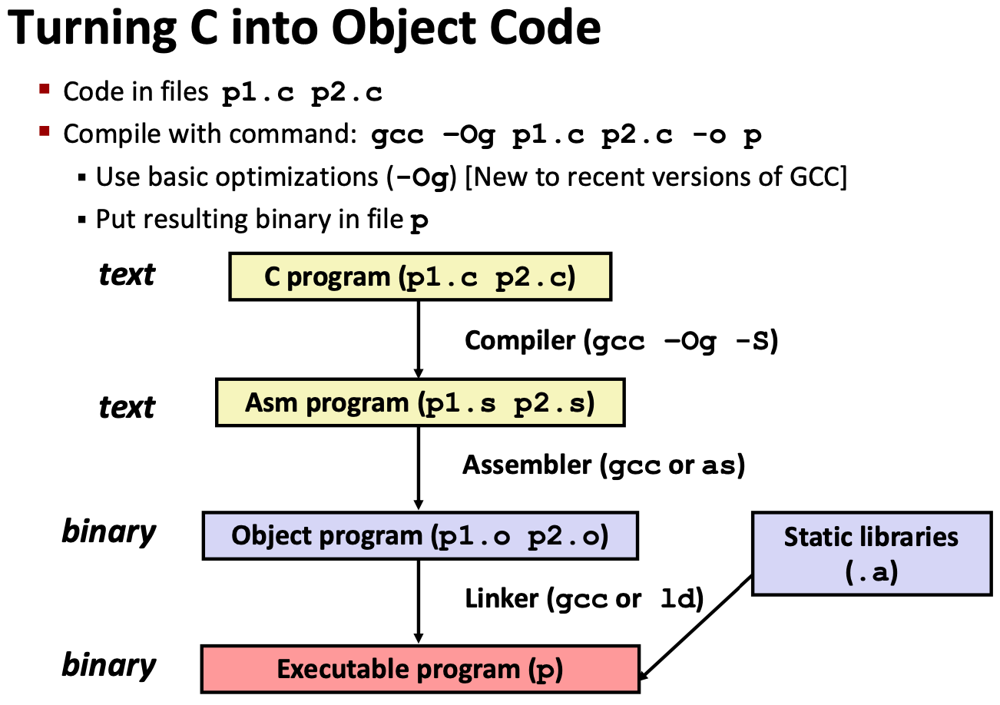

# Lecture 05 Machine-Level Programming I: Basics

## History if Intel processors and architectures

* x86 is a Complex Instruction Set Computer (CISC)
* Reduced Instruction Set Computer (RISC)
* Processor technology dimension = width of narrowest wires (10nm ≈ 100atoms wide)

## Assembly Basics

* Architecture: (a.k.a. instruction set architecture)
  * Machine code: The byte-level programs that a processor executes
  * Assembly code: A text representation of machine code
* Microarchitecture: Implementation of the architecture

* Programmer-Visible State
  * **PC: Program counter**
    * Address of next instruction
    * Called "RIP" (x86-64)
  * **Register file**
    * Heavily used program data
  * **Condition codes**
    * Stores status information about most recent arithmetic or logical operation
    * Used for conditional branching
  * **Memory**
    * Byte addressable array
    * Code and user data
    * Stack to support procedures
* Data Types
  * Integer data of 1, 2, 4, or 8 bytes
    * Data values
    * Addresses (untyped pointers)
  * Floating point data of 4, 8, or 10 bytes
  * SIMD vector data types of 8, 16, 32, or 64 bytes
  * Code: Byte sequences encoding series of instructions
  * No aggregate types such as arrays or structures

### Registers

### Operations

* Transfer data
* Perform arithmetic function on register or memory data
* Transfer control

### Memory

* Normal `(R)`: `Mem[Reg[R]]`
* Displacement `D(R)`: `Mem[Reg[R]+D]`
* Most general form `D(Rb, Ri, S)`: `Mem[Reg[Rb]+S*Reg[Ri]+D]`

## Arithmetic & Logical Operations

* `leaq Src, Dst`
  * `Src` is address mode expression
  * Set `Dst` to address denoted by expression

## C, Assemble, Machine Code

### Turning C into Object Code

* Code in files `p1.c` `p2.c`
* Compile with command: `gcc -Og p1.c p2.c -o p`
  * Use basic optimizations (`-Og`)
  * Put resulting binary in file

### Disassembling Object Code

* `objdump -d sum`
  * Can be run on either `a.out` (complete executable) or `.o` file
* With `gdb` debugger
  * `gdb sum`
  * `disassemble sumstore`
  * `x/14xb sumstore`

