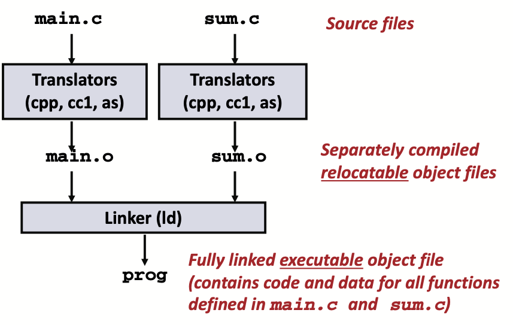
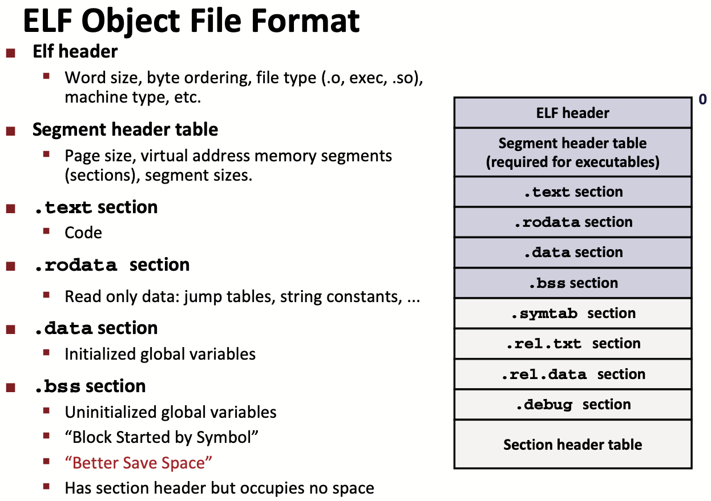
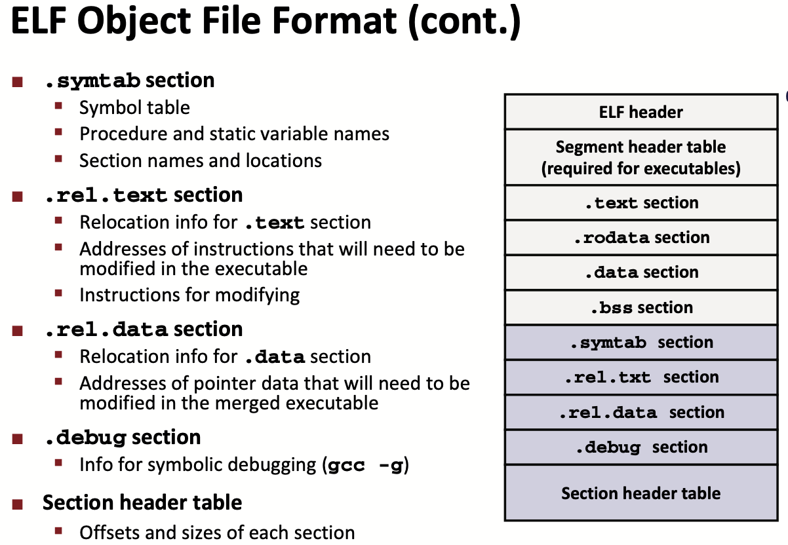
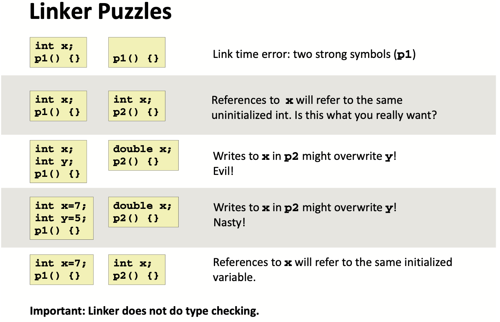
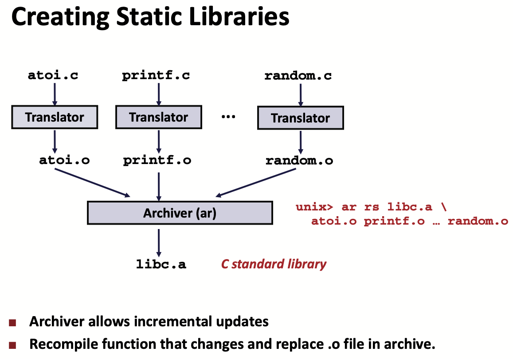
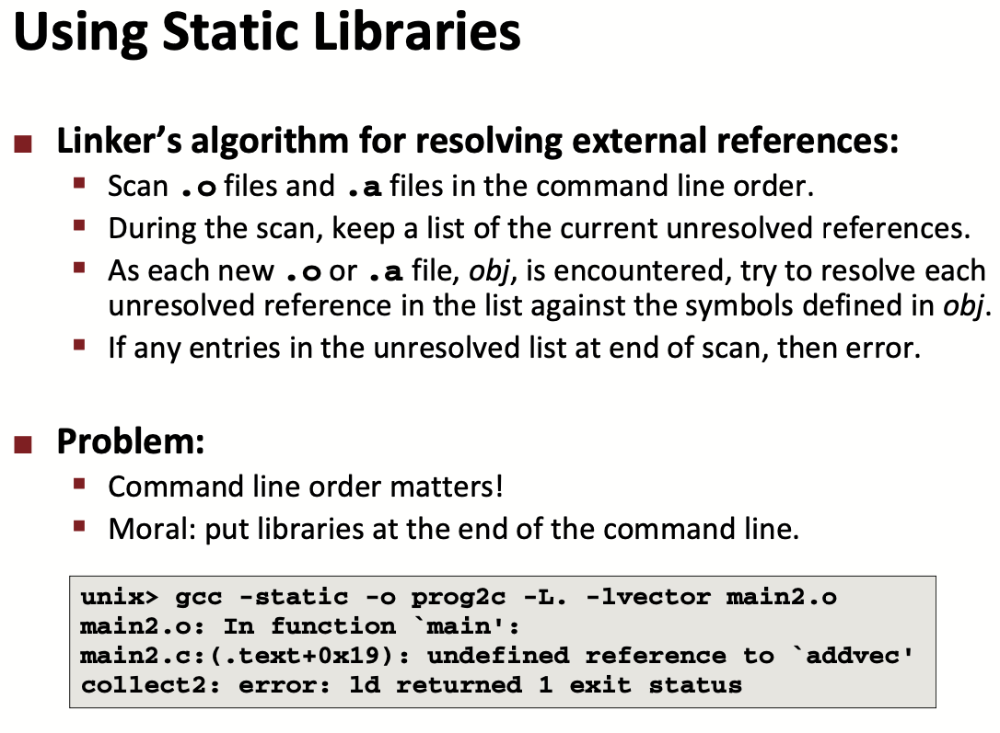
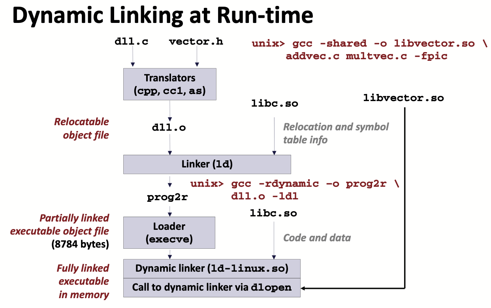

# Lecture 14 Linking

## Linking

* Programs are translated and linked using a compiler driver:
  * `linux> gcc -Og -o prog main.c sum.c`
  * `linux> ./prog`

### Why Linkers

* Reason 1: Modularity
  * Program can be written as a collection of smaller source files, rather than one monolithic mass
  * Can build libraries of common functions
    * e.g., Math library, standard C library
* Reason 2: Efficiency
  * Time: Separate compilation
  * Space: Libraries
    * Common functions can be aggregated into a single file
    * Option 1: Static Linking
      * Executable files and running memory images contain only the library code they actually use
    * Option 2: Dynamic linking
      *  Executable files contain no library code
      * During execution, single copy of library code can be shared across all executing processes

### What Do Linkers Do

* Step 1: Symbol resolution
  * Programs define and reference symbols (global variables and functions):
    * `void swap() {...} /* define symbol swap */`
    * `swap(); /* reference swap */`
    * `int *xp = &x; /* define symbol xp, reference x */`
  * Symbol definitions are stored in object file (by assembler) in symbol table
    * Symbol table is an array of entries
    * Each entry includes name, size, and location of symbol
  * During symbol resolution step, the linker associates each symbol reference with exactly one symbol definition
* Step 2: Relocation
  * Merges separate code and data sections into single sections
  * Relocates symbols from their relative locations in the `.o` files to their final absolute memory locations in the executable
  * Updates all references to these symbols to reflect their new positions

## Object Files

### Three Kinds of Object Files

* Relocatable object file (`.o` file)
  * Contains code and data in a form that can be combined with other relocatable object files to form executable object file
    * Each `.o` file is produced from exactly one source (`.c`) file
* Executable object file (`a.out` file)
  * Contains code and data in a form that can be copied directly into memory and then executed
* Shared object file (`.so` file)
  * Special type of relocatable object file that can be loaded into memory and linked dynamically, at either load time or run-time
  * Called Dynamic Link Libraries (DLLs) by Windows

### Executable and Linkable Format (ELF)

* Standard binary format for object files
* One unified format for Object files
* Generic name: ELF binaries

### Linker Symbols

* Global symbols
  * Symbols defined by module m that can be referenced by other modules
  * e.g., non-static C functions and non-static global variables
  * Avoid if you can; otherwise use `static` if you can
  * Initialize if you define a global variable
  * Use `extern` if you reference an external global variable
* External symbols
  * Global symbols that are referenced by module m but defined by some other module.
* Local symbols
  * Symbols that are defined and referenced exclusively by module m.
  * e.g, C functions and global variables defined with the static attribute
  * **Local linker symbols are not local program variables**
    * Local non-static C variables: stored on the stack
    * Local static C variables: stored in either `.bss` or `.data`
* Program symbols are either strong or weak
  * Strong: procedures and initialized globals
  * Weak: uninitialized globals
    * Or ones declared with specifier `extern`

### Linker’s Symbol Rules

* Rule 1: Multiple strong symbols are not allowed
* Rule 2: Given a strong symbol and multiple weak symbols, choose the strong symbol
* Rule 3: If there are multiple weak symbols, pick an arbitrary one

## Libraries

### Old-Fashioned Solution: Static Libraries

* Static libraries (.a archive files)
  * Concatenate related relocatable object files into a single file with an index (called an archive)
  * Enhance linker so that it tries to resolve unresolved external references by looking for the symbols in one or more archives
  * If an archive member file resolves reference, link it into the executable
* Commonly used libraries
  * `libc.a` - the C standard library
  * `limb.a` - the C math library

### Modern Solution: Shared Libraries

* Object files that contain code and data that are loaded and linked into an application dynamically, at either load-time or run-time
* Also called: dynamic link libraries, `DLL`s, `.so` files
* Dynamic linking can occur when executable is first loaded and run (load-time linking)
* Dynamic linking can also occur after program has begun (run-time linking)
* Shared library routines can be shared by multiple processes

