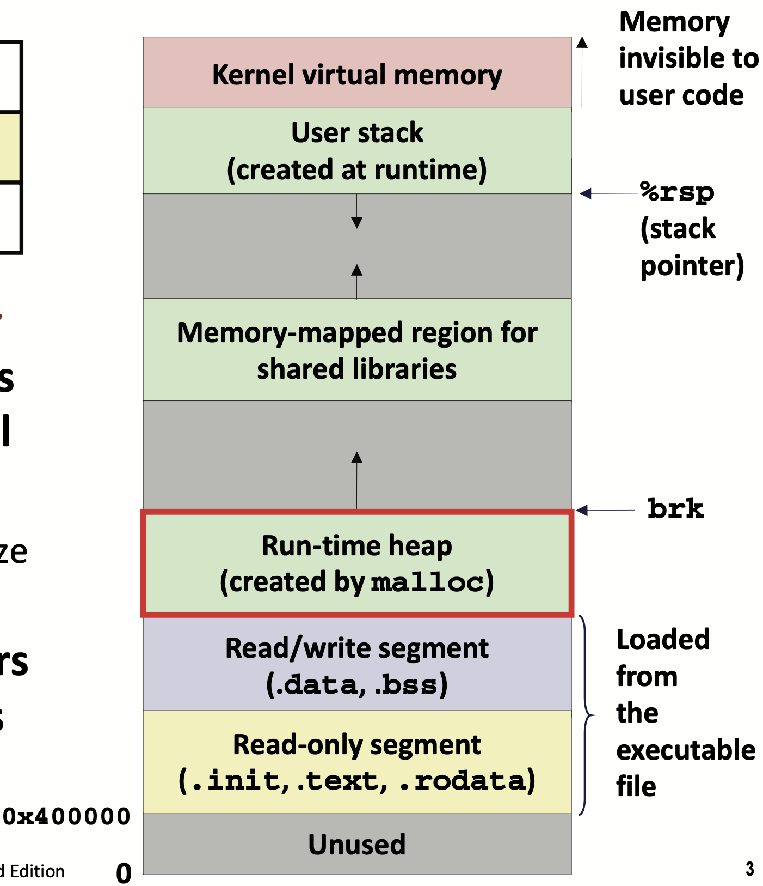

# Lecture 15 Malloc Basics

## Dynamic Memory Allocation

* Programmers use **dynamic memory allocators** to acquire **virtual memory (VM)** at runtime
  * For data structures whose size is only known at runtime
* Dynamic memory allocators manage an area of process VM known as the **heap**
* Allocator maintains heap as collection of variable sized **blocks**, which are either **allocated** or **free**
  * Explicit allocator: application allocates and frees space (e.g. `malloc` and `free` in C)
  * Implicit allocator: application allocates, but does not free space (e.g. `new` and garbage collection in Java)
* Memory Structure

## The malloc Package

* `malloc`
  * Successful:
    * Returns a pointer to a memory block of at least size bytes aligned to a 16-byte boundary (on x86-64)
    * If `size == 0` returns `NULL`
  * Unsuccessful:
    * Returns `NULL(0)` and sets `errno` to `ENOMEM`
* `free`
  * Returns the block pointed by `p` to pool of available memory
  * `p` must come from a previous call to `malloc`, `calloc`, or `realloc`
* `calloc`
  * Initializes allocated block to zero
* `realloc`
  * Changes the size a previously allocated block
* `sbrk`
  * Used internally by allocators to grow or shrink the heap

## Performance Goals

* Goals: maximize throughput and peak memory utilization
* Aggregate payload $P_k$: sum of currently allocated payloads
* Current heap size $H_k$: $H_k$ is monotonically nondecreasing
* Overhead after $k+1$ requests: fraction of heap space NOT used for program data

## Fragmentation

* **Internal Fragmentation** occurs if payload is smaller than block size
  * Depends only on the pattern of **previous** requests
  * Only requires space for allocated data, data structures, and unused space due to alignment constraints
* **External Fragmentation** occurs when there is enough aggregate heap memory, but no single free block is large enough
  * Depends on the pattern of **future** requests

## Implementation Issues

* Knowing how much to free
  * Keep the length (in bytes) of a block in the word preceding the block
  * Including the header in header field
* Keeping track of free blocks
  * Implicit list using length—links all blocks
  * Explicit list among the free blocks using pointers
  * Segregated free list (Different free lists for different size classes)
  * Blocks sorted by size (Can use a balanced tree with pointers within each free block, and the length used as a key)

## Implicit Free List

* For each block we need both size and allocation status
* Use low-order address bits in size segment as allocated/free flag (1 for allocated 0 for free)
* Search list from beginning, choose first free block that fits
* Finding space for specified bytes (including header)
* Finding a free block
  * First fit: Search list from beginning, choose first free block that fits
  * Next fit: Search list starting where previous search finished
  * Best fit: Choose the best free block: fits, with fewest bytes left over
* Coalesce
  * Join with next/previous blocks, if they are free
  * Bidirectional Coalescing: **Boundary tags**
    * Replicate size/allocated word at “bottom” (end) of free blocks
    * Leads to internal fragmentation
  * Constant time coalescing
* Heap Structure
  * Dummy footer before first header marked as allocated to prevent accidental coalescing when freeing first block (the same as last footer)