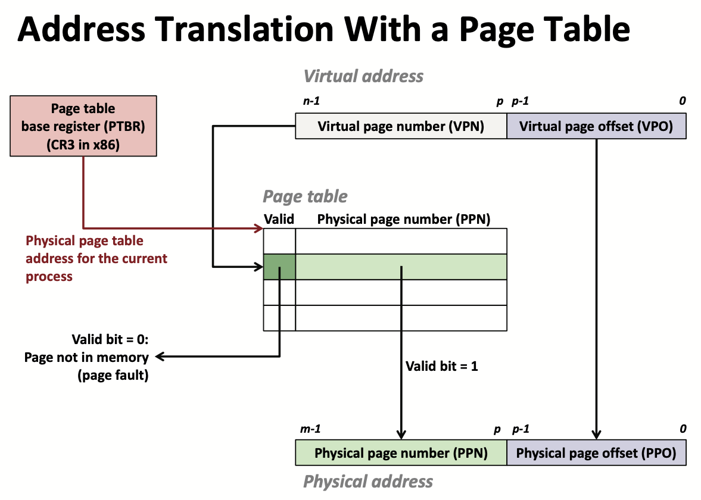
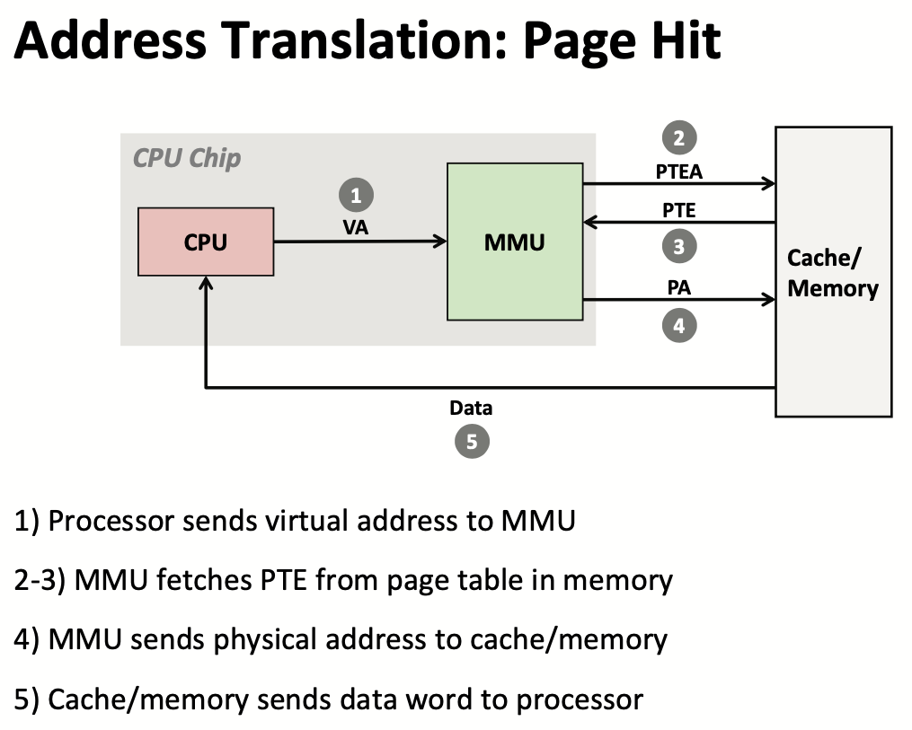
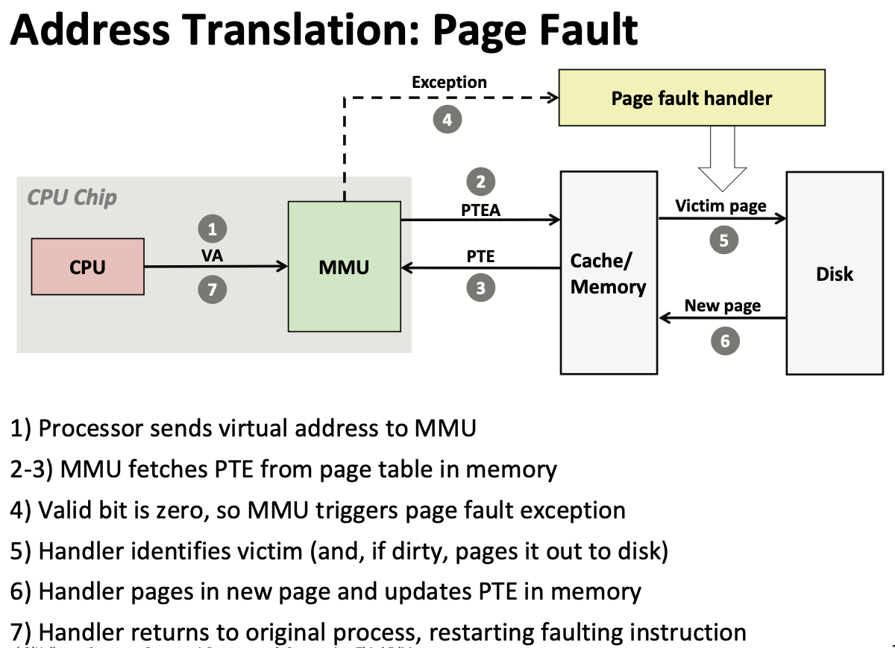
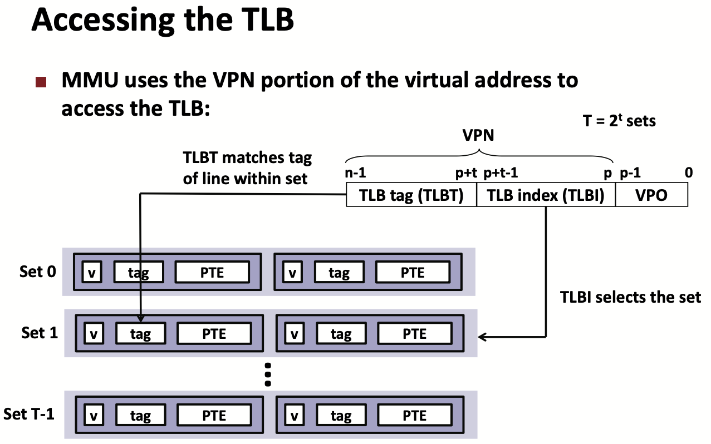

# Lecture 17 Virtual Memory: Concepts

## Address Spaces

* CPU Chip
  * CPU -> Virtual address (VA) -> MMU -> Physical address (PA) -> Main memory
* Linear Address spaces:
  * ${0,1,2,3,\cdots}$
* Virtual address space: Set of $N=2^n$ virtual address
  * ${0,1,2,3,\cdots,N-1}$
* Physical address space: Set of $M=2^m$ physical address
  * ${0,1,2,3,4,\cdots,M-1}$

## Why Virtual Memory

* Uses main memory efficiently
  * Use DRAM as a cache for parts of a virtual address space
* Simplifies memory management
  * Each process gets the same uniform linear address space
* Isolates address spaces
  * One process can't interfere with another's memory
  * User program cannot access privileged kernel information and code

## VM as a Tool for Caching

* virtual memory is an array of N contiguous bytes stored on disk
* The contents of the array on disk are cached in physical memory (DRAM cache)
  * These cache blocks are called pages (size is $P = 2^p$ bytes)

### DRAM Cache Organization

* DRAM cache organization driven by the enormous miss penalty
* Consequences
  * Large page (block) size: typically 4 KB
    * Linux “huge pages” are 2 MB (default) to 1 GB
  * Fully associative
    * Any VP can be placed in any PP
    * Requires a “large” mapping function – different from cache memories
  * Highly sophisticated, expensive replacement algorithms
  * Write-back rather than write-through

### Enabling Data Structure: Page Table

* A **page table** is an array of page table entries (PTEs) that maps virtual pages to physical pages
* **Page hit**: reference to VM word that is in physical memory (DRAM cache hit)
* **Page fault**: reference to VM word that is not in physical memory (DRAM cache miss)
* Handling Page Fault
  * Page fault handler selects a victim to be evicted
  * Offending instruction is restarted: page hit
  * Waiting until the miss to copy the page to DRAM is known as **demand paging**
* Completing page fault
  * Page fault handler executes return from interrupt (`iret`) instruction
    * Like `ret` instruction, but also restores privilege level
    * Return to instruction that caused fault
    * But, this time there is no page fault

### Locality of VM

* Virtual memory seems terribly inefficient, but it works because of locality
* At any point in time, programs tend to access a set of active virtual pages called the **working set**
* If (working set size < main memory size)
  * Good performance for one process (after cold misses)
* If (working set size > main memory size )
  * **Thrashing**: Performance meltdown where pages are swapped (copied) in and out continuously

## VM as a Tool for Memory Management

* Each process has its own virtual address space
* Sharing code and data among processes
  * Map virtual pages to the same physical page
* Simplifying Linking and Loading
  * `execve` allocates virtual pages for .text and .data sections & creates PTEs marked as invalid

## VM as a Tool for Memory Protection

* Extend PTEs with permission bits
* MMU checks these bits on each access

## VM Address Translation

### Address Translation Symbols

* Components of the virtual address (VA)
  * VPO: Virtual page offset
  * VPN: Virtual page number
  * TLBI: TLB index
  * TLBT: TLB tag
* Components of the physical address (PA)
  * PPO: Physical page offset (same as VPO)
  * PPN: Physical page number

### Address Translation With a Page Table

### Address Translation: Page Hit

### Address Translation: Page Fault

### Speeding up Translation with a TLB

* Page table entries (PTEs) are cached in L1 like any other memory word
  * PTEs may be evicted by other data references
  * PTE hit still requires a small L1 delay
* Solution: Translation Lookaside Buffer (TLB)
  * Small set-associative hardware cache in MMU
  * Maps virtual page numbers to physical page numbers
  * Contains complete page table entries for small number of pages
* Accessing the TLB

### Multi-Level Page Tables

* Example: 2-level page table
  * Level 1 table: each PTE points to a page table
  * Level 2 table: each PTE points to a page
