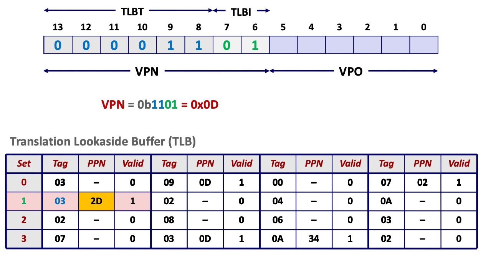
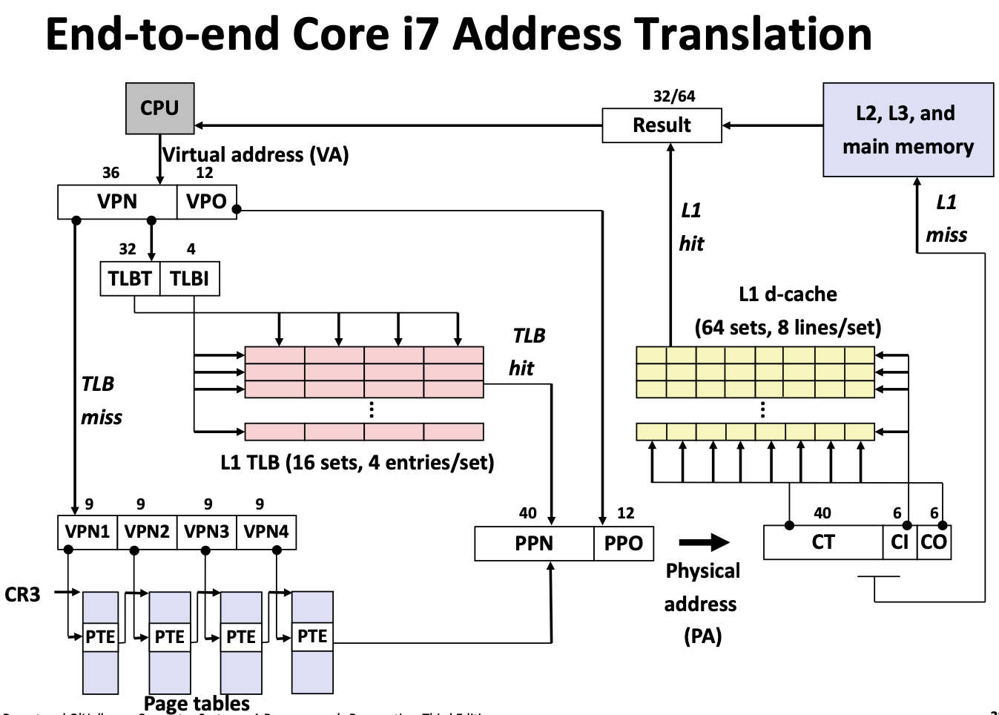
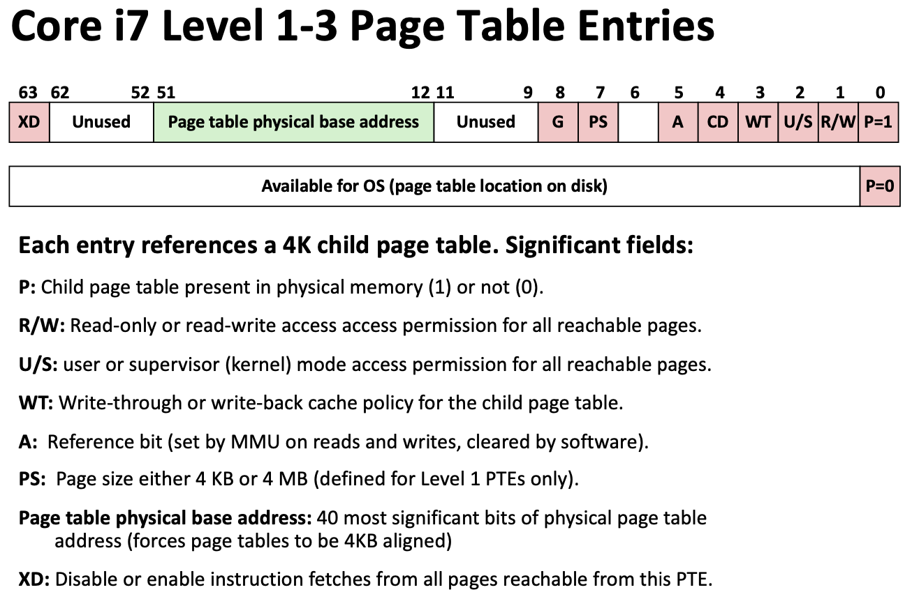
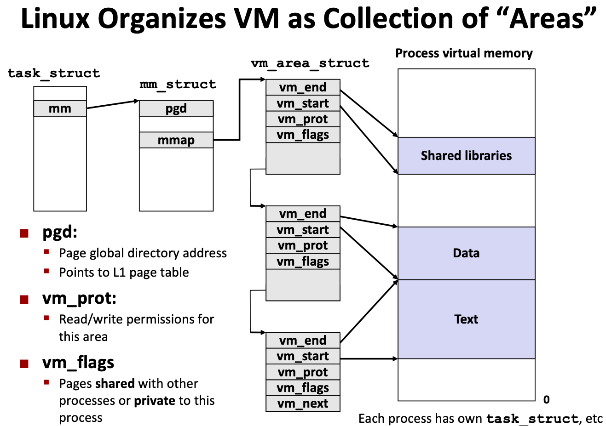
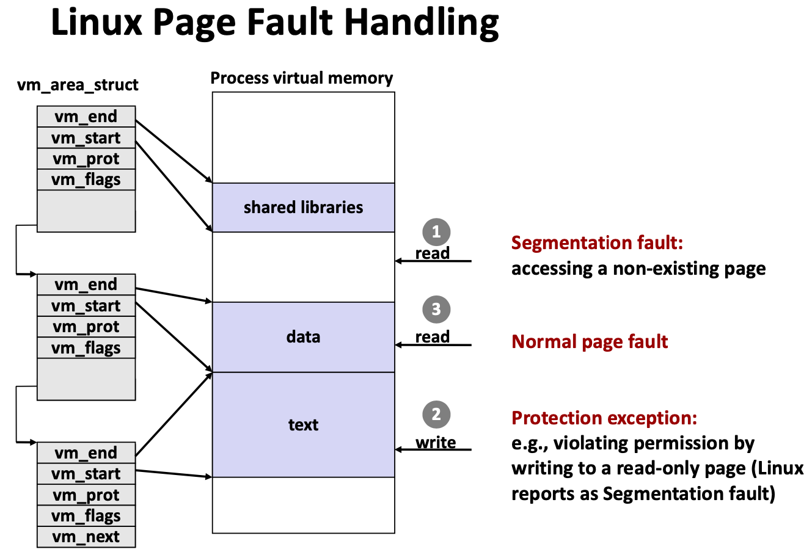

# Lecture 18 Virtual Memory: Systems

## Simple Memory System Example

* Addressing
  * 14-bit VA
  * 12-bit PA
  * Page size = 64 bytes
  * TLB
    * 16-entries
    * 4-way associative

## Case Study: Core i&/Linux Memory System

### End-to-end Core i7 Address Translation

* **Core i7 Level 1-3 Page Table Entries**

### Linux Organizes VM as Collection of Areas

### Linux Page Fault Handling

## Memory Mapping

* VM areas initialized by associating them with disk objects
  * Called **memory mapping**
* Area can be backed by (i.e., get its initial values from) :
  * Regular file on disk (e.g., an executable object file)
  * Anonymous file (e.g., nothing)
    * First fault will allocate a physical page full of 0's (demand-zero page)
    * Once the page is written to (dirtied), it is like any other page
* Dirty pages are copied back and forth between memory and a special **swap file**

### Private Copy-on-write (COW) Objects

* Two processes mapping a private **copy-on-write (COW)** object
* Area flagged as private copy-on- write
* PTEs in private areas are flagged as read-only
* Instruction writing to private page triggers protection fault
* Handler creates new R/W page
* Instruction restarts upon handler return
* Copying deferred as long as possible

### Finding Shareable Pages

* **Kernel Same-Page Merging**
  * OS scans through all of physical memory, looking for duplicate pages
  * When found, merge into single copy, marked as copy-on-write
  * Especially useful when processor running many virtual machines

### User-Level Memory Mapping

* Uses of mmap
  * Reading big files
* Shared data structures (when called with `MAP_SHARED` flag)
  * File-based data structures
