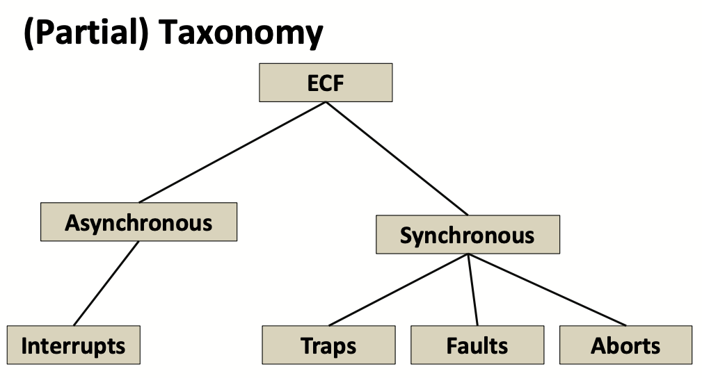
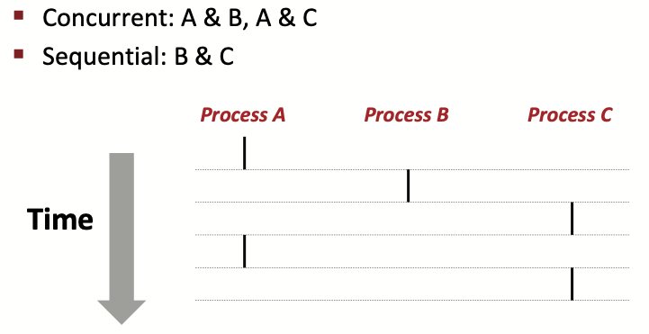
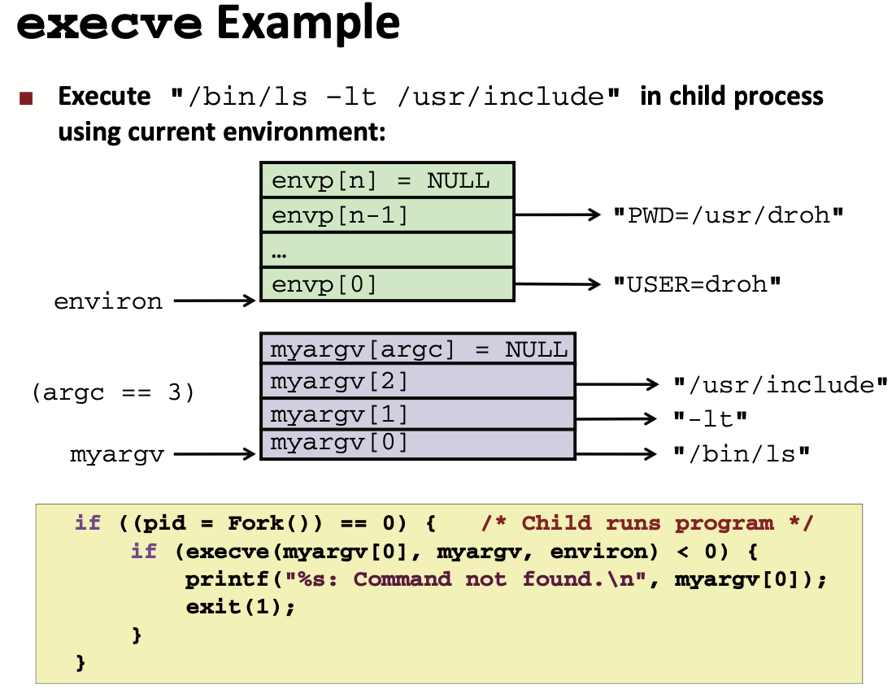
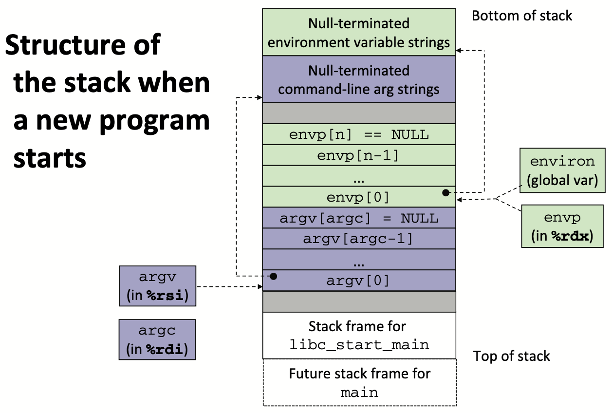
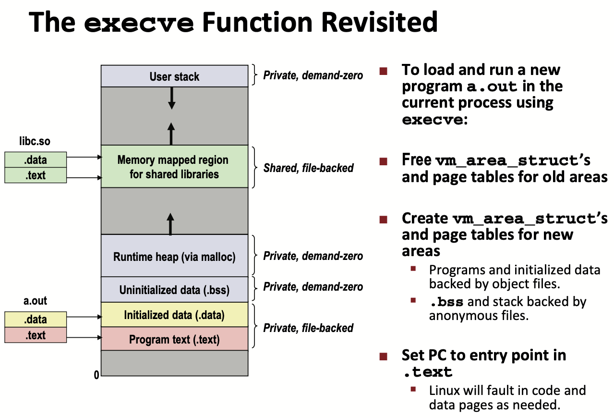

# Lecture 19 Exceptional Control Flow: Exceptions and Processes

## Exceptional Control Flow

### Control Flow

* From startup to shutdown, a CPU simply reads and executes (interprets) a sequence of instructions, one at a time
* Change control flow
  * Jumps and branches
  * Call and return

### Exceptional Control Flow

* Low level mechanisms
  * **Exceptions**
    * Change in control flow in response to a system event (i.e., change in system state)
    * Implemented using combination of hardware and OS software
* Higher level mechanisms
  * **Process context switch**
    * Implemented by OS software and hardware timer
  * **Signals**
    * Implemented by OS software
  * **Nonlocal jumps**: setjmp() and longjmp()
    * Implemented by C runtime library

## Exceptions

* An **exception** is a transfer of control to the OS kernel in response to some event (i.e., change in processor state)
  * Kernel is the memory-resident part of the OS
  * Examples of events: Divide by 0, arithmetic overflow, page fault, I/O
    request completes, typing Ctrl-C
* Exception Tables
  * Each type of event has a unique exception number k
  * k = index into exception table (a.k.a. interrupt vector)
  * Handler k is called each time exception k occurs
* Taxonomy



### Asynchronous Exceptions (Interrupts)

* Caused by events external to the processor
  * Indicated by setting the processor’s interrupt pin
  * Handler returns to “next” instruction

### Synchronous Exceptions

* Caused by events that occur as a result of executing an instruction
* **Trap**
  * Intentional, set program up to “trip the trap” and do something
  * Examples: **system calls**, gdb breakpoints
  * Returns control to “next” instruction
* **Faults**
  * Unintentional but possibly recoverable
  * Examples: page faults (recoverable), protection faults (unrecoverable), floating point exceptions
  * Either re-executes faulting (“current”) instruction or aborts
  * Fault Example: Page Fault
    * User writes to memory location that portion (page) of user’s memory is currently on disk
    * Kernel copies page from disk to memory and return and reexecute instruction
  * Fault Example: Invalid Memory Reference
    * Kernel detects invalid address that sends `SIGSEGV` signal to user process
    * User process exits with "segmentation fault"
* **Aborts**
  * Unintentional and unrecoverable
  * Examples: illegal instruction, parity error, machine check
  * Aborts current program

### System Calls

* Each x86-64 system call has a unique ID number

| Number | Name    | Descrption             |
| ------ | ------- | ---------------------- |
| 0      | read    | Read file              |
| 1      | write   | Write file             |
| 2      | open    | Open file              |
| 3      | close   | Close file             |
| 4      | stat    | Get info about file    |
| 57     | fork    | Create process         |
| 59     | execute | Execute a program      |
| 60     | _exit   | Terminate process      |
| 62     | kill    | Send signal to process |

## Processes

* A **process** is an instance of a running program
* Key abstractions:
  * **Logical control flow**
    * Each program seems to have exclusive use of the CPU
    * Provided by kernel mechanism called **context switching**
  * **Private address space**
    * Each program seems to have exclusive use of main memory
    * Provided by kernel mechanism called **virtual memory**

### Multiprocessing

* Multiprocessing is the iillusion that computer runs many processes simultaneously
* Single processor executes multiple processes concurrently
  * Process executions interleaved (multitasking)
  * Address spaces managed by virtual memory system
  * Register values for nonexecuting processes saved in memory
* The Traditional Reality
  * Save current registers in memory
  * Schedule next process for execution
  * Load saved registers and switch address space (context switch)
* Multicore processors
  * Multiple CPUs on single chip
  * Share main memory (and some caches)
  * Each can execute a separate process

### Concurrent Processes

* Each process is a logical control flow
* Two processes run **concurrently** (are concurrent) if their flows overlap in time
* Otherwise, they are **sequential**
* Control flows for concurrent processes are physically disjoint in time
* However, we can think of concurrent processes as running in parallel with each other



### Context Switching

* Processes are managed by a shared chunk of memory-resident OS code called the **kernel**
  * the kernel is not a separate process, but rather runs as part of some existing process
* Control flow passes from one process to another via a **context switch**


## Process Control

### System Call Error Handling

* On error, Linux system-level functions typically return -1 and set global variable `errno` to indicate cause

  * You must check the return status of every system-level function
  * Only exception is the handful of functions that return **void**

* Error-reporting functions

  * Not always appropriate to exit when something goes wrong

* Error-reporting Wrappers

  * ```c
    pid_t Fork(void)
    {
    	pid_t pid;
    	if ((pid = fork()) < 0)
        unix_error("Fork error");
    	return pid;
    }
    ```

### Obtaining Process IDs

* `pid_t getpid(void)`
* `pid_t getppid(void)`

### Process States

* Running
  * Process is either executing, or waiting to be executed and will eventually be scheduled by the kernel
* Stopped
  * Process execution is suspended and will not be scheduled until further notice
* Terminated
  * Process is stopped permanently

### Terminating Processes

* Process becomes terminated for one of three reasons:
  * Receiving a signal whose default action is to terminate
  * Returning from the `main` routine
  * Calling the `exit` function
* `void exit(int status)`
  * Terminates with an exit status of `status`
  * Convention: normal return status is 0, nonzero on error
  * Another way to explicitly set the exit status is to return an integer value from the main routine
* `exit` is called **once** but **never** returns

## Creating Processes

* Parent process creates a new running child process by calling `fork`
* `int fork(void)`
  * Returns 0 to the child process, child’s PID to parent process
  * Child is almost identical to parent:
    * Child get an identical (but separate) copy of the parent’s virtual address space
    * Child gets identical copies of the parent’s open file descriptors
    * Child has a different PID than the parent
* `fork` is interesting (and often confusing) because it is called **once** but returns **twice**
* Can’t predict execution order of parent and child
* To create virtual address for new process:
  * Create exact copies of current `mm_struct`, `vm_area_struct`, and page tables
  * Flag each page in both processes as read-only
  * Flag each `vm_area_struct` in both processes as private COW
* On return, each process has exact copy of virtual memory
* Subsequent writes create new pages using COW mechanism

### Reaping Child Processes

* When process terminates, it still consumes system resources
* Called a “zombie”
* Reaping
  * Performed by parent on terminated child (using `wait` or `waitpid`)
  * Parent is given exit status information
  * Kernel then deletes zombie child process
* If any parent terminates without reaping a child, then the orphaned
  child should be reaped by `init` process (pid == 1)
  * Unless ppid == 1! Then need to reboot
  * So, only need explicit reaping in long-running processes (e.g. shells and servers)
* If child process still active even though parent has terminated
  * Must kill child explicitly, or else will keep running indefinitely

### Synchronizing with Children

* Parent reaps a child by calling the `wait` function
* `int wait(int *child_status)`
  * Suspends current process until one of its children terminates
  * Implemented as syscall
  * Return value is the pid of the child process that terminated
  * If child_status != NULL, then the integer it points to will be set to a value that indicates reason the child terminated and the exit status
* `waitpid`: Waiting for a Specific Process
* `pid_t waitpid(pid_t pid, int *status, int options)`
  * Suspends current process until specific process terminates

### Loading and Running Programs

* `int execve(char *filename, char *argv[], char *envp[])`
* Loads and runs in the current process:
  * Executable file `filename`
    * Can be object file or script file beginning with #!interpreter (e.g., #!/bin/bash)
  * with argument list `argv` (By convention argv[0]==filename)
  * and environment variable list `envp`
    * “name=value” strings (e.g., USER=droh)
    * `getenv`, `putenv`, `printenv`
* Overwrites code, data, and stack
  * Retains PID, open files and signal context
* Called once and never returns
  * except if there is an error
* execve Example







