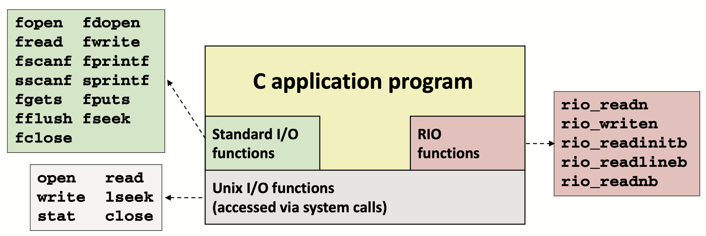
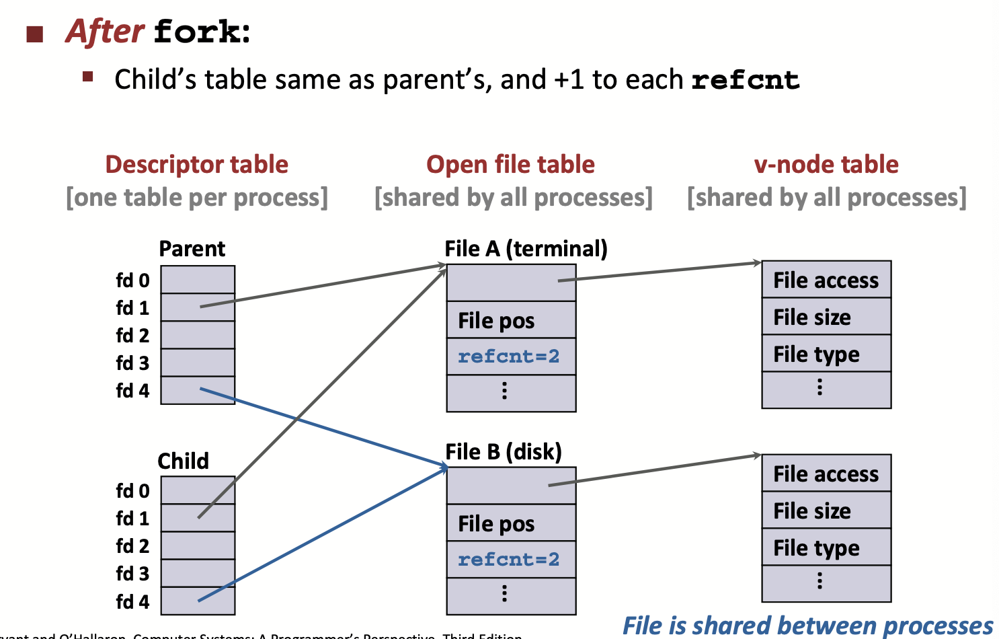

# Lecture 21 System-Level I/O



## Unix I/O and C Standard I/O

* All I/O devices are represented as files:
  * `/dev/sda2` (`/usr` disk partition)
  * `/dev/tty2` (terminal)
* Even the kernel is represented as a file:
  * `/proc` (kernel data structures)
* Elegant mapping of files to devices allows kernel to export simple interface called Unix I/O:
  * Opening and closing files: `open()` and `close()`
  * Reading and writing a file: `read()` and `write()`
  * Changing the current file position (seek)
    * indicates next offset into file to read or write
    * `lseek()`

### File Types

* Regular file
  * Applications often distinguish between text files and binary files
  * End of line (EOL) indicators
    * line feed (LF) on Linux and Mac OS: '\n' (0xa)
    * Carriage return (CR) followed by line feed (LF) on Windows and Internet protocols: `\r\n` (0xd 0xa)
* Directory
  * Each directory contains at least two entries
    * . (dot) is alinktoitself
    * .. (dot dot) is a link to the parent directory in the directory hierarchy
  * All files are organized as a hierarchy anchored by root directory named / (slash)
  * Locations of files in the hierarchy denoted by pathnames
    * Absolute pathname starts with ‘/’ and denotes path from root
    * Relative pathname denotes path from current working directory
* Socket
* Other file types
  * Named pipes (FIFOS)
  * Symbolic links
  * Character and block devices

### Opening Files

* `open()` returns a small identifying integer file descriptor
  * `fd == -1` indicates that an error occurred
* Each process created by a Linux shell begins life with three open files associated with a terminal:
  * 0: standard input (stdin)
  * 1: standard output (stdout)
  * 2: standard error (stderr)

### Closing Files

* Closing a file informs the kernel that you are finished accessing that file
* Always check return codes, even for seemingly benign functions such as `close()`

### Reading Files

* Reading a file copies bytes from the current file position to memory, and then updates file position
* Returns number of bytes read from file `fd` into `buf`

### Writing Files

* Writing a file copies bytes from memory to the current file position, and then updates current file position
* Returns number of bytes written from `buf` to file `fd`

### Short Counts

* Short counts can occur in these situations:
  * Encountering (end-of-file) EOF on reads
  * Reading text lines from a terminal
  * Reading and writing network sockets
* Short counts never occur in these situations:
  * Reading from disk files (except for EOF)
  * Writing to disk files

## Metadata, Sharing, and Redirection

* **Metadata** is data about data
* Per-file metadata maintained by kernel
  * Accessed by users with the `stat` and `fstat` functions
* Two distinct descriptors sharing the same disk file through two distinct open file table entries
  * e.g., calling `open` twice with the same `filename` argument
* How Processes Share Files: fork
  * A child process inherits its parent’s open files
  * Note: situation unchanged by `exec` functions (use `fcntl` to change)



## I/O Redirection

* Call `dup2(oldfd,newfd)` function to implement **I/O redirection**
  * Copies (per-process) descriptor table entry `oldfd` to entry `newfd`

## Standard I/O

* The C standard library (libc.so) contains a collection of higher-level **standard I/O** functions

### Standard I/O Streams

* Standard I/O models open files as **streams**
  * Abstraction for a file descriptor and a buffer in memory

### Buffered I/O

* Applications often read/write one character at a time
* Implementing as Unix I/O calls expensive
* Use Unix `read` to grab block of bytes
* User input functions take one byte at a time from buffer
  * Refill buffer when empty
* Standard I/O functions use buffered I/O
* Buffer flushed to output fd on “\n”, call to fflush or exit, orreturnfrommain

## Robust I/O (only cmu-15213 special wrappers)

```c
/* Read at most max_count bytes from file into buffer. Return number bytes read, or error value */
ssize_t read(int fd, void *buffer, size_t max_count);
/* Write at most max_count bytes from buffer to file. Return number bytes written, or error value */
ssize_t write(int fd, void *buffer, size_t max_count);
```

* RIO provides two different kinds of functions
  * Unbuffered input and output of binary data
    * `rio_readn` and `rio_writen`
  * Buffered input of text lines and binary data
    * `rio_readlineb` and `rio_readnb`
    * Buffered RIO routines are thread-safe and can be interleaved arbitrarily on the same descriptor

### Unbuffered RIO Input and Output

* `rio_readn` returns short count only if it encounters EOF
  * Only use it when you know how many bytes to read
* `rio_writen` never returns a short count
* Calls to `rio_readn` and `rio_writen` can be interleaved arbitrarily on the same descriptor

### Buffered RIO Input Functions

* Efficiently read text lines and binary data from a file partially cached in an internal memory buffer
* `rio_readlineb` reads a text line of up to `maxlen` bytes from file `fd` and stores the line in `usrbuf`
* Stopping conditions
  * `maxlen` bytes read
  * EOF encountered
  * Newline ('\\n') encountered
* `rio_readnb` reads up to n bytes from file `fd`
* Stopping conditions
  * `maxlen` bytes read
  * EOF encountered

## Choose I/O Functions

* General rule: use the highest-level I/O functions you can
* When to use standard I/O
  * When working with disk or terminal files
* When to use raw Unix I/O
  * Inside signal handlers, because Unix I/O is async-signal-safe
  * In rare cases when you need absolute highest performance
* When to use RIO
  * When you are reading and writing network sockets
  * Avoid using standard I/O on sockets