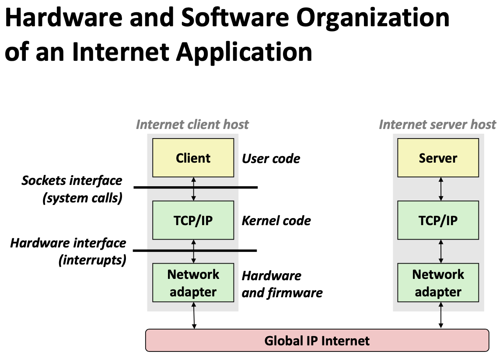
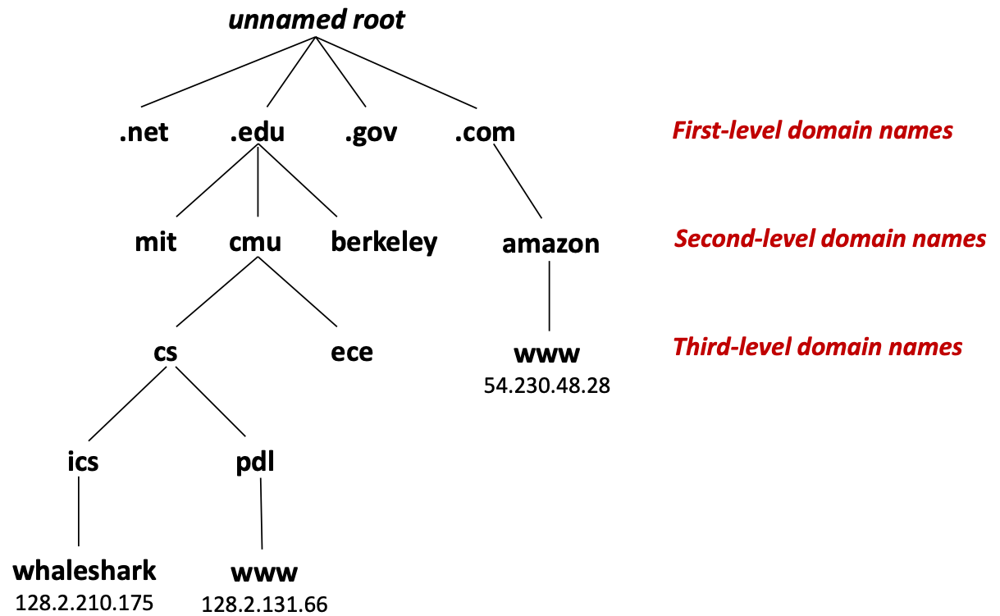
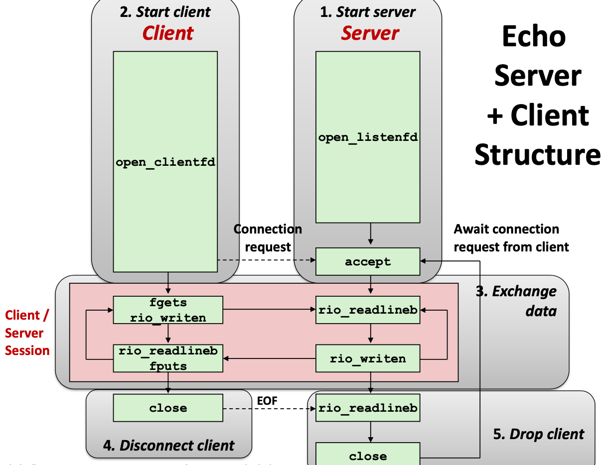
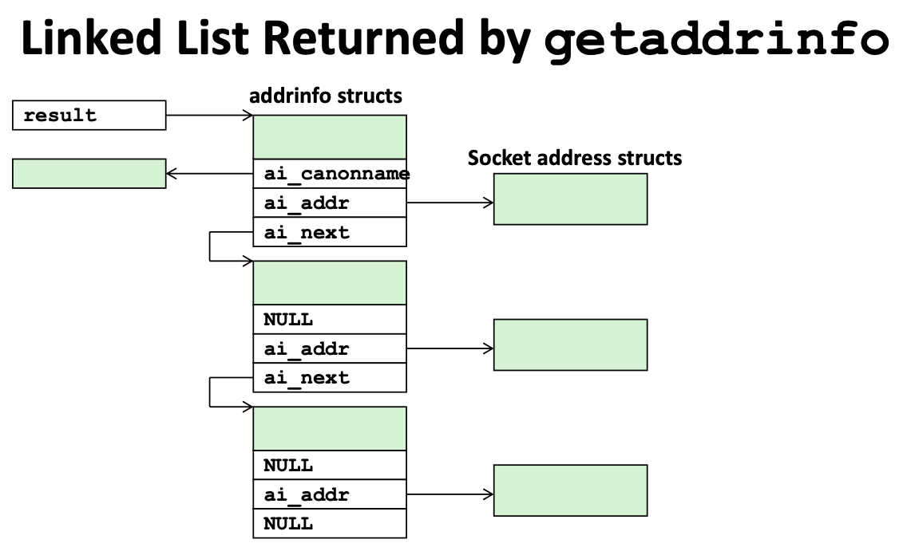

# Lecture 22 Network Programming: Part I

## A Client-Server Transaction

* A server process and one or more client processes
* Server manages some resource
* Server provides service by manipulating resource for clients
* Server activated by request from client (vending machine analogy)


## Computer Networks

* A network is a hierarchical system of boxes and wires organized by geographical proximity

### Ethernet Segment

* Ethernet segment consists of a collection of hosts connected by wires to a hub
* Each Ethernet adapter has a unique 48-bit address (**MAC addres**s)
* Hosts send bits to any other host in chunks called **frames**
* Hub slavishly copies each bit from each port to every other port
* **Hubs are obsolete**
  * Bridges (switches, routers) became cheap enough to replace them

### Bridged Ethernet Segment

* **Bridges** cleverly learn which hosts are reachable from which ports and then selectively copy frames from port to port

### Internet

* Multiple incompatible LANs can be physically connected by specialized computers called **routers**
* The connected networks are called an **internet**

### Protocol

* How is it possible to send bits across incompatible LANs and WANs?
* Solution: **protocol** software running on each host and router
  * Protocol is a set of rules that governs how hosts and routers should cooperate when they transfer data from network to network
  * Smooths out the differences between the different networks
* Provides a naming scheme
  * An internet protocol defines a uniform format for **host addresses**
  * Each host (and router) is assigned at least one of these internet addresses that uniquely identifies it
* Provides a delivery mechanism
  * An internet protocol defines a standard transfer unit (**packet**)
  * Packet consists of **header** and **payload**
    * Header: contains info such as packet size, source and destination addresses
    * Payload: contains data bits sent from source host

### Global IP Internet

* Based on the TCP/IP protocal family
* IP (Internet Protocal)
  * Provides basic naming scheme and unreliable delivery capability of packets (datagrams) from host-to-host
* UDP (Unreliable Datagram Protocol)
  * Uses IP to provide unreliable datagram delivery from process-to-process
* TCP (Transmission Control Protocol)
  * Uses IP to provide reliable byte streams from process-to-process over connections
* Accessed via a mix of Unix file I/O and functions from the **sockets interface**



### A Programmer's View of the Internet

* Hosts are mapped to a set of 32-bit IP addresses
  * `127.0.0.1` (always localhost)
* The set of IP addresses is mapped to a set of identifiers called Internet domain names
* A process on one Internet host can communicate with a process on another Internet host over a connection

## IP Addresses

* 32-bit IP addresses are stored in an **IP address struct**
  * IP addresses are always stored in memory in **network byte order** (big-endian byte order)

```c
/* Internet address structure */
struct in_addr {
  uint32_t s_addr; /* network byte order (big-endian) */
};
```

### Dotted Decimal Notation

* By convention, each byte in a 32-bit IP address is represented by its decimal value and separated by a period
  * IP address: 0x8002C2F2 = 128.2.194.242
* Use `getaddrinfo` and `getnameinfo` functions to convert between IP addresses and dotted decimal format

## Domain Names



* The Internet maintains a mapping between IP addresses and domain names in a huge worldwide distributed database called **Domain Naming System (DNS)**
* Conceptually, programmers can view the DNS database as a collection of millions of host entries
  * Each host entry defines the mapping between a set of domain names and IP addresses
* Can explore properties of DNS mappings using `nslookup`
* Each host has a locally defined domain name `localhost` which always maps to the **loopback address 127.0.0.1**
* Use `hostname` to determine real domain name of local host

## Internet Connections

* Clients and servers communicate by sending streams of bytes over **connections**.
* Each connection is:
  * Point-to-point: connects a pair of processes
  * Full-duplex: data can flow in both directions at the same time
  * Reliable: stream of bytes sent by the source is eventually received by the destination in the same order it was sent
* A **socket** is an endpoint of a connection
  * **Socket address** is an `IPaddress:port` pair
* A **port** is a 16-bit integer that identifies a process:
  * Ephemeral port: Assigned automatically by client kernel when client makes a connection request
  * Well-known port: Associated with some service provided by a server (e.g., port 80 is associated with Web servers)
    * echo servers: echo 7
    * ftp servers: frp 21
    * ssh servers: ssh 22
    * email servers: smtp 225
    * web servers: http 80
    * contained in the file `/etc/services`

### Anatomy of a Connection

* A connection is uniquely identified by the socket addresses of its endpoints (socket pair)
  * (cliaddr:cliport, servaddr:servport)

## Sockets Interface

* Set of system-level functions used in conjunction with Unix I/O to build network applications

### Sockets

* To the kernel, a socket is an endpoint of communication
* To an application, a socket is a file descriptor that lets the application read/write from/to the network
* Clients and servers communicate with each other by reading from and writing to socket descriptors
* The main distinction between regular file I/O and socket I/O is how the application “opens” the socket descriptors

### Echo Server+Client Struture



### Socket Address Structure

* For address arguments to connect, bind, and accept
* For casting convenience, we adopt the Stevens convention:
  * `typedef struct sockaddr SA;`
* Internet (IPv4) specific socket address:
  * Must cast `(struct sockaddr_in *)` to `(struct sockaddr *)` for functions that take socket address arguments

```c
struct sockaddr {
  uint16_t sa_family; /* Protocol family */
  char sa_data[14]; /* Address data */
};
```

### Host and Service Conversion

* `getaddrinfo` is the modern way to convert string representations of hostnames, host addresses, ports, and service names to socket address structures
* Each addrinfo struct returned by `getaddrinfo` contains arguments that can be passed directly to `socket` function, also to `connect` and `bind` functions

```c
int getaddrinfo(const char *host, /* Hostname or address */
                const char *service, /* Port or service name */
                const struct addrinfo *hints, /* Input parameters */
                struct addrinfo **result); /* Output linked list */
void freeaddrinfo(struct addrinfo *result); /* Free linked list */
const char *gai_strerror(int errcode); /* Return error msg */
```



```c
struct addrinfo {
	int ai_flags; /* Hints argument flags */
	int ai_family; /* First arg to socket function */
  int ai_socktype; /* Second arg to socket function */
  int ai_protocol; /* Third arg to socket function */
  char *ai_cannonname; /* Canonical host name */
	size_t ai_addrlen; /* Size of ai_addr struct */
	struct sockaddr *ai_addr; /* Ptr to socket address structure */
  struct addrinfo *ai_next; /* Ptr to next item in linked list */
};
```

* `getnameinfo` is the inverse of getaddrinfo, converting a socket address to the corresponding host and service

```c
int getnameinfo(const SA *sa, socklen_t salen, /* In: socket addr */
								char *host, size_t hostlen, /* Out: host */
                char *serv, size_t servlen, /* Out: service */
                int flags); /* optional flags */
```

