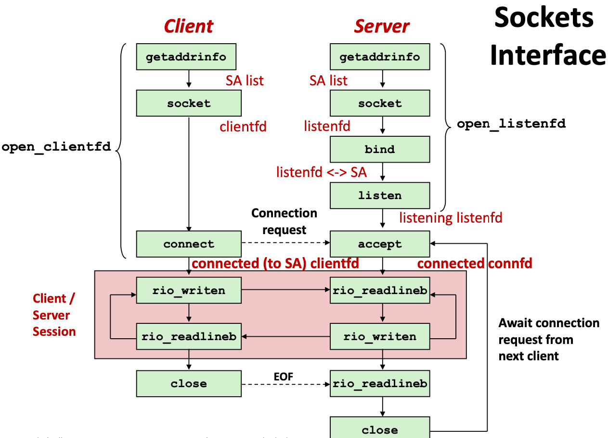
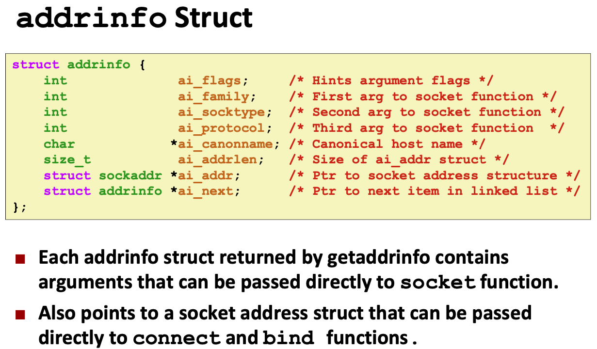
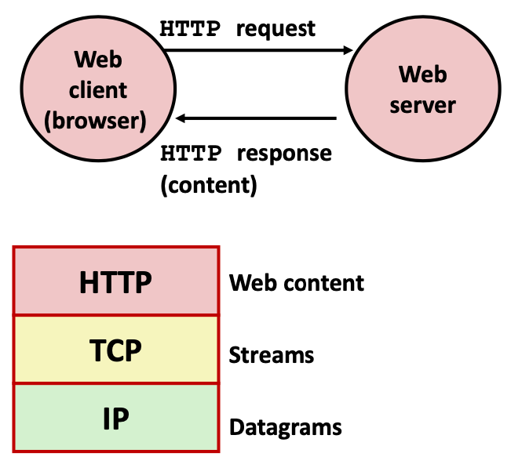

# Lecture 23 Network Programming: Part II

## Sockets Interface

### Sockets Interface: socket

* Clients and servers use the socket function to create a **socket descriptor**:
  * `int socket(int domain, int type, int protocol)`
  * Example:
    * `int clientfd = socket(AF_INET, SOCK_STREAM, 0);`
    * which indicates that using 32-bit IPV4 addresses and the socket will be the end point of a reliable TCP connection
  * **Better Example**:
    * `struct addrinfo *infop = ...; int sockfd = socket(p->ai_family, p-> ai_socktype, p->ai_protocol);`
    * which is not protocol specific

### Sockets Interface: bind

* A server uses `bind` to ask the kernel to associate the server's socket address with a socket descriptor
  * `int bind(int sockfd, SA *addr, socklen_t addrlen);`
  * `typedef struct sockaddr SA;`
* Process can read bytes that arrive on the connection whose endpoint is `addr` by reading from descriptor `sockfd`
* Similarly, writes to `sockfd` are transferred along connection whose endpoint is `addr`

### Sockets Interface: listen

* Kernel assumes that descriptor from socket function is an **active socket** that will be on the client end
* A server calls the listen function to tell the kernel that a descriptor will be used by a server rather than a client:
  * `int listen(int sockfd, int backlog);`
* Converts `sockfd` from an active socket to a **listening socket** that can accept connection requests from clients
* `backlog` is a hint about the number of outstanding connection requests that the kernel should queue up before starting to refuse requests (128-ish by default)

### Sockets Interface: accept

* Servers wait for connection requests from clients by calling `accept`:
  * `int accept(int listenfd, SA *addr, int *addrlen);`
* Waits for connection request to arrive on the connection bound to `listenfd`, then fills in client’s socket address in addr and size of the socket address in `addrlen`
* Returns a **connected descriptor** that can be used to communicate with the client via Unix I/O routines

### Sockets Interface: connect

* A client establishes a connection with a server by calling connect:
  * `int connect(int clientfd, SA *addr, socklen_t addrlen);`
* Attempts to establish a connection with server at socket address `addr`
  * If successful, then `clientfd` is now ready for reading and writing
  * Resulting connection is characterized by socket pair
    * (x:y, addr.sin_addr:addr.sin_port)
    * x is client address
    * y is ephemeral port that uniquely identifies client process on client host
* Best practice is to use getaddrinfo to supply the arguments `addr` and `addrlen`

### Connected vs. Listening Descriptors

* Listening descriptor
  * End point for client connection requests
  * Created once and exists for lifetime of the server
* Connected descriptor
  * End point of the connection between client and server
  * A new descriptor is created each time the server accepts a connection request from a client
  * Exists only as long as it taks to service client
* This allows for concurrent servers that can communicate over many client connections simultaneously

## Web Server Basics

* Clients and servers communicate using the HyperText Transfer Protocol (HTTP)
  * Client and server establish TCP connection
  * Client requests content
  * Server responds with requested content
  * Client and server close connection (eventually)

### Web Content

* Web servers return content to clients
  * content: a sequence of bytes with an associated MIME (Multipurpose Internet Mail Extensions) type
    * text/html; text/plain; iimage/gif; mage/png; image/jpeg;
* The content returned in HTTP responses can be either static or dynamic
  * Static content: content stored in files and retrieved in response to an HTTP request
  * Dynamic content: content produced on-the-fly in response to an HTTP request

### URLs and how clients and servers use them

* Unique name for a file: URL (Universal Resource Locator)
* Clients use prefix (http://www.cmu.edu:80) to infer:
  * What kind (protocol) of server to contact (HTTP)
  * Where the server is (www.cmu.edu)
  * What port it is listening on (80)
* Servers use suffix (/index.html) to:
  * Determine if request is for static or dynamic content.
    * One convention: executables reside in `cgi-bin` directory
  * Find file on file system

### HTTP Requests

* HTTP request is a request line, followed by zero or more request headers
* Request line: <method> <uri> <version>
  * <method> is one of GET, POST, OPTIONS, HEAD, PUT, DELETE, or TRACE
  * <uri> is typically URL for proxies, URL suffix for servers
  * <version> is HTTP version of request (HTTP/1.0 or HTTP/1.1)
* Request headers: <header name>: <header data>
  * Provide additional information to the server

### HTTP Responses

* HTTP response is a response line followed by zero or more response headers, possibly followed by content, with blank line (“\r\n”) separating headers from content
* Response line: <version> <status code> <status msg>
  * <version> is HTTP version of the response
  * <status code> is numeric status
  * <status msg> is corresponding English text
    * 200 OK Request was handled without error
    * 301 Moved Provide alternate URL
    * 404 Not foound Server couldn't find the file
* Response headers: <header name>: <header data>
  * Content-Type: MIME type of content in response body
  * Content-Length: Length of content in response body