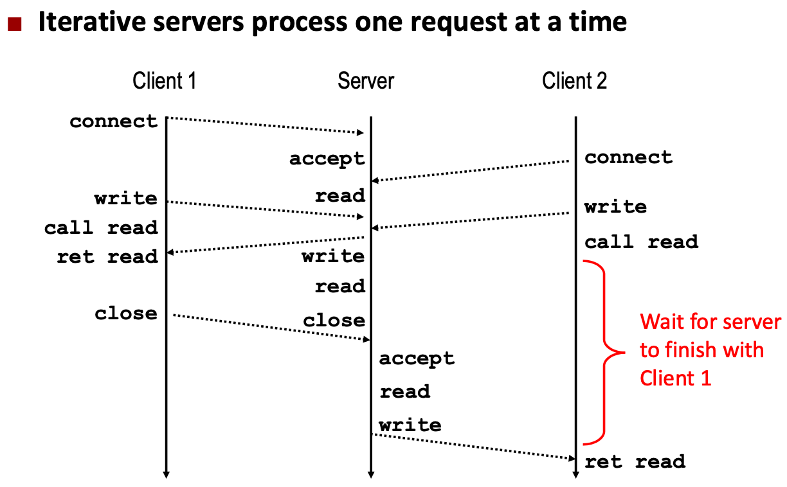
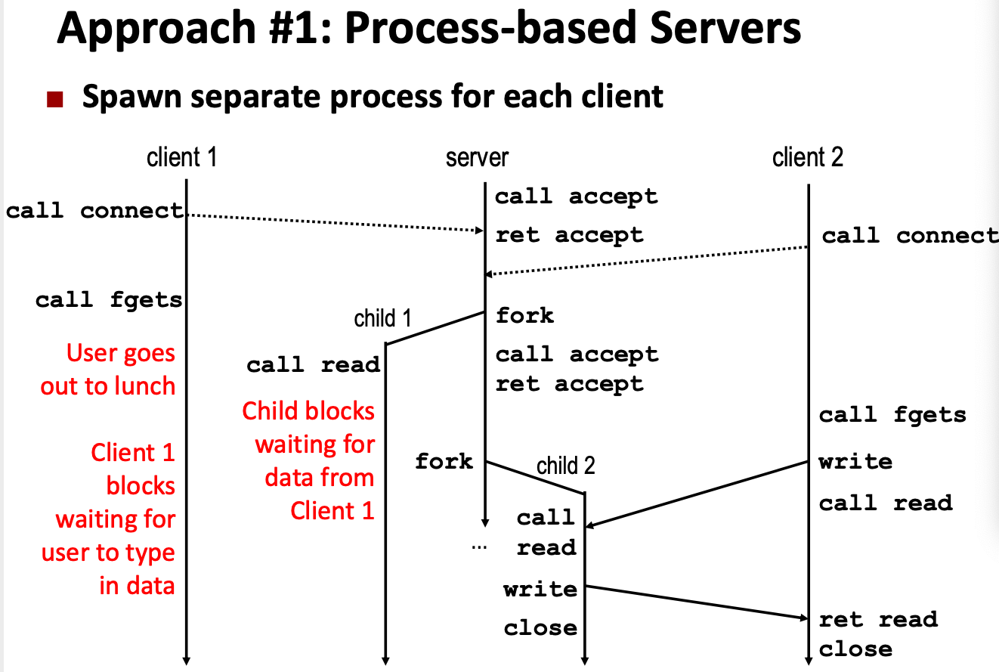
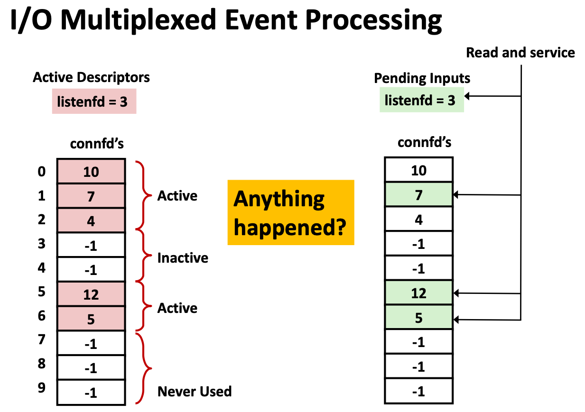
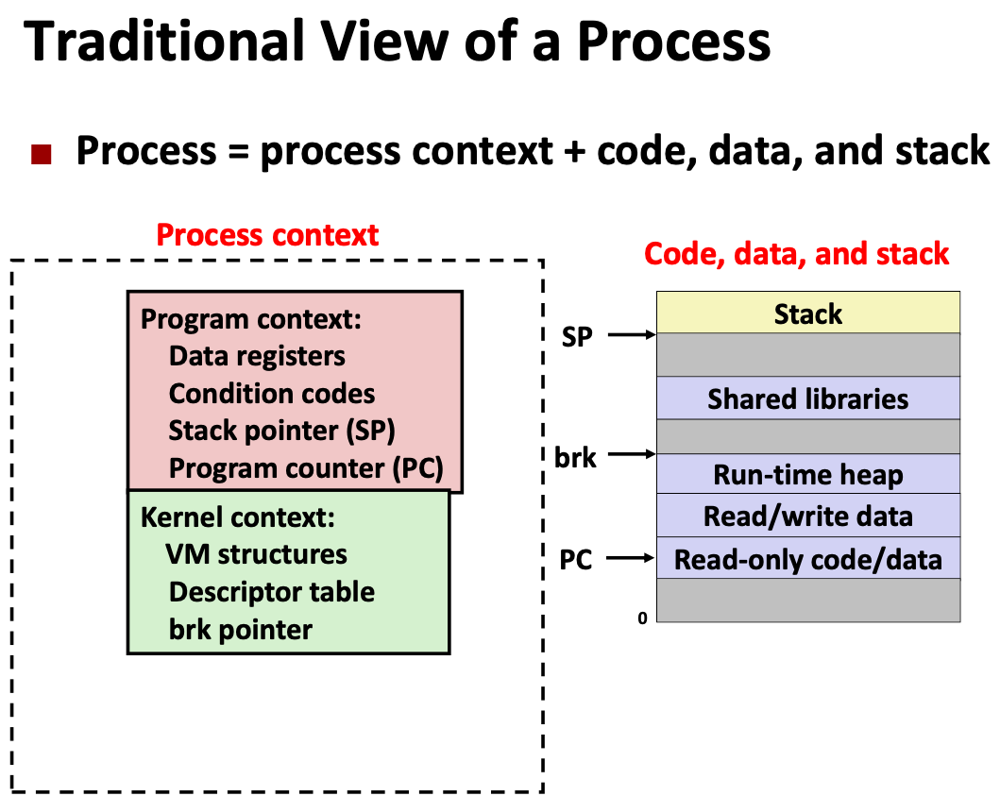
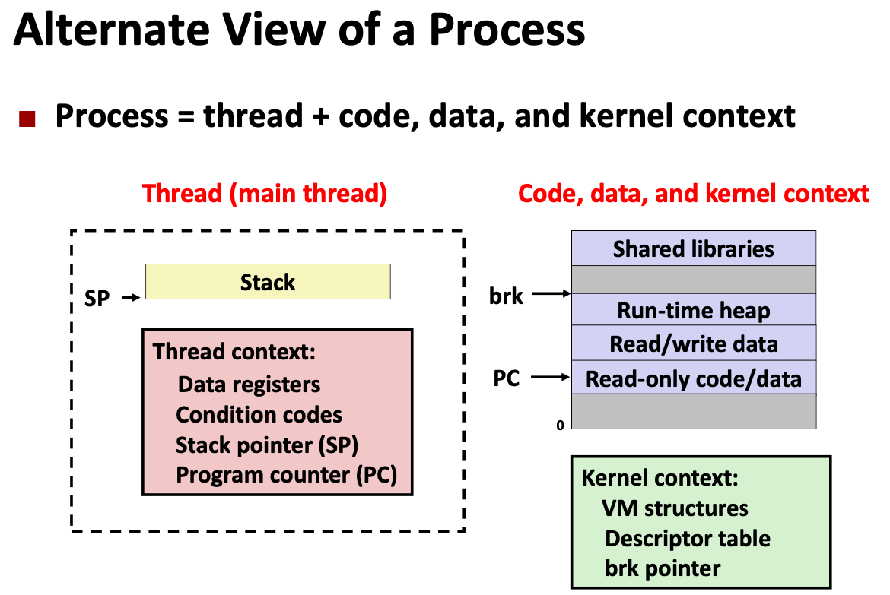
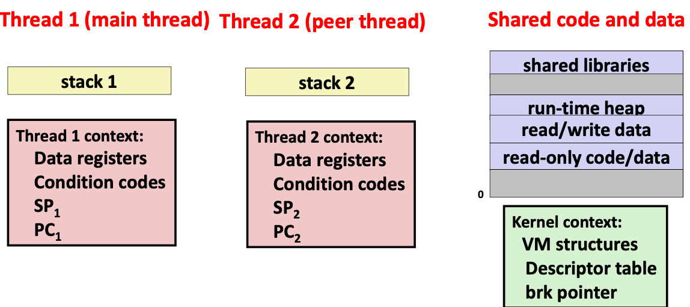
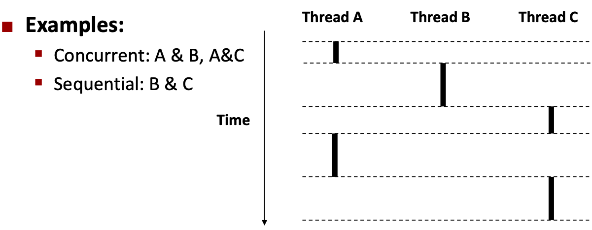
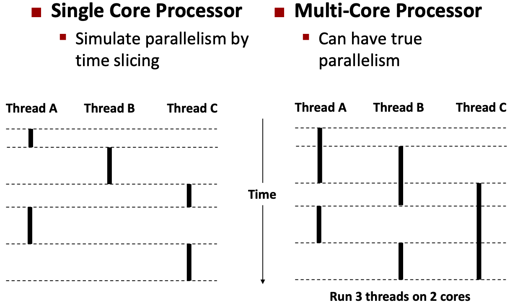
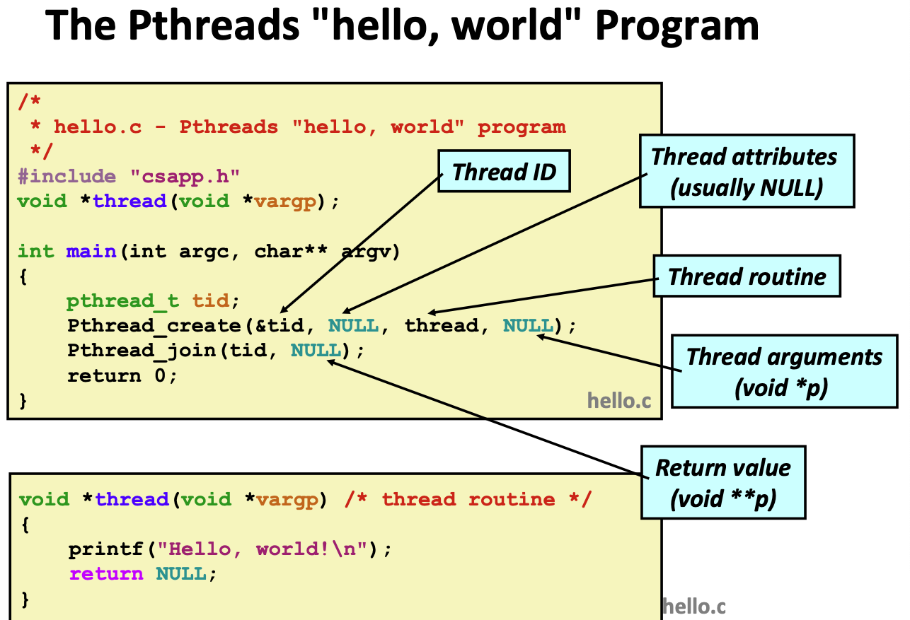

# Lecture 24 Concurrent Programming

## Deadlock

```c
void catch_child(int signo) {
  printf("Child exited!\n"); // this call may reenter printf/puts! BAD! DEADLOCK!
  while(waitpid(-1, NULL, WNOHANG) > 0) continue; // reap alo children
}
```

* `printf` code:
  * Acquire lock->Do something->Release lock->Execute next instruction
* `printf` (and `fprintf`, `sprintf`) implement buffered I/O, which requires lock to access the shared buffers

## Classical Problem Classes of Concurrent Programs

* Races: outcome depends on arbitrary scheduling decisions elsewhere in the system
  * Example: who gets the last seat on the airplane?
* Deadlock: improper resource allocation prevents forward progress
  * Example: traffic gridlock
* Livelock / Starvation / Fainess: external events and/or system scheduling decisions can prevent sub-task progress
  * Example: people always jump in front of you in line

## Iterative Servers



* Second client attempts to connect to iterative server
* Call to connect returns
  * Even though connection not yet accepted
  * Server side TCP manager queues request
  * Feature known as "TCP listen backlog"
* Call to rio_writen returns
  * Server side TCP manager buffers input data
* Call to rio_readlineb blocks
  * Server hasn't written anything for it to read yet
* Better solution: use concurrent servers instead

## Concurrent Servers

### Approaches for Writing Concurrent Servers

* Process-based
  * Kernel automatically interleaves multiple logical flows
  * Each flow has its own **private** address space
* Event-based
  * Programmer manually interleaves multiple logical flows
  * All flows share the same address space
  * Use technique called **I/O multiplexing**
* Thread-based
  * Kernel automatically interleaves multiple logical flows
  * Each flow shares the **same** address space
  * Hybrid of process-based and event-based

### Process-based Servers



```c
int main(int argc, char **argv)
{
  int listenfd, connfd;
  socklen_t clientlen;
  struct sockaddr_storage clientaddr;
  signal(SIGCHLD, sigchld_handler);
  listenfd = open_listenfd(argv[1]);
  while (1) {
  	clientlen = sizeof(struct sockaddr_storage);
  	connfd = accept(listenfd, (SA *) &clientaddr, &clientlen);
  	if (Fork() == 0) {
    	close(listenfd); /* Child closes its listening socket */
  		echo(connfd); /* Child services client */
  		close(connfd); /* Child closes connection with client */
  		exit(0); /* Child exits */
  	}
		close(connfd); /* Parent closes connected socket (important!) */
  }
}

void sigchld_handler(int sig) {
	while (waitpid(-1, 0, WNOHANG) > 0) ; // reap all zombie children
		return;
}
```

* Each client handled by independent child process
* No shared state between them
* Both parent & child have copies of `listenfd` and `connfd`
  * Parent must close `connfd`
  * Child should close `listenfd`
* Listening server process must reap zombie children
* Parent process must `close` its copy of connfd
  * Kernel keeps reference count for each socket/open file
  * After fork, `refcnt(connfd)` = 2
  * Connection will not be closed until `refcnt(connfd)`
* Pros
  * Handle multiple connections concurrently
  * Clean sharing model
    * descriptors (no)
    * file tables (yes)
    * global variables (no)
  * Simple and straightforward
* Cons
  * Additional overhead for process control
  * Nontrivial to share data between processes

### Event-based Servers

* Server maintains set of active connections
  * Array of `connfd`s
* **Repeat**
  * Determine which descriptors (`connfd`'s or `listenfd`) have pending inputs
    * e.g., using `select` function
    * arrival of pending input is an event
  * If `listenfd` has input, then `accept` connection
  * Serve all `connfd`'s with pending inputs



* Pros
  * One logical control flow and address space
  * Can single-step with a debugger
  * No process or thread control overhead
* Cons
  * Significantly more complex to code than process- or thread-based designs
  * Hard to provide fine-grained concurrency
    * e.g., how to deal with partial HTTP request headers?
  * Cannot take advantage of multi-core
    * Single thread of control

### Thread-based Servers

* Very similar to process-based servers
  * but using threads instead of processes

## Process & Thread

### Views of a Process







* Multiple threads can be associated with a process
  * Each thread has its own logical control flow
  * Each thread shares the same code, data, and kernel context
  * Each thread has its own stack for local variables
    * but not protected from other threads
  * Each thread has its own thread id (TID)
* **Threads associated with process form a pool of peers**
  * Unlike processes which form a tree hierarchy

### Concurrent Threads

* Two threads are concurrent if their flows overlap in time



### Concurrent Thread Execution



### Threads vs. Process

* How threads and processes are similar
  * Each has its own logical control flow
  * Each can run concurrently with others (possibly on different cores)
  * Each is context switched
* How threads and processes are different
  * Threads share all code and data (except local stacks)
    * Processes (typically) do not
  * Threads are somewhat less expensive than processes
    * Process control (creating and reaping) twice as expensive as thread control
    * ~20K cycles to create and reap a process
    * ~10K cycles (or less) to create and reap a thread

### Threads vs. Signals

* Signal handler shares state with regular program
  * Including stack
* Signal handler interrupts normal program execution
  * Unexpected procedure call
  * Returns to regular execution stream
  * Not a peer
* Limited forms of synchronization
  * Main program can block / unblock signals
  * Main program can pause for signal

## Posix Threads (Pthreads) Interface

* Pthreads: standard interface for ~60 functions that manipulate threads from C programs
  * Creating and reaping threads
    * `pthread_create()`
    * `ptrhead_join()`
  * Determining your thread ID
    * `pthread_self()`
  * Terminating threads
    * `pthread_cancel()`
    * `pthread_exit()`
    * `exit()` terminates all threads
    * `return` terminates current thread
  * Synchronizing access to shared variables
    * `pthread_mutex_init`
    * `pthread_mutex_lock`
    * `pthread_mutex_unlock`



## Thread-based Concurrent Echo Server

```c
int main(int argc, char **argv)
{
  int listenfd, *connfdp;
  socklen_t clientlen;
  struct sockaddr_storage clientaddr; pthread_t tid;
  listenfd = open_listenfd(argv[1]);
  while (1) {
    clientlen = sizeof(struct sockaddr_storage);
    connfdp = malloc(sizeof(int));
    *connfdp = accept(listenfd, (SA *) &clientaddr, &clientlen);
    pthread_create(&tid, NULL, thread, connfdp);
	}
	return 0;
}

/* Thread routine */
void *thread(void *vargp) {
	int connfd = *((int *)vargp);
  pthread_detach(pthread_self());
  free(vargp);
	echo(connfd);
  close(connfd);
  return NULL;
}
```

* Spawn new thread for each client
* Pass it copy of connection file descriptor
* Note use of `malloc()`! [but not `free()`]
* Producer-Consumer Model
  * **Allocate in main**
  * **Free in thread routine**
* Each client handled by individual peer thread
* Threads share all process state except TID
* Each thread has a separate stack for local variables

### Issues With Thread-Based Servers

* Must run “detached” to avoid memory leak
  * At any point in time, a thread is either joinable or detached
  * Joinable thread can be reaped and killed by other threads
    * must be reaped (with `pthread_join`) to free memory resources
  * Detached thread cannot be reaped or killed by other threads
    * resources are automatically reaped on termination
  * Default state is joinable
    * use `pthread_detach(pthread_self())` to make detached
* Must be careful to avoid unintended sharing
  * For example, passing pointer to main thread’s stack
    * `pthread_create(&tid, NULL, thread, (void *)&connfd);`
* All functions called by a thread must be thread-safe

### Pros and Cons of Thread-based Designs

* Pros
  * Easy to share data structure between threads
    * e.g., logging information, file cache
  * Threads are more efficient than processes
* Cons
  * Unintentional sharing can introduce subtle and hard-to-reproduce errors
    * The ease with which data can be shared is both the greatest strength and the greatest weakness of threads
    * Hard to know which data shared & which private
    * Hard to detect by testing