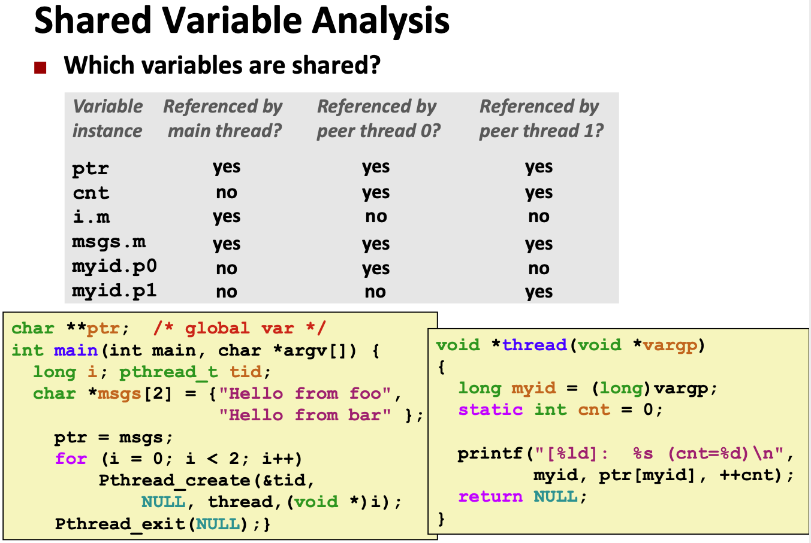
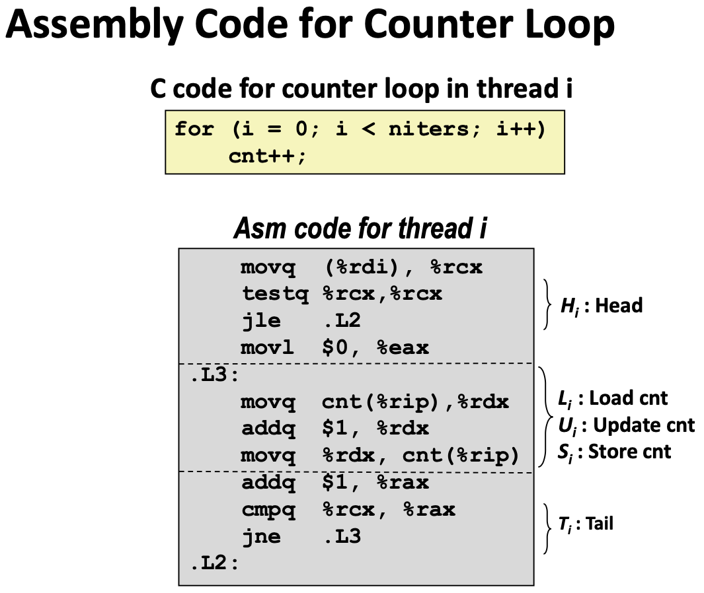
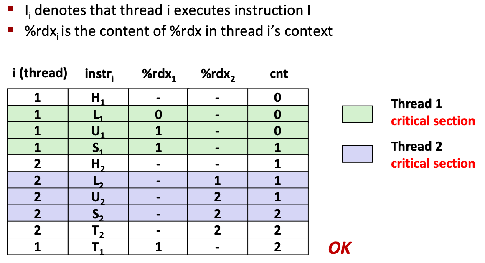
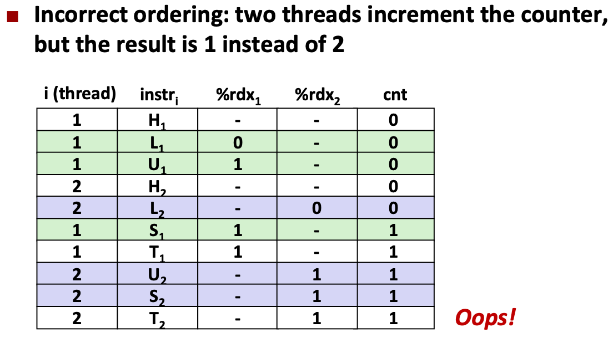
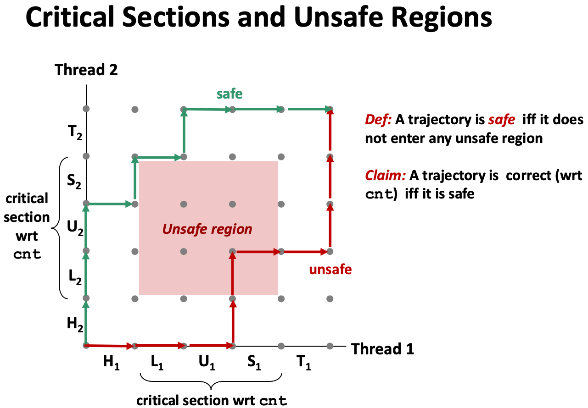
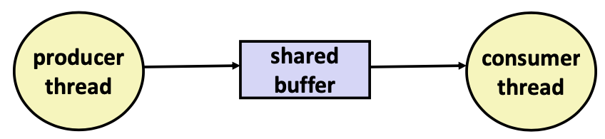
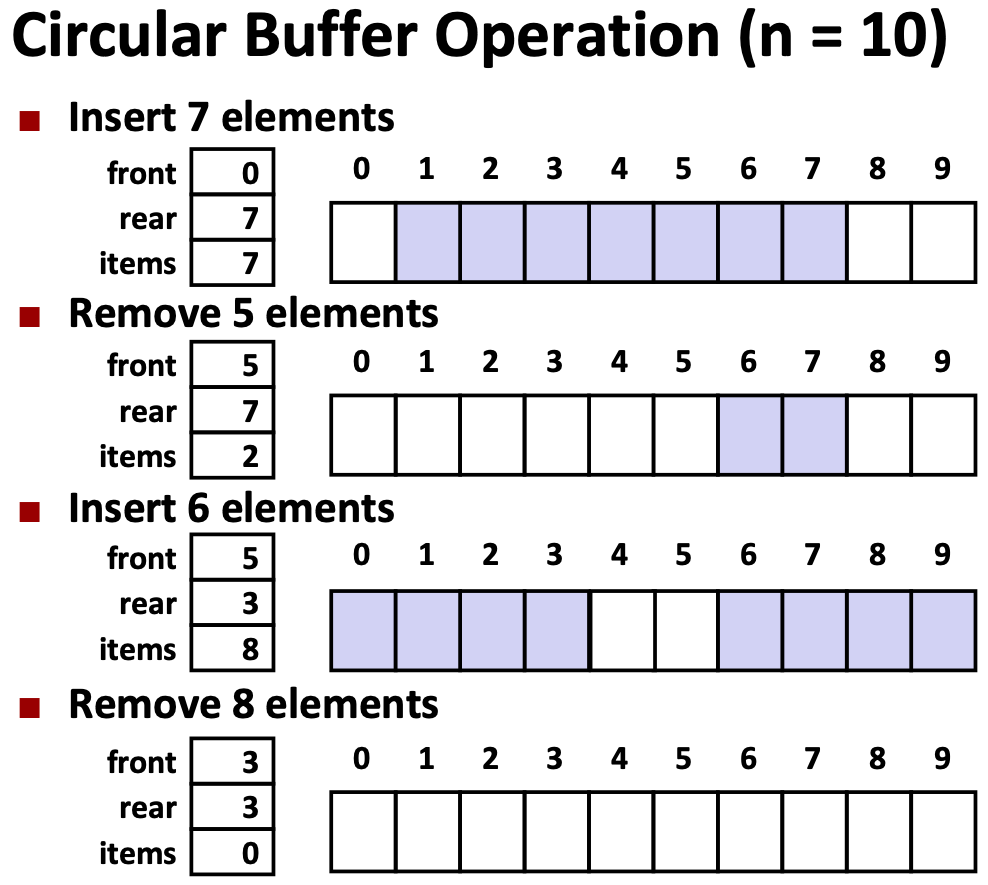

# Lecture 25 Synchronization: Basics

## Sharing

### Shared Variables in Threaded C Programs

* A variable x is shared if and only if multiple threads reference some instance of x

### Threads Memory Model: Conceptual

* **Multiple threads run within the context of a single process**
* **Each thread has its own separate thread context**
  * Thread ID, stack, stack pointer, PC, condition codes, and GP registers
* All threads share the remaining process context
  * Code, data, heap, and shared library segments of the process virtual address space
  * Open files and installed handlers

### Threads Memory Model: Actual

* Separation of data is not strictly enforced:
  * Register values are truly separate and protected, but any thread can read and write the stack of any other thread

### Three Ways to Pass Thread Arguments

#### Passing an Argument to a Thread - Pedantic

```c
int hist[N] = {0};
int main(int argc, char *argv[]) {
   long i;
	pthread_t tids[N];
	for (i = 0; i < N; i++) {
		long* p = Malloc(sizeof(long));
    *p = i;
    pthread_create(&tids[i], NULL, thread, (void *)p);
  }
	for (i = 0; i < N; i++)
		pthread_join(tids[i], NULL);
  check();
}

void *thread(void *vargp) {
   hist[*(long *)vargp] += 1;
   free(vargp);
   return NULL;
}
```

* Use malloc to create a per thread heap allocated place in memory for the argument
* Remember to free in thread
* Producer-consumer pattern

#### Passing an Argument to a Thread - Ptr to stack slot

```c
char **ptr;  /* global var */
int main(int argc, char *argv[]) {
	long i;
	pthread_t tid;
  char *msgs[2] = {
  	"Hello from foo",
  	"Hello from bar"
	};
  ptr = msgs;
  for (i = 0; i < 2; i++)
		pthread_create(&tid, NULL, thread, (void *)i);
  pthread_exit(NULL);
}

void *thread(void *vargp) {
    long myid = (long)vargp;
    static int cnt = 0;
    printf("[%ld]:  %s (cnt=%d)\n", myid, ptr[myid], ++cnt);
    return NULL;
}
```

#### Passing an Argument to a Thread - Cast of `int`

```c
int hist[N] = {0};
int main(int argc, char *argv[]) {
  long i;
	pthread_t tids[N];
	for (i = 0; i < N; i++)
    pthread_create(&tids[i], NULL, thread, (void *)i);
	for (i = 0; i < N; i++)
    pthread_join(tids[i], NULL);
	check();
}

void *thread(void *vargp) {
   hist[(long)vargp] += 1;
   return NULL;
}
```

### Mapping Variable Instances to Memory



### Concurrent Execution

* Key idea: In general, any sequentially consistent interleaving is possible, but some give an unexpected result
  * For now. In reality, on x86 even non-sequentially consistent interleavings are possible

#### Concurrent Execution Example: Counter Loop







### Progress Graph

* A **progress graph** depicts the **discrete execution state space** of concurrent threads
* Each point corresponds to a possible execution state
* A **trajectory** is a sequence of legal state transitions that describes one possible concurrent execution of the threads
* A trajectory is **safe** iff it does not enter any unsafe region



## Mutual Exclusion

### Enforcing Mutual Exclusion

* How can we guarantee a safe trajectory?
* We must **synchronize** the execution of the threads so that they can never have an unsafe trajectory
  * i.e., need to guarantee **mutually exclusive access** for each critical section
* Classic solution:
  * Semaphores (Edsger Dijkstra)
  * Mutex and condition variables (Pthreads)
  * Monitors (Java)

## Semaphores

* **Semaphore**: non-negative global integer synchronization variable
* Manipulated by P and V operations
  * `P(s): [ while (s == 0) wait(); s--; ]`
    * Dutch for "Proberen" (test)
    * If s is nonzero, then decrement s by 1 and return immediately
      * Test and decrement operations occur atomically (indivisibly)
    * If s is zero, then suspend thread until s becomes nonzero and the thread is restarted by a V operation
    * After restarting, the P operation decrements s and returns control to the caller
  * `V(s): [ s++; ]`
    * Dutch for "Verhogen" (increment)
    * Increment s by 1
      * Increment operation occurs atomically
    * If there are any threads blocked in a P operation waiting for s to become non-zero, then restart exactly one of those threads, which then completes its P operation by decrementing s
* **Semaphore invariant: (s >= 0)**
* OS kernel guarantees that operations between brackets [ ] are executed indivisibly

### C Semaphore Operations

```c
 #include <semaphore.h>
int sem_init(sem_t *s, 0, unsigned int val);} /* s = val */
int sem_wait(sem_t *s); /* P(s) */
int sem_post(sem_t *s); /* V(s) */
```

### Using Semaphores for Mutual Exclusion

* Associate a unique semaphore mutex, initially 1, with each shared variable (or related set of shared variables)
* Surround corresponding critical sections with P(mutex) and V(mutex) operations
* **Mutex**: binary semaphore used for mutual exclusion
  * P operation: “locking” the mutex
  * V operation: “unlocking” or “releasing” the mutex
  * “Holding” a mutex: locked and not yet unlocked.
* Counting semaphore: used as a counter for set of available resources

### Binary Semaphores for Mutual Exclusion

* Mutex is special case of semaphore
  * Value either 0 or 1
* Pthreads provides `pthread_mutex_t`
  * Operations: lock, unlock
* Recommended over general semaphores when appropriate

```c
volatile long cnt = 0; /* Counter */
pthread_mutex_t mutex;
pthread_mutex_init(&mutex, NULL); // No special attributes

for (i = 0; i < niters; i++) {
  pthread_mutex_lock(&mutex);
  cnt++;
  pthread_mutex_unlock(&mutex);
}
```

## Producer-Consumer Synchronization

### Using Semaphores to Coordinate Access to Shared Resources

* Basic idea: Thread uses a semaphore operation to notify another thread that some condition has become true
  * Use counting semaphores to keep track of resource state
  * Use binary semaphores to notify other threads

### The Producer-Consumer Problem

* Common synchronization pattern:
  * Producer waits for empty **slot**, inserts item in buffer, and notifies consumer
  * Consumer waits for **item**, removes it from buffer, and notifies producer
* Example
  * Event-driven graphical user interfaces
    * Producer detects mouse clicks, mouse movements, and keyboard hits and inserts corresponding events in buffer
    * Consumer retrieves events from buffer and paints the display



* Maintain two semaphores: full + empty
* Initially: empty==1, full==0

```c
struct {
	int buf; /* shared var */
  sem_t full; /* sems */
  sem_t empty;
} shared;

/* Producer Thread */
void *producer(void *arg) {
  int i, item;
  for (i=0; i<NITERS; i++) {
    /* Produce item */
		item = i;
    printf("produced %d\n", item);
    /* Write item to buf */
		P(&shared.empty);
    shared.buf = item;
    V(&shared.full);
	}
  return NULL;
}

/* Consumer Thread */
void *consumer(void *arg) {
  int i, item;
  for (i=0; i<NITERS; i++) {
    /* Read item from buf */
		P(&shared.full);
    item = shared.buf;
    V(&shared.empty);
    /* Consume item */
		printf("consumed %d\n“, item);
  }
  return NULL;
}
```

* Consider multiple producers & multiple consumers
* Producers will contend with each to get empty
* Consumers will contend with each other to get full

### Producer-Consumer on an n-element Buffer

* Implemented using a shared buffer package called `sbuf`
* Circular Buffer
  * Store elements in array of size n
  * items: number of elements in buffer
  * Empty buffer: front == rear
  * rear: index of most recently inserted element
  * front: (index of next element to remove – 1) mod n



```c
init(int v) {
   items = front = rear = 0;
}
insert(int v) {
   if (items >= n)
       error();
   if (++rear >= n) rear = 0;
   buf[rear] = v;
   items++;
}
int remove()
{
	if (items == 0) error();
	if (++front >= n)
    front = 0;
  int v = buf[front];
	items--;
	return v;
}
```

* Requires a mutex and two counting semaphores:
  * `mutex`: enforces mutually exclusive access to the buffer and counters
  * `slots`: counts the available slots in the buffer
  * `items`: counts the available items in the buffer
* Makes use of general semaphores
  * Will range in value from 0 to n

```c
typedef struct {
  int *buf; /* Buffer array */
	int n; /* Maximum number of slots */
	int front; /* buf[front+1 (mod n)] is first item */
  int rear; /* buf[rear] is last item */
  sem_t mutex; /* Protects accesses to buf */
  sem_t slots; /* Counts available slots */
  sem_t items; /* Counts available items */
} sbuf_t;

/* Create an empty, bounded, shared FIFO buffer with n slots */
void sbuf_init(sbuf_t *sp, int n) {
	sp->buf = Calloc(n, sizeof(int));
	sp->n = n; /* Buffer holds max of n items */
	sp->front = sp->rear = 0; /* Empty buffer iff front == rear */
  sem_init(&sp->mutex, 0, 1); /* Binary semaphore for locking */
	sem_init(&sp->slots, 0, n); /* Initially, buf has n empty slots */
	sem_init(&sp->items, 0, 0); /* Initially, buf has zero items */
}

/* Clean up buffer sp */
void sbuf_deinit(sbuf_t *sp) {
	free(sp->buf);
}

 /* Insert item onto the rear of shared buffer sp */
void sbuf_insert(sbuf_t *sp, int item) {
	P(&sp->slots); /* Wait for available slot */
  P(&sp->mutex); /* Lock the buffer */
	if (++sp->rear >= sp->n) /* Increment index (mod n) */
		sp->rear = 0;
  sp->buf[sp->rear] = item; /* Insert the item */
  V(&sp->mutex); /* Unlock the buffer */
  V(&sp->items); /* Announce available item */
}

/* Remove and return the first item from buffer sp */
int sbuf_remove(sbuf_t *sp) {
	int item;
	P(&sp->items); /* Wait for available item */
  P(&sp->mutex); /* Lock the buffer */
	if (++sp->front >= sp->n) /* Increment index (mod n) */
		sp->front = 0;
	item = sp->buf[sp->front]; /* Remove the item */
  V(&sp->mutex); /* Unlock the buffer */
  V(&sp->slots); /* Announce available slot */
	return item;
}
```