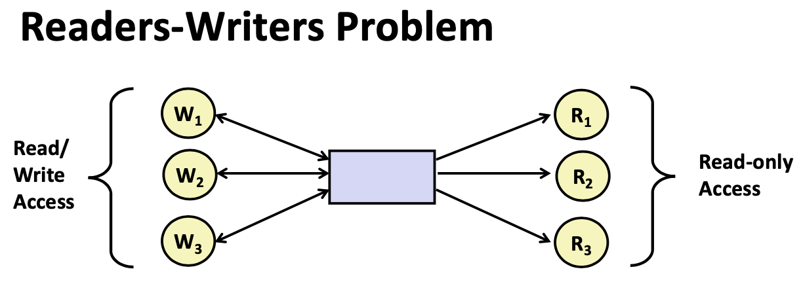
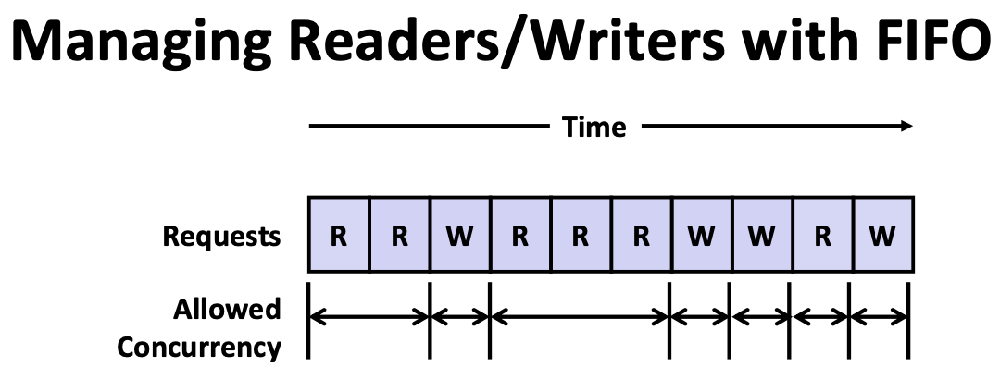
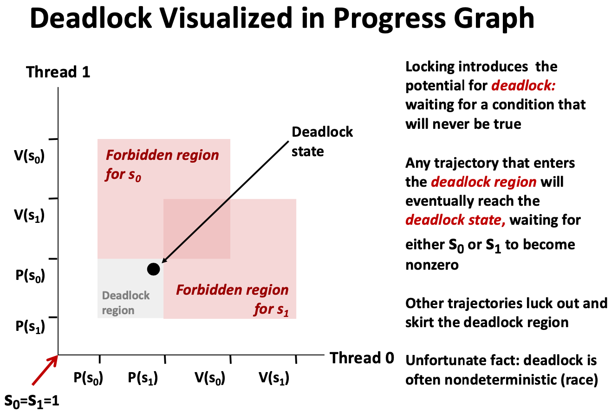

# Lecture 26 Synchronization: Advanced

## Readers-Writers Problem



* Problem Statement:
  * Reader threads only read the object
  * Writer threads modify the object (read/write access)
  * Writers must have exclusive access to the object
  * Unlimited number of readers can access the object
* Occurs frequently in real systems
  * e.g., Online airline reservation system
  * e.g., Multithreaded caching Web proxy
* First readers-writers problem (favors readers)
  * No reader should be kept waiting unless a writer has already been granted permission to use the object
  * A reader that arrives after a waiting writer gets priority over the writer
* Second readers-writers problem (favors writers)
  * Once a writer is ready to write, it performs its write as soon as
    possible
  * A reader that arrives after a writer must wait, even if the writer is also waiting
* Starvation (where a thread waits indefinitely) is possible in both cases

### Solution to First Readers-Writers Problem

```c
int readcnt; /* Initially 0 */
sem_t mutex, w; /* Both initially 1 */
void reader(void) {
  while (1) {
    P(&mutex);
    readcnt++;
    if (readcnt == 1) /* First in */
      P(&w);
    V(&mutex);
    /* Reading happens here */
    P(&mutex);
    readcnt--;
    if (readcnt == 0) /* Last out */
      V(&w);
    V(&mutex);
  }
}

void writer(void) {
  while (1) {
    P(&w);
    /* Writing here */
		V(&w);
  }
}
```

* Short coming of first solution
  * Continuous stream of readers will block writers indefinitely
* **Second version**
  * Once writer comes along, blocks access to later readers
  * Series of writes could block all reads
* FIFO implementation
  * Threads kept in FIFO
  * Each has semaphore that enables its access to critical section

```c
int readcnt, writecnt; // Initially 0
sem_t rmutex, wmutex, r, w; // Initially 1
void reader(void) {
  while (1) {
  	P(&r);
    P(&rmutex);
    readcnt++;
    if (readcnt == 1) /* First in */
      P(&w);
    V(&rmutex);
    V(&r)
  	/* Reading happens here */
  	P(&rmutex);
    readcnt--;
    if (readcnt == 0) /* Last out */
      V(&w);
    V(&rmutex);
  }
}
                           
void writer(void) {
  while (1) {
    P(&wmutex);
    writecnt++;
    if (writecnt == 1)
      P(&r);
    V(&wmutex);
    P(&w);
    /* Writing here */
    V(&w);
    P(&wmutex);
    writecnt--;
    if (writecnt == 0)
    	V(&r);
    V(&wmutex);
  }
}
```

### Managing Readers/Writers with FIFO



* Read & Write requests are inserted into FIFO
* Requests handled as remove from FIFO
  * Read allowed to proceed if currently idle or processing read
  * Write allowed to proceed only when idle
* Requests inform controller when they have completed
* Guarantee very request is eventually handled

### Library Reader/Writer Lock

* Data type `pthread_rwlock_t`
* Operations
  * Acquire read lock: `pthread_rw_lock_rdlock(pthread_rw_lock_t *rwlock)`
  * Acquire write lock: `pthread_rw_lock_rdlock(pthread_rw_lock_t *rwlock)`
  * Release (either) lock: `pthread_rw_lock_rdlock(pthread_rw_lock_t *rwlock)`
* Up to programmer to decide what requires read access and what requires write access

## Races

* A **race** occurs when correctness of the program depends on one thread reaching point x before another thread reaches point y
* Race Elimination
  * Don’t share state
    * E.g., use malloc to generate separate copy of argument for each thread
  * Use synchronization primitives to control access to shared state

## Deadlocks

* A process is **deadlocked** iff it is waiting for a condition that will never be true
* **Typical Scenario**
  * Processes 1 and 2 needs two resources (A and B) to proceed
  * Process 1 acquires A, waits for B
  * Process 2 acquires B, waits for A
  * Both will wait forever
* Avoid deadlock
  * No way for trajectory to get stuck
  * **Processes acquire locks in same order**
  * Order in which locks released immaterial



## Thread Safety

* Functions called from a thread must be thread-safe

* A function is **thread-safe** iff it will always produce correct results when called repeatedly from multiple concurrent threads

* Classes of thread-unsafe functions:

  * Class 1: Functions that do not protect shared variables

    * Fix: Use `P` and `V` semaphore operations (or mutex)
    * Issue: Synchronization operations will slow down code

  * Class 2: Functions that keep state across multiple invocations

    * Relying on persistent state across multiple function invocations
    * Fix: Pass state as part of argument and thereby eliminate static state

  * Class 3: Functions that return a pointer to a static variable

    * Fix 1: Rewrite function so caller passes address of variable to store result

    * Fix 2: Lock-and-copy

    * ```c
      /* Convert integer to string */
      char *itoa(int x) {
      	static char buf[11];
        sprintf(buf, "%d", x);
        return buf;
      }
      
      char *lc_itoa(int x, char *dest) {
        P(&mutex);
        strcpy(dest, itoa(x));
        V(&mutex);
        return dest;
      }
      ```

  * Class 4: Functions that call thread-unsafe functions

    * Calling one thread-unsafe function makes the entire function that calls it thread-unsafe
    * Fix: Modify the function so it calls only thread-safe functions

### Reentrant Functions

* A function is **reentrant** iff it accesses no shared variables when called by multiple threads
  * Require no synchronization operations
  * Only way to make a Class 2 function thread-safe is to make it reetnrant

## Interactions Between Threads and Signal Handling

### Signal Handling

* Signal can occur at any point in program execution
  * Unless signal is blocked
* Signal handler runs within same thread
* Must run to completion and then return to regular program execution

### Threads / Signals Interactions

* Many library functions use lock-and-copy for thread safety
  * Because they have hidden state
  * `malloc`
    * Free lists
  * `fprintf`, `printf`, `puts`
    * So that outputs from multiple threads don't interleave
  * `sprintf`
    * Not officially synch-signal-safe, but seems to be OK
* OK for handler that doesn’t use these library functions
* What if:
  * Signal received while library function holds lock
  * Handler calls same (or related) library function
  * Then a dealock occurs
* **Key Point**
  * Threads employ symmetric concurrency
  * Signal handling is asymmetric